# Design Guide for Single-Stage PF LLC Converter with L6790A

**벌크 커패시터 없는 단일단 역률보정 LLC 컨버터 설계 지침서**
설계 절차 · 계산식 · 25 V / 26.3 A · 세트 권선비 7.5 : 1 설계 예제 · 부록: EVL6790_670W 평가보드 대조 · SMath 구현 노트 · 데이터시트/설계 툴 정오표 · 핀 및 설계 규칙

**Rev. 2.1 · 2026-09**

---

## 문서 성격 및 출처

본 문서는 개인 학습 및 설계 참고용으로 작성된 비공식 자료이며, STMicroelectronics의 공식 간행물이 아니다. 아래 자료만을 근거로 작성되었다.

- **DS** — L6790A Preliminary Datasheet (DRAFT, 2026-04-30)
- **Tool** — L6790 design spreadsheet release 1.0 (2026-07-21)
- EVL6790_670W mother / daughter board schematics Rev. 1

DS는 DRAFT 상태이며 일부 항목이 TBD이고, 문서 내부에 상호 모순되는 상수가 존재한다 (**부록 C** 참조). 양산 설계 전에 정식 릴리스 데이터시트로 반드시 재검증할 것.

본문의 예제 수치는 동봉한 SMath 시트와 독립 참조 구현으로 이중 대조하여 확인하였다. Tool 과 다르게 계산하는 항목은 **부록 C** 에 항목별로 정리하였다.

> **▷ 그림 안내** — 그림은 이 파일과 같은 위치의 `figures/` 폴더에 함께 들어 있다. 출처는 두 가지다. (i) **일반 LLC 이론 그림**은 onsemi/Fairchild **AN-4151**과 Infineon **AN 2013-03**에서 가져왔으며 각 캡션에 원 그림 번호를 명시하였다 — 내부 학습용이며 외부 배포 시 각 사에 확인할 것. (ii) **본 설계 고유의 그림**(등가 입력 범위, $f_{sw}(\theta)$ 스윕, 이 탱크의 실제 게인 곡선, 합성 탱크 전류, 루프 보드선도, 2단/1단 블록도)은 본 문서의 식으로 직접 계산해 그린 것이다.

> **▷ 렌더링 안내** — 수식은 LaTeX 문법(`$...$`, `$$...$$`)이다. GitHub, Obsidian, Typora, VS Code 등 MathJax/KaTeX 지원 뷰어에서 렌더링된다. 식 번호는 `\tag{[n]}` 으로 붙였다 — \[1\]~\[148\] 은 ST 설계 절차의 순서를 따르고, \[149\] 이후는 본 문서가 더한 식이다.

---

## 개요

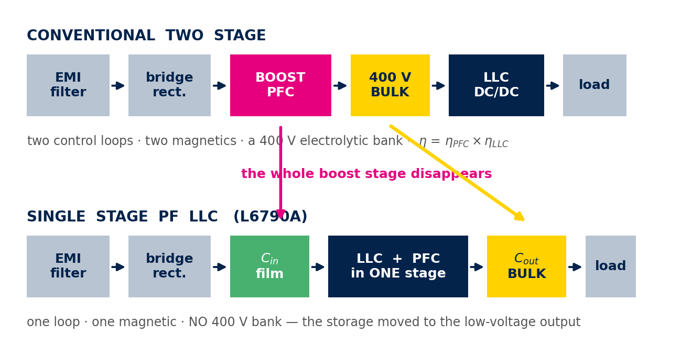

*통상적인 2단 구성. 앞단이 역률을 만들고 400 V 벌크 커패시터가 에너지를 저장한 뒤, LLC가 절연과 조정을 담당한다. 단일단은 이 그림에서 왼쪽 절반을 통째로 지운다.*

L6790A는 벌크 커패시터 없이 정류된 상용전원에서 직접 절연 출력을 만들면서 역률 1과 저왜율을 동시에 달성하는 *단일단(single-stage)* LLC 공진형 컨버터 제어 IC이다. 기존 2단 구성(Boost PFC + LLC)의 400 V 벌크 커패시터와 승압단 전체를 제거한다.

본 문서는 다음을 제공한다.

- 동작 원리의 간략한 정리 (§2)
- 설계 순서와 각 단계의 계산식 — 식 번호 \[1\]–\[148\] (§3–§7)
- **25 V / 26.3 A = 657.5 W** 유니버설 입력 설계 예제 (각 식 바로 아래 수치 제시)
- 설계 요약표 (§8), EVL6790_670W 보드 대조 (부록 A), SMath 구현 노트 (부록 B), 데이터시트·설계 툴 정오표 (부록 C), 핀·설계 규칙과 실측 항목 (부록 D)

### 표기 규약

- 모든 게인 $M$은 **하프브리지 구동 기준**으로 정의한다. 풀브리지 구동 시에는 입력 전압을 2배한 *등가* 전압을 사용한다 (§3.3).
- $N_{rect}=1$: 센터탭(CT) 정류, $N_{rect}=2$: 풀브리지(FB) 정류. $N_{rect}$는 *출력에서 1차측으로 반사되는 경로에 직렬로 들어가는 정류 소자 개수*이기도 하다.
- $n$은 **등가 모델의 권선비**이다 — $L_r$을 별도 인덕터로 구현했을 때의 $N_p/N_s$ (CT의 경우 $N_s$는 반쪽 권선). $L_r$을 트랜스포머 누설로 통합하면 **실제로 감는 권선비는 $n_T=n\sqrt{1+\lambda_{act}}$**이다 (§3.10). 두 값 모두 반사 전압 $n\,V_{o,eff}$를 같게 유지한다. ST 설계 툴은 $n$을 "Physical Turn Ratio"로 라벨하고 $N_{rect}=2$에서 이 값의 2배를 출력하므로 이중으로 주의할 것 (**부록 C.5**, §3.10).
- $\theta$는 라인 위상각. $\theta=0$이 영교차, $\theta=\pi/2$가 라인 피크.
- 별도 언급이 없으면 모든 수식은 SI 단위(V, A, $\Omega$, F, H, Hz, s)로 계산한다.

## 동작 원리 요약

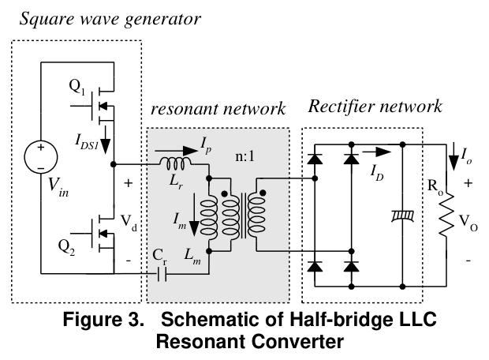

*LLC 컨버터의 네 블록. 스위치가 사각파를 만들고, 탱크가 그것을 정현파로 다듬으며, 트랜스포머가 강압과 절연을, 정류기가 DC 복원을 맡는다. 본 문서가 설계하는 것은 가운데 탱크다.*

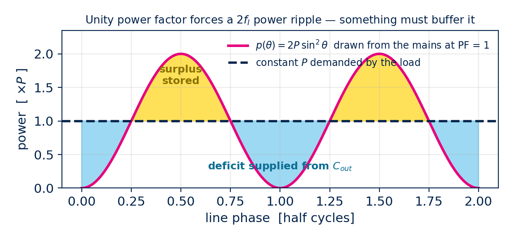

*역률 1이면 상용전원이 넘겨주는 순시 전력은 평탄하지 않다. 라인 피크에서 평균의 2배, 영교차에서 0이다. 부하는 항상 일정한 P를 원하므로, 그 차이를 어딘가에 저장해야 한다. 단일단에서는 그 저장소가 출력 커패시터로 옮겨간다.*

### 게인은 제어 변수가 아니다

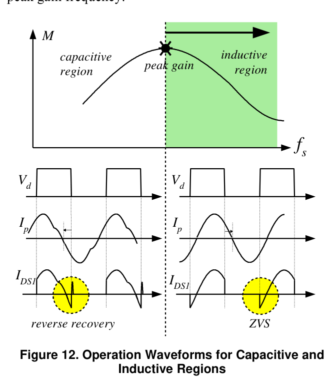

*유도성 영역(게인 피크의 오른쪽)에서는 탱크 전류가 구동 전압보다 뒤져 데드타임 동안 중점을 다음 레일까지 끌어내린다 — 이것이 ZVS다. 용량성 영역에서는 전류가 앞서 바디 다이오드가 하드 리커버리되고 게인 기울기까지 뒤집혀 출력이 제어를 벗어난다.*
*figure: onsemi / Fairchild AN-4151, Fig. 12*

> **⚠ 차용 그림의 기호는 본 문서와 다르다.** onsemi·Infineon·MPS 는 $f_o$ 를 **직렬 공진**(본 문서의 $f_r$)으로 쓴다. 본 문서에서 $f_o$ 는 $L_r+L_m$ 이 만드는 **하측 공진**이며 주파수 하한이다. 차용 그림에서 $f_o$ 라고 적힌 세로선은 전부 본 문서의 $f_r=151.7$ kHz 로 읽을 것.

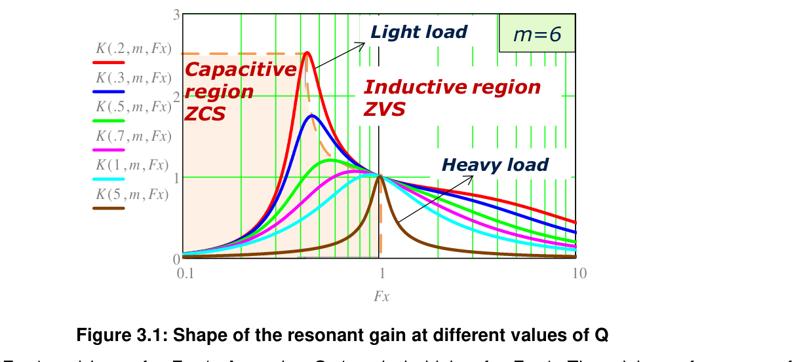

*부하별 게인 곡선과 용량성/유도성 경계. 점선은 각 곡선의 꼭짓점을 이은 선이며, 이 왼쪽이 용량성 영역(하드 스위칭, 금지)이다.*

일반적인 LLC 설계의 사고방식인 “주파수로 게인을 조절하여 출력 전압을 조정한다”는 본 토폴로지에서 성립하지 않는다. 양쪽 포트가 모두 전압원이기 때문이다.

- **출력**: $C_{out}$이 mF급이므로 라인 반주기(10 ms) 내에서 $V_{out}$은 고정.
- **입력**: 벌크 커패시터가 없으므로 버스 전압은 $|v_{ac}(\theta)|$ 그 자체.

따라서 순시 전압 게인은 제어 결과가 아니라 *경계 조건*으로 강제된다.

$$
M(\theta)=\frac{n\,V_{o,eff}}{V_{drive}(\theta)},\qquad V_{drive}=\begin{cases} V_{in}(\theta) & \text{full bridge}\\[2pt] V_{in}(\theta)/2 & \text{half bridge}\end{cases}\tag{[1]}
$$

$M$이 이미 결정되어 있으므로, FHA 게인식을 역으로 풀면 스위칭 주파수가 결정하는 것은 $Q$뿐이며 $Q$는 곧 부하, 즉 전력이다.

$$
M(f_n,Q)=\frac{1}{\sqrt{A^2+Q^2\!\left(f_n-\dfrac{1}{f_n}\right)^{\!2}}}, \qquad A=1+\lambda-\frac{\lambda}{f_n^{2}}\tag{[2]}
$$

$$
Q(f_n)=\frac{\sqrt{\dfrac{1}{M^{2}}-A^{2}}}{\left|f_n-\dfrac{1}{f_n}\right|}\tag{[3]}
$$

여기서 $f_n=f_{sw}/f_r$, $\lambda=L_r/L_m$, $Q=Z_0/R_{ac}$이다.

**즉 이 컨버터는 두 전압원 사이에 매달린 “주파수 제어 전력원”이다.** 역률 1이 되려면 순시 전력이 $p(\theta)=2P\sin^{2}\theta$를 따라야 하므로, $f_{sw}$를 라인 반주기에 걸쳐 변조하는 것이 곧 PFC 동작이다.

### 두 발산의 상쇄

$\theta\to 0$에서 요구 게인은 $M_{req}\propto 1/\sin\theta$로 발산하지만, 요구 부하는 $Q\propto\sin^{2}\theta$로 소멸한다. $Q\to 0$일 때 도달 가능한 게인 한계 $1/|A|$는 하측 공진 주파수 $f_o$에서 발산하므로, 게인 수요가 폭발하는 지점에서 게인 천장도 함께 폭발한다. 결과적으로 모든 $\theta$에서 해가 존재한다.

$$
f_o=\frac{1}{2\pi\sqrt{(L_r+L_m)C_r}}=f_r\sqrt{\frac{\lambda}{1+\lambda}}\tag{[4]}
$$

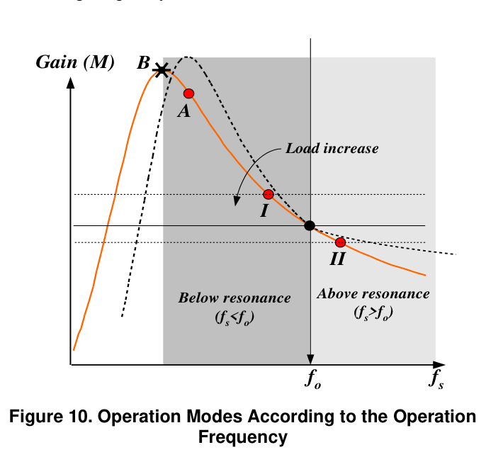

*부하가 늘면(Q 증가) 곡선이 낮고 평탄해져 도달 가능한 피크 게인이 떨어진다. 즉 **전부하가 탱크 설계의 최악 조건**이다.*
*figure: onsemi / Fairchild AN-4151, Fig. 10*

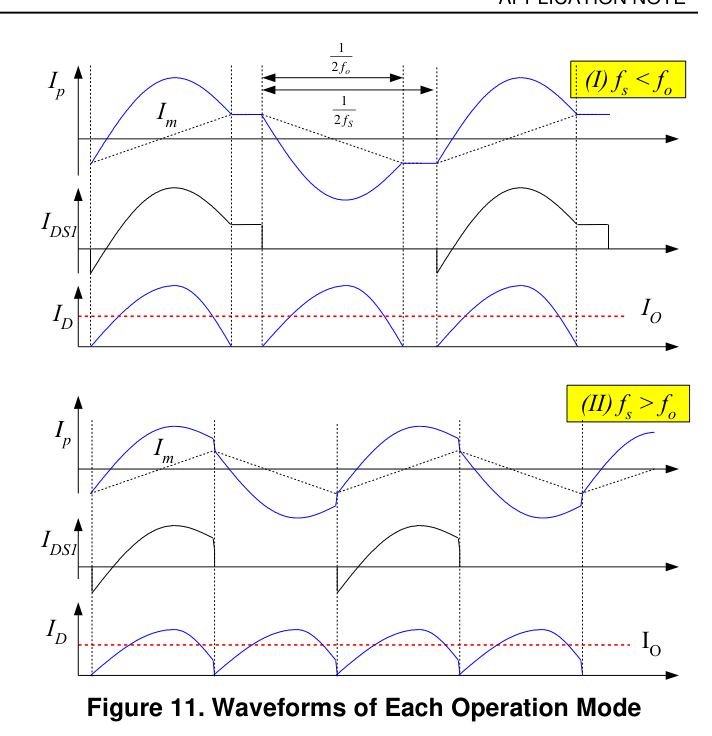

*$f_{sw}<f_r$(위)에서는 2차 전류가 반주기 안에 0에 도달해 정류기가 영전류로 꺼지지만 순환 전류가 크다. $f_{sw}>f_r$(아래)은 순환 전류가 최소이나 정류기가 하드 커뮤테이션된다. 단일단은 대부분 위쪽 영역에서 동작한다.*
*figure: onsemi / Fairchild AN-4151, Fig. 11*

> **▷** $f_o$가 이 컨버터의 **주파수 하한**이다. 영교차 근방에서 동작점은 $f_o$로 수렴한다. VCO의 최소 주파수 클램프 $f_{Min}$을 $f_o$ 이상으로 두는 것이 안전하다 (§5.1).

### Topology morphing

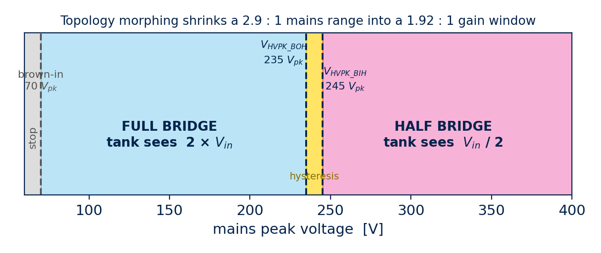

*같은 입력에서도 풀브리지는 하프브리지의 2배로 탱크를 구동한다. C_R이 DC를 차단하므로 하프브리지는 ±V_in/2만 보게 된다.*

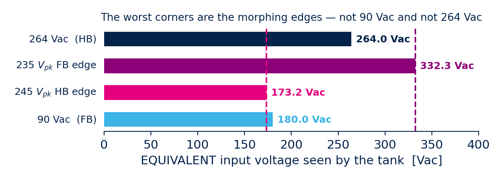

*그래서 저입력에서는 풀브리지를 써서 탱크가 2×90 = 180 Vac를 본 것처럼 만든다. §3.3의 등가 입력 전압이 이것이다.*

90–264 Vac는 2.9:1로 단일 탱크가 감당하기 어렵다. L6790A는 라인 피크가 235 V 이하에서는 풀브리지(구동 2배), 245 V 이상에서는 하프브리지로 무중단 전환하여 유효 게인 창을 약 1.9:1로 축소한다. 하프브리지 모드는 LOUT2를 정적으로 High로 유지하여 2번 레그의 로우사이드를 계속 도통시키는 방식이며, $C_r$이 DC를 차단하므로 탱크는 $\pm V_{in}/2$만 본다. 추가 하드웨어가 필요 없다.

### 제어 법칙 — FB 핀은 전력 지령이다

DS의 버스트 모드 식($R_{BM}=16.7\,\mathrm{k\Omega/V^2}\cdot R_{CS}P_{in,BM}$, $V_{BM,eq}=R_{BM}/100\mathrm{k}+0.5$)과 블록도의 곱셈기 표현을 결합하면 FB 전압의 물리적 의미가 드러난다.

$$
V_{FB}=V_{os}+\frac{2K_{HV}}{K_M K_{FF}}\,R_{CS}\,P_{in} =0.5\,\mathrm{V}+0.167\,\frac{\mathrm{V}}{\Omega\!\cdot\!\mathrm{W}}\;R_{CS}P_{in}\tag{[5]}
$$

$K_{HV}=3.34\times10^{-3}$, $K_M=0.2\,\mathrm{V^{-2}}$, $K_{FF}=0.2\,\mathrm{V^{3}}$, $V_{os}=0.5\,\mathrm{V}$이다. FB 조절폭 $V_{FB,range}=2.8$ V를 대입하면 $2.8/0.167=16.8\,\Omega\!\cdot\!\mathrm{W}$가 되어 DS §5.3.3의 최대전력 규칙과 정확히 일치한다.

**결과적으로 최대전력 제한, 버스트 진입점, 과부하 검출이 모두 FB 전압이라는 하나의 스케일 위에 놓인다.** 외부 옵토 루프는 “입력 전력”을 지령하고, 내부 루프가 그 전력을 라인 사이클에 $\sin^{2}\theta$로 분배한다.

## 전력단 설계

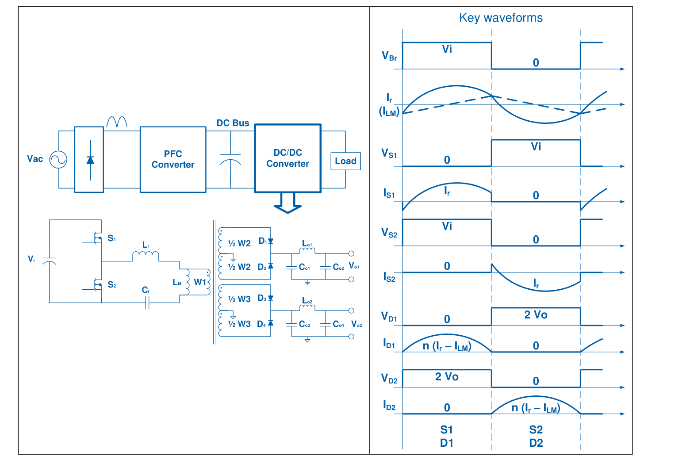

*전력은 왼쪽에서 오른쪽으로 흐르며 각 단이 자기 몫을 가져간다. §3.2는 P_out에서 거꾸로 올라가 P_in을 구한다.*

### 목표 사양

**표 — 설계 예제의 목표 사양**

| **항목**               | **기호**                                               | **예제 값**   |
| :--------------------------- | :----------------------------------------------------------- | :------------------ |
| 입력 전압 범위               | $V_{ac,min}$ / $V_{ac,max}$                              | 90 / 264 Vac       |
| 라인 주파수 (최소)           | $f_l$ / $f_{l,min}$                                      | 50 / 47 Hz         |
| 출력 전압                    | $V_{out}$                                                  | 25 V               |
| 출력 전력                    | $P_{out}$                                                  | 657.5 W              |
| 홀드업 시간 / 최저 허용 출력 | $T_{hold}$ / $V_{o,min}$                                 | 12 ms / 19 V      |
| 출력 리플 (pk-pk)            | $\Delta v_{out}$                                           | 5 %                |
| LLC단 목표 효율              | $\eta_{HB}$                                                | 98 %               |
| 직렬 공진 주파수 목표        | $f_r$                                                      | 150 kHz            |
| 설계용 최대 스위칭 주파수    | $f_{sw,max}$                                               | 225 kHz            |
| 설계용 최소 스위칭 주파수    | $f_{sw,min}$                                               | 50 kHz             |
| 출력 정류 구성               | $N_{rect}$                                                 | 1 (center-tap SR)   |
| 정류기 전압 강하             | $V_{rect}$                                                 | 0 V                |
| 하프브리지 중점 기생용량     | $c_{HB}$                                                   | 800 pF             |
| 데드타임 기준값 (설계 가정)  | $t_D$                                                      | 220 ns              |
| 입력 브리지 (동기 정류, 소자 1개) | $V_{f,BR}$ / $R_d$                                    | 0.08 V / 0.04 $\Omega$ |
| EMI 필터 등가 저항           | $R_{EMI}$                                                  | 0.15 $\Omega$         |
| 구성                         | —                                                           | universal, morphing |

### 전력 예산

$$
I_{out} =\frac{P_{out}}{V_{out}}\tag{[6]}
$$

$$
\eta_{rect} =\frac{V_{out}}{V_{out}+N_{rect}V_{rect}}\tag{[7]}
$$

$$
P_{sec} =\frac{P_{out}}{\eta_{rect}}\tag{[8]}
$$

$$
P_{in,LLC} =\frac{P_{out}}{\eta_{rect}\,\eta_{HB}}\tag{[9]}
$$

$$
I_{in,max} =\frac{P_{in,LLC}}{V_{ac,min}}\tag{[10]}
$$

손실 항목:

$$
P_{d,rect} =P_{out}\,\frac{1-\eta_{rect}}{\eta_{rect}}\tag{[11]}
$$

$$
P_{d,LLC} =P_{sec}\,\frac{1-\eta_{HB}}{\eta_{HB}}\tag{[12]}
$$

$$
P_{d,BR} =2\left(\frac{2\sqrt{2}}{\pi}I_{in,max}V_{f,BR}\right)+2R_d I_{in,max}^{2}\tag{[13]}
$$

$$
P_{d,EMI} =R_{EMI}\,I_{in,max}^{2}\tag{[14]}
$$

종합 효율과 정격 입력 전력:

$$
\eta_{ac} =\frac{P_{in,LLC}}{P_{in,LLC}+P_{d,BR}+P_{d,EMI}}\tag{[15]}
$$

$$
\eta_{tot} =\eta_{HB}\,\eta_{rect}\,\eta_{ac}\tag{[16]}
$$

$$
P_{in} =\frac{P_{out}}{\eta_{tot}}\tag{[17]}
$$

**예제:** $I_{out}=26.3$ A, $\eta_{rect}=100\,\%$(SR), $P_{in,LLC}=670.92$ W, $I_{in,max}=7.455$ A, $P_{d,LLC}=13.42$ W, $P_{d,BR}=5.520$ W, $P_{d,EMI}=8.336$ W, $\eta_{ac}=97.98\,\%$, $\eta_{tot}=96.02\,\%$, $\boxed{P_{in}=684.77\ \mathrm{W}}$

> **▷** $P_{in}$은 이후 $R_{CS}$(최대전력 제한)와 $C_{in}$ 산정의 기준이 된다.

### 등가 설계 입력 전압 — morphing의 효과

Morphing에서 탱크가 보는 구동 진폭은 라인 rms가 아니라 **그때의 브리지 모드**가 정한다. 따라서 등가 입력 전압은 라인 전압 범위와 다르다.

> **▷ 이 절은 morphing 이 켜져 있다고 보고 그 결과만 쓴다.** 임계 235 / 245 V$_{pk}$ 는
> **IC 고정 상수**라 설계자가 못 바꾼다. 반면 **morphing 을 켤지 말지와 브라운아웃 전압
> $V_{BO}$ 는 둘 다 $R_{CFG}$ 가 정하며, 그 선정은
> [브라운아웃 및 토폴로지 — CFG 핀](#cfg-pin) 에서 한다.** 여기서는 값을 특정하지 않는다.
> **고정 FB 나 고정 HB 로 쓸 경우 아래 치환을 하면 안 된다.** 따라서 등가 입력 전압은 라인 전압 범위의 양 끝이 아니라 **morphing 임계점**에서 최악이 된다.

| 조건                                                       | 브리지 |             구동 진폭 (peak) |             등가 입력 (rms) |
| :--------------------------------------------------------- | :----- | ---------------------------: | --------------------------: |
| $V_{ac,min}=90$ Vac                                      | FB     |    $\sqrt2\cdot90=127.3$ V |                   180.0 Vac |
| **$V_{HVPK\_BIH}=245\ \mathrm{V_{pk}}$ (HB 하한)** | HB     |            $245/2=122.5$ V | **173.2 Vac** ← 최소 |
| **$V_{HVPK\_BOH}=235\ \mathrm{V_{pk}}$ (FB 상한)** | FB     |                    $235$ V | **332.3 Vac** ← 최대 |
| $V_{ac,max}=264$ Vac                                     | HB     | $\sqrt2\cdot264/2=186.7$ V |                   264.0 Vac |

$$
V_{in,min} =\min\!\left(2\,V_{ac,min},\ \frac{V_{HVPK\_BIH}}{\sqrt2}\right)\tag{[18]}
$$

$$
V_{in,max} =V_{ac,max},\qquad V_{in,FBmax}=\frac{2\,V_{HVPK\_BOH}}{\sqrt2}\tag{[19]}
$$

$$
V_{in,res} =V_{in,nom}\,(1-\delta_{res})\tag{[20]}
$$

$V_{in,nom}$은 공진점 근방에서 운전하고 싶은 등가 입력 전압, $\delta_{res}$는 공진점 위쪽 변조 여유(5 % 권장)이다.

**예제:** $V_{in,min}=\min(180,\,173.24)=\mathbf{173.24}$ Vac, $V_{in,max}=264$ Vac, $V_{in,FBmax}=\mathbf{332.34}$ Vac, $V_{in,nom}=225$ Vac, $\delta_{res}=5\,\%\Rightarrow V_{in,res}=213.75$ Vac. 탱크가 보는 범위는 90–264 Vac(2.93:1)가 아니라 **173.2–332.3 Vac(1.92:1)** 이다.

> **▷** **등가 입력 범위는 173.2–332.3 Vac (1.92 : 1)이다.** §2.3에서 말한 "게인 창 약
> 1.9 : 1"이 바로 이 비이며, 180–264 Vac (1.47 : 1)가 아니다. 위 표의 두 굵은 행이 탱크
> 설계의 진짜 양 끝이고, 90 Vac와 264 Vac는 **둘 다 그 안쪽**이다.

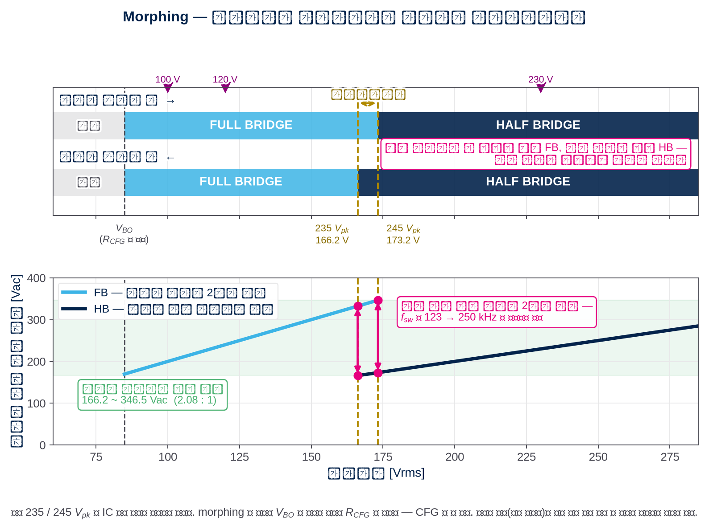

*어느 라인 전압에서 풀브리지이고 어디부터 하프브리지인가. **위 패널의 두 레인이 이 그림의
핵심이다** — 히스테리시스 밴드(235–245 V$_{pk}$) 안에서는 같은 전압인데도 올라온 쪽은
아직 FB, 내려온 쪽은 이미 HB다. **아래 패널은 그것이 탱크에 무엇을 하는지 보여준다** —
모드가 넘어가는 순간 탱크 구동 전압이 2 : 1 로 뛰고, $f_{sw}$ 가 127 → 249 kHz 로
따라가야 한다. 보라 삼각형은 실사용 계통으로, 모두 밴드 밖에 있다. 왼쪽 $V_{BO}$ 선의 위치는 $R_{CFG}$ 가 정하며 [CFG 핀 절](#cfg-pin)에서 고른다.*

#### 히스테리시스 밴드 — 진짜 최악은 8 % 더 넓다

위 표는 각 임계값을 **그 모드가 보장되는 쪽**에 배정한 것이다. 그런데 235–245 V$_{pk}$
사이에서는 **라인 전압만으로 모드가 정해지지 않는다** — 어느 쪽에서 올라왔는지에 달려 있다.

| 이력 | 235–245 V$_{pk}$ 구간의 모드 | 그때 탱크가 보는 등가 입력 |
| :--- | :--- | ---: |
| 저입력에서 **올라오는** 중 | 245 V$_{pk}$ 를 넘을 때까지 **FB 유지** | 최대 $2\times245/\sqrt2=\mathbf{346.5}$ Vac |
| 고입력에서 **내려가는** 중 | 235 V$_{pk}$ 아래로 갈 때까지 **HB 유지** | 최소 $235/\sqrt2=\mathbf{166.2}$ Vac |

따라서 **설계가 실제로 감당해야 하는 범위는 166.2–346.5 Vac (2.08 : 1)** 이다.

| | 173.2–332.3 기준 | 166.2–346.5 기준 |
| :--- | ---: | ---: |
| 최악 요구 게인 | 1.2294 | **1.2817** |
| 탱크 피크 게인 여유 | 15.8 % | **11.1 %** |
| $f_{sw,max}$ | 249.0 kHz | **262.7 kHz** |
| VCO 상한 대비 여유 | 28.3 % | **21.7 %** |
| 설계 코너 $T_{ZC}$ | 460 ns | **379 ns** |
| ZVS 여유 | 2.09배 | **1.72배** |

> **▷ 본 설계는 넓은 범위로도 전부 통과한다** — 설계를 바꿀 필요는 없다. 다만 여유가
> 위와 같이 줄어드는 것이므로, 사양을 조이거나 탱크를 다시 잡을 때는 **좁은 쪽 숫자를
> 쓰지 말 것.**

> **▷ 실사용에서 이 밴드에 앉는 계통은 없다.** 235–245 V$_{pk}$ 는 166–173 Vrms 이고,
> 100/120 V 계통도 220/230/240 V 계통도 그 밖에 있다. 그래서 실제로는 기동할 때 모드가
> 한 번 정해지고 그대로 간다. 이 밴드를 만나는 것은 **AC 소스로 임계를 통과시키는
> 시험**과 **라인 딥/서지 시험**뿐이다 — 그리고 그것이 시험에서 하는 일이다.
>
> **▷ 프로그래머블 AC 소스라면 램프가 아니라 스텝으로 볼 것.** 램프는 전압 루프에 따라올
> 시간을 준다. 임계를 사이에 두고 한 라인 사이클 만에 건너뛰는 **스텝**(예: 175 → 160 V,
> 그리고 그 반대)이 진짜 최악이며, 그때 브리지 구동은 2 : 1 로 뛰는데 루프는 아직 이전
> 동작점에 있다.

> **⚠ 위험 사항 — 모드 전환 순간의 출력 강하.** 임계를 지나 브리지가 바뀌면 탱크 구동
> 전압이 **한 라인 사이클 만에 2 : 1 로 변한다.** 출력을 유지하려면 $f_{sw}$ 가
> 127 ↔ 249 kHz 로 따라가야 하는데, 전압 루프의 교차는 17.6 Hz(시상수 9.1 ms)다.
> **FB → HB 방향(구동이 절반이 되는 쪽)에서 회복이 끝날 때까지 출력이 처진다.**
>
> **상승 방향은 IC 가 막는다** — 구동이 2배가 되어도 최대전력 제한 \[81\]이 $P_{in}$ 을
> 묶으므로 초과분은 작고, OVP1 까지 100 ms 이상 걸린다.
>
> **강하 방향은 출력 뱅크가 받는다.** 이 사건은 **홀드업보다 가볍다** — 홀드업은 전력이
> **완전히 0** 인 채로 12 ms 를 견디는 조건이고 $C_{out}$ 은 이미 그것을 만족한다
> (13.42 ms). 전환 과도는 전력이 줄 뿐 끊기지 않으므로 같은 뱅크가 더 쉽게 받는다.
> **따라서 이 사건 때문에 $C_{out}$ 을 늘리거나 루프를 빠르게 할 이유는 없다.**
>
> **다만 그 포함관계를 시간영역으로 확인한 적은 없다.** 루프가 홀드업 예산(12 ms) 안에
> 회복하지 못하면 두 사건이 겹칠 때 여유가 줄어든다. 대신호 스텝 응답을 한 번 풀어
> 확인하는 것이 남아 있다.


> **▷** $\lambda$ 의 최소 게인 조건 \[26\] 은 **탱크가 보는 최고 등가 입력 $V_{in,FBmax}$(=332.3)** 에서 세운다 — 요구 게인이 가장 낮은 점이고, 무부하 점근선 $1/(1+\lambda)$ 이 그 아래에 있어야 무부하 조절이 주파수로 끝난다. 본 설계(7.5:1)는 $M_{FBthr}=0.641<0.645$ 라 **점근선을 0.7 % 밑돌아 \[26\] 이 해를 잃는다** — 그때는 무부하·고입력이 버스트 모드로 넘어갈 뿐 전부하 설계는 영향이 없다(부록 C.31). 권선비를 9:1 로 올리면 0.793 > 0.686 으로 해가 생긴다. $V_{in,max}$(=264, 최고 라인·HB)는 §4 의 동작점 하나로만 쓴다. **전부하 최대 운전 주파수는 $V_{in,FBmax}$ 에서 결정된다** (§4.2).

> **▷** Morphing 없이 고정 풀브리지 또는 고정 하프브리지로 쓸 경우 이 치환을 하면 안 된다. 고정 HB이면 $V_{in,min}=V_{ac,min}$, 고정 FB이면 $V_{in,max}=2V_{ac,max}$가 되어 게인 창이 훨씬 넓어지고 사실상 설계가 성립하지 않는다.

### 권선비

1차측으로 반사되는 등가 출력 전압을 먼저 정의한다. 정류기 강하는 도통 경로에 직렬로 놓인 소자 개수($N_{rect}$)만큼 더해진다.

$$
V_{o,eff}=V_{out}+N_{rect}\,V_{rect}\tag{[21]}
$$

반사 전압은 $n\,V_{o,eff}$이고, 하프브리지 등가 구동 진폭은 $\sqrt{2}V_{in,res}/2$이므로 공진점($M=1$) 조건에서

$$
n=\frac{\sqrt{2}\;V_{in,res}}{2\,V_{o,eff}}\tag{[22]}
$$

**예제:** $V_{o,eff}=25$ V($N_{rect}=1$, SR 이므로 정류 강하 0), $n=\sqrt2\cdot213.75/50=6.046$. **다만 $n$ 은 여기서 그대로 쓰지 않는다.** 감는 것은 $n_T=n\sqrt{1+\lambda_{act}}$ 이고(§3.10), 3코어 직병렬(1차 직렬·2차 병렬)에 2차 2턴이면 세트 권선비는 $3N_p/2$ — **1.5 단위로만** 감을 수 있다. $6.046\times\sqrt{1.55}=7.53$ 에 가장 가까운 것이 **유닛 5 : 2, 세트 15 : 2 = 7.5** 이므로 $n_T=7.5$ 를 먼저 정하고 $n=n_T/\sqrt{1+\lambda_{act}}=6.024$ 를 거꾸로 얻는다. 반사 전압은 $n\,V_{o,eff}=150.6$ V 가 된다. **$n$ 과 $n_T$ 를 혼동하면 게인이 통째로 어긋난다.**

> **▷** **ST 설계 툴과 다른 부분이다.** Tool은 $V_{o,eff}=(V_{out}+N_{rect}V_{rect}) /N_{rect}$로 두어 $N_{rect}=2$에서 $V_{o,eff}=30$ V, $n=5$를 출력한다. 반사 전압 $n\,V_{o,eff}=150$ V는 같으므로 *게인과 탱크 설계값은 동일*하지만, $n$ 자체를 쓰는 모든 전류식($I_{trafo,pk}$, $I_{Lm,pk}$, $n_T$)이 어긋난다. 근거와 검증은 부록 C.5 참조. $N_{rect}=1$(센터탭)에서는 양쪽 정의가 일치한다.

> **▷ 외부 검증 — TI SDAA419 "Turn Ratio Correction Factor for Integrated Transformer LLC Design".** "$n$ 이 곧 물리 권선비"라는 오해가 흔하므로 참고 문헌 5종(TDK, onsemi AN-4151, Infineon AN 2013-03·ICL5102, TI SDAA419)을 대조했다. TI 가 자사 EVM(UCC25661EVM-128, 390 VDC/12 V/15 A, $L_P=510\,\mu$H, $L_K=85\,\mu$H 실측)에서 **똑같은 증상**을 보고한다 — "the turn ratio is not matched our target when we designed the resonant inductor which is integrated inside the transformer." 2차 누설까지 반영해 유도한 보정 인수 $L_P/L_M$은 대수적으로 **정확히 $n_T/n=\sqrt{1+\lambda}$와 같다**($L_M=L_P\sqrt{1-L_K/L_P}\Rightarrow L_P/L_M=\sqrt{L_P/(L_P-L_K)}=\sqrt{1+\lambda}$, $\lambda=L_K/(L_P-L_K)$). 무보정 권선비(15.35)보다 보정 권선비(16.8)가 실제 보드의 물리비(33:2:2=16.5)에 더 가깝고, SIMPLIS 시뮬레이션(무보정 115.53 kHz vs 보정 100.42 kHz)과 오실로스코프 실측(97.66 kHz)이 전부 보정 쪽을 확인한다. TDK·onsemi·Infineon(LCC 버전)의 예제가 이 보정 없이도 맞아떨어진 것은 그들의 $\lambda$가 작아(0.14–0.25) 2차 턴수 반올림에 묻혔기 때문이다 — 본 설계의 $\lambda_{act}=0.55$, 2차 2턴에서는 묻히지 않는다.

### 요구 게인 범위

$$
M_{V\!min,pk} =\frac{2\,n\,V_{o,eff}}{\sqrt{2}\,V_{in,min}}\tag{[23]}
$$

$$
M_{V\!max,pk} =\frac{2\,n\,V_{o,eff}}{\sqrt{2}\,V_{in,max}}\tag{[24]}
$$

이 두 값은 *라인 피크*에서의 게인이다. 라인 위상 전체에 대해서는

$$
M_{req}(\theta,V_{ac})=\frac{2\,n\,V_{o,eff}}{\sqrt{2}\,V_{ac}\sin\theta}\tag{[25]}
$$

**예제:** $M_{V\!min,pk}=1.2294$ (173.24 Vac 등가), $M_{V\!max,pk}=0.8068$ (264 Vac), 그리고 $V_{in,FBmax}$(332.34 Vac 등가)에서 $M_{FBthr}=0.6409$. 이 마지막 값이 무부하 게인의 점근선 $1/(1+\lambda_{act})=0.6452$ **아래**에 있다 — 0.7 % 차이지만, 무부하로는 어떤 주파수에서도 이 게인에 닿지 못한다. 그 영역은 버스트 모드가 맡는다(부록 C.31). 권선비를 9:1 로 올리면 요구 게인이 0.793 이 되어 점근선(0.686) 위로 올라가고 약 231 kHz 에 무부하 해가 생긴다.

### $\lambda=L_r/L_m$ 선정

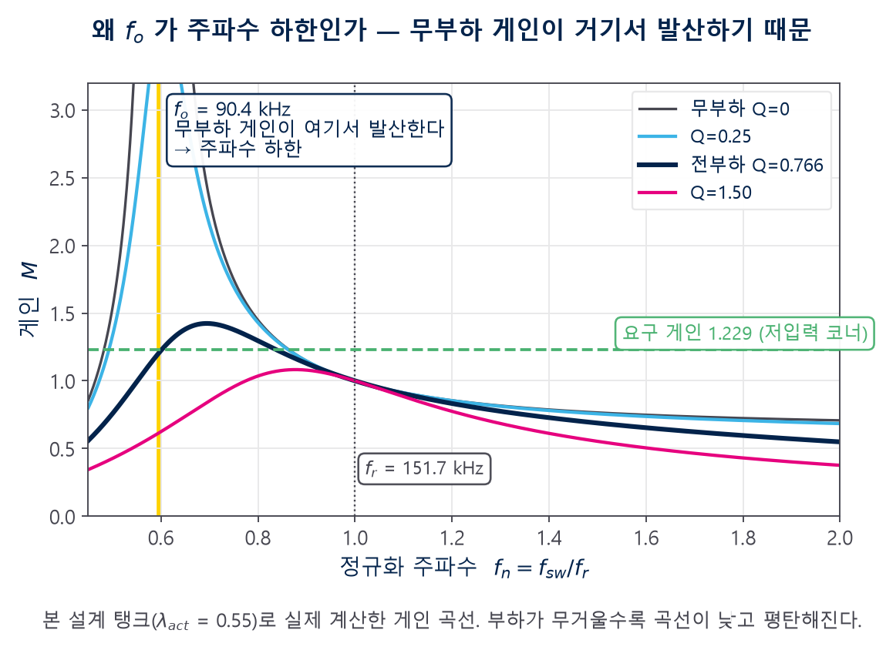

*본 설계의 탱크($\lambda_{act}=0.55$)로 실제 계산한 게인 곡선. $f_o=90.4$ kHz 가 주파수 하한이며, 영교차 근방에서 동작점이 이쪽으로 수렴한다. λ가 클수록 곡선이 높고 가팔라져 넓은 게인을 낼 수 있으나 순환 전류가 커진다.*

세 가지 하한 조건을 모두 계산한 뒤 가장 큰 값을 취한다.

**(a) 최소 게인 조건** — 탱크가 보는 최고 등가 입력(FB 문턱, $V_{in,FBmax}$)에서 $M_{FBthr}$ 를 만들 수 있어야 한다. $Q\to0$일 때 고주파 점근 게인이 $1/(1+\lambda)$이므로

$$
\lambda_{min,1}=\frac{1}{M_{FBthr}}-1\tag{[26]}
$$

**(b) 최대 주파수 조건**

$$
\lambda_{min,2}=\frac{\lambda_{min,1}}{1-\left(\dfrac{f_r}{f_{sw,max}}\right)^{2}}\tag{[27]}
$$

**(c) 데드타임을 고려한 최대 주파수 조건**

$$
\lambda_{min,TD}=\frac{\lambda_{min,1}}{1-\dfrac{\pi^{2}}{8}\left(\dfrac{f_r}{f_{sw,max}}\right)^{2}}\tag{[28]}
$$

**(d) 최소 주파수 조건**

> **▷ $m$ 이 작을수록 게인이 커진다.** Infineon AN 의 게인 곡선군은 $m=3\sim7$ 만 그린다 — **본 설계의 $m=2.82$ 는 그 차트 밖**이다. 같은 이야기를 아래 \[26\]의 피크 게인 도표가 하고, 그쪽에는 우리 동작점이 들어 있다.

$$
\lambda_{min,3}=\frac{\left(\dfrac{f_{sw,min}}{f_r}\right)^{2}}{1-\left(\dfrac{f_{sw,min}}{f_r}\right)^{2}}\tag{[29]}
$$

$$
\lambda=\max\bigl(\lambda_{min,1},\,\lambda_{min,2},\,\lambda_{min,TD},\,\lambda_{min,3}\bigr)\tag{[30]}
$$

**예제:** $\lambda_{min,1}=0.5604$, $\lambda_{min,2}=1.0087$, $\lambda_{min,TD}=1.2407$, $\lambda_{min,3}=0.1250 \Rightarrow \boxed{\lambda=1.2407}$. 실제 탱크는 $\lambda_{act}=0.55$ 로 **설계 $\lambda$ 의 44 % 에 그친다** — §3.9 에서 이유를 본다. $m=L_p/L_r=1+1/\lambda_{act}=2.82$ — **일반 LLC 의 5–10 과는 다른 세계다.**

> **▷ $f_{sw,max}$ 는 탱크를 검사하는 값이 아니라 계산하는 값이다.** \[27\]·\[28\] 이 그것으로 **나눈다.** $f_r/f_{sw,max}=150/225$ 이면 제곱비가 44.4 % 라 두 분모가 1 훨씬 아래로 떨어지고, 요구 $\lambda$ 가 $\lambda_{min,1}=0.560$ 에서 1.009·1.241 로 **두 배 넘게** 오른다. $f_{sw,max}$ 를 $f_r$ 쪽으로 밀면 분모가 0 이 되어 발산한다. 그리고 225 kHz 의 출처는 ST 툴의 관례 $1.5\times f_r$ 이다 — **한계가 아니라 선택**이고, 탱크의 상류에 있어 바꾸면 $L_m$ 이 따라 움직인다. 설계 시트에서 "최대"라는 이름이 이렇게 상류에 있는 경우는 드물어서 라운드 넘버를 무심코 넣기 쉬운 자리다. 실리콘 한계인 $f_{Max}$(§5.1, $R_T\cdot C_T\cdot T_{idle}$ 이 정하고 $k_{ceil}$ 이 사후 판정)와 **종류가 다르다.**

> **▷** **단일단 LLC의 지문(fingerprint)이다.** 일반 LLC는 $m=L_p/L_r=1+1/\lambda=6\sim11$ (즉 $\lambda=0.1\sim0.2$)이지만 여기서는 $\lambda\approx0.5$, 즉 $L_m\approx2L_r$이다. 자화 전류가 크고 순환 전류가 지배적이며 공진 주파수 아래에서 대부분 동작한다. 관습적인 $L_m/L_r=5\sim10$을 적용하면 저입력에서 아예 기동하지 않는다. 이것이 승압단을 제거한 대가이다.

### 등가 부하 저항과 품질 계수

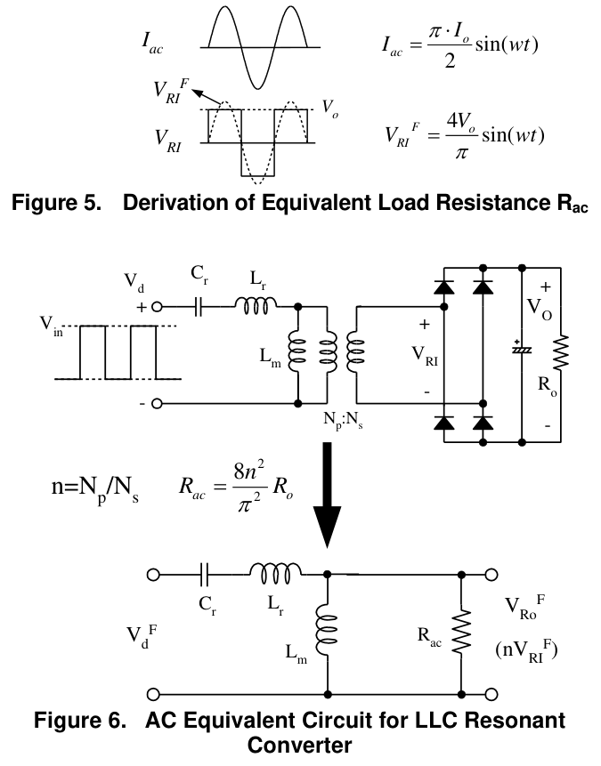

*계산에서는 트랜스포머·정류기·부하를 R_ac라는 저항 하나로 대체한다. Q는 Z0/R_ac, 즉 탱크가 얼마나 무겁게 걸려 있는지를 나타내는 수다.*

$$
R_{ac}=\frac{4}{\pi^{2}}\,n^{2}\,\frac{V_{o,eff}^{2}}{P_{in,LLC}}\tag{[31]}
$$

> **▷** 일반 LLC의 $R_{ac}=(8/\pi^2)n^2V_o^2/P$와 비교하면 계수가 절반이다. 이는 $R_{ac}$를 *순시 전력 $2P_{in}$*(라인 피크값)에서 정의한 것과 같으며, 결과적으로 아래의 $Q$는 라인 피크에서의 값이 된다. 임의의 위상에서는 $Q(\theta)=Q_{pk}\sin^{2}\theta$이다.

ZVS를 보장하기 위한 $Q$ 상한 두 가지:

$$
Q_{ZVS,1} =\frac{\lambda}{M_{V\!min,pk}}\sqrt{\frac{1}{\lambda}+\frac{M_{V\!min,pk}^{2}}{M_{V\!min,pk}^{2}-1}} \qquad (M_{V\!min,pk}>1)\tag{[32]}
$$

$$
Q_{ZVS,2} =\frac{2}{\pi}\,\lambda\,\frac{t_D}{R_{ac}\,c_{HB}}\tag{[33]}
$$

$$
Q_{ZVS} =\frac{1}{1+m_{ZVS}}\min\bigl(Q_{ZVS,1},\,Q_{ZVS,2}\bigr)\tag{[34]}
$$

> **▷** \[32\]는 "요구 게인이 게인 곡선의 꼭짓점에 정확히 놓이는 $Q$"의 **닫힌형 근사**이다. 검산하면 $Q=Q_{ZVS,1}$에서의 실제 피크 게인은 요구 게인보다 조금 높다(본 설계: $M=1.2294$ 에 대해 1.2315, 0.2 %; $\lambda$ 가 작은 탱크에서는 약 1 %). 즉 \[32\]는 약간 보수적이다. \[33\]은 데드타임 중 중점 천이에 필요한 전하 조건에서 나온 별개의 상한이며, 본 예제에서는 \[32\]가 지배한다.

$$
Z_0 =R_{ac}\,Q_{ZVS}\tag{[35]}
$$

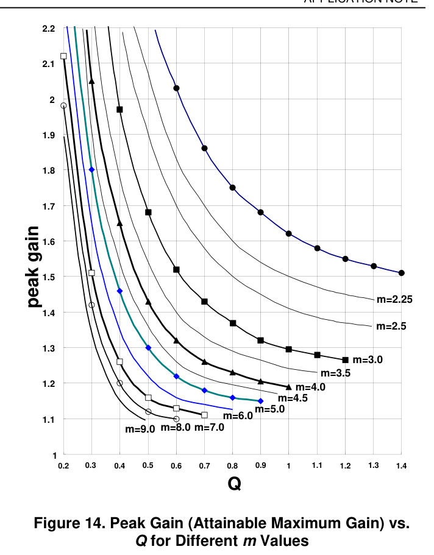

*Q와 $m$의 조합으로 결정되는 도달 가능 최대 게인. 요구 게인을 만족하는 $(Q,m)$ 쌍을 이 도표에서 읽는 것이 일반 LLC의 표준 절차이며, 본 문서의 \[26\]~\[34\]는 같은 일을 닫힌형으로 한다.*
*figure: onsemi / Fairchild AN-4151, Fig. 14*

$m_{ZVS}$는 ZVS 여유(15 % 권장)이다.

**예제:** $R_{ac}=13.70\,\Omega$, $Q_{ZVS,1}=1.957$, $Q_{ZVS,2}=15.85$, $m_{ZVS}=15\,\%\Rightarrow Q_{ZVS}=1.702$, $Z_0=23.32\,\Omega$

### ZVS 검증

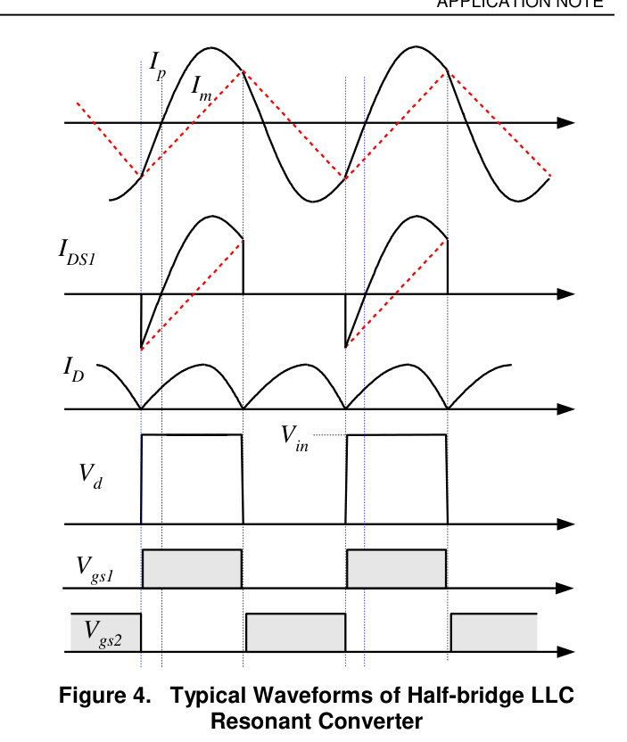

*한 스위칭 주기의 파형. 데드타임 동안에도 탱크 전류가 계속 흘러 다음 스위치의 전압을 0까지 끌어내린다. §3.8의 검증은 결국 "그 일이 데드타임 안에 끝나는가"를 묻는 것이다.*

정규화 최소 주파수, 탱크 위상, 공진 전류 영교차 시각을 구해 데드타임과 비교한다.

$$
f_{n,min}=\frac{1}{\sqrt{1+\dfrac{1}{\lambda}\left(1-M_{V\!min,pk}^{-\left[1+(Q_{ZVS}/Q_{ZVS,1})^{5}\right]}\right)}}\tag{[36]}
$$

$$
\varphi_{min}=\arctan\!\left[ \frac{\bigl(\lambda^{2}+\lambda+(f_{n,min}^{2}-1)Q_{ZVS}^{2}\bigr)f_{n,min}^{2}-\lambda^{2}} {Q_{ZVS}\,f_{n,min}^{3}}\right]\tag{[37]}
$$

$$
T_{ZC}=\frac{\varphi_{min}}{2\pi\,f_{n,min}\,f_r}\tag{[38]}
$$

$$
\boxed{\;T_{ZC}\ \ge\ t_D\;}\qquad\text{(만족하지 않으면 } m_{ZVS}\text{를 키운다)}\tag{[39]}
$$

\[36\]–\[38\]은 **닫힌형 지름길**이다. $f_{n,min}$의 지수 5(부록 C.9)는 경험적 피팅이라 ZVS 경계 근처에서 오차가 커진다. 최종 확인은 반드시 선정된 탱크로 **실제 동작점을 풀어서** 한다.

$$
\boxed{\;\min_{\theta,\,V_{ac},\,P_o}\ T_{ZC}=\frac{\varphi\bigl(f_n(\theta),\,Q(\theta)\bigr)}{2\pi f_{sw}(\theta)}\ \ge\ t_D\;}\tag{[38a]}
$$

여기서 $f_n(\theta)$는 \[59\]의 해, $\varphi$는 \[37\]이며 — \[37\]은 탱크 입력 임피던스의 위상각과 **엄밀히 동일**함을 확인하였다(수치 오차 $10^{-16}$ 수준). 즉 \[38a\]의 정확도는 FHA 자체의 정확도와 같다.

**예제(선정 탱크 $C_r$ 100 nF · $L_r$ 11 µH · $L_m$ 20 µH로 \[38a\]를 전 영역 스윕):**

| 부하            |        173.2 Vac | 180 Vac | 225 Vac | 264 Vac | 332.3 Vac |
| :-------------- | ---------------: | ------: | ------: | ------: | --------: |
| 100 %           |          **460** |     517 |     671 |     674 |       603 |
| 75 %            |              757 |     776 |     791 |     720 |       561 |
| 50 %            |             1084 |    1079 |     971 |     808 |      501† |
| 25 %\*          |             1470 |    1445 |    1231 |     974 |      401† |

\*버스트 진입점이 $P_{in,BM}=75$ W($\approx$ 11 %)이므로 그 아래는 연속 운전 영역이 아니다.
†FB 코너에서 50 % 부하 아래는 요구 $f_{sw}$ 가 VCO 상한 $f_{Max}=319.6$ kHz 를 넘는다(50 % 322 kHz · 25 % 436 kHz) — 오실레이터가 걸려 실제로는 버스트로 넘어가는 점이다(§5.1). 표의 값은 그 주파수가 나온다고 가정한 계산값이다.

탱크를 설계한 코너(전부하 · 173.2 Vac 등가 · $\theta=90^\circ$)는 **460 ns**($f_n=0.8378$, $\varphi=0.3675$ rad)로 $t_D=220$ ns 대비 **여유 2.09배**다. 표에서 가장 작은 값은 25 % 부하 · 332.3 Vac 등가의 401 ns(1.82배)이지만 그 점은 오실레이터가 닿지 못하는 곳이다(†) — **닿는 범위 안의 최악은 설계 코너의 460 ns 이고, FB 코너 50 % 부하가 501 ns 로 그 다음**이다.

> **▷ 왜 경부하·고입력이 ZVS 의 최악점인가.** 중점을 넘기는 전하는 자화전류가 나르고 그 피크는 $V_{in}/(4f_{sw}L_m)$ 이다. 부하를 덜면 게인을 깎으려고 $f_{sw}$ 가 올라가 그 전류가 떨어지는데 중점 용량은 그대로다. 설계 코너(전부하·저입력)는 *게인* 의 최악점이지 ZVS 의 최악점과 같으란 법이 없다 — 본 설계는 FB 코너에서 부하를 덜수록 $T_{ZC}$ 가 줄고(603 → 501 → 401 ns), VCO 상한이 막지 않았다면 25 % 부하가 최악이 됐을 것이다. 권선비가 커서 공진 깊이 아래에 앉는 탱크(9:1, $L_m$ 24 µH)에서는 전부하 코너가 최악(530 ns)으로 남지만, 그것은 그 탱크의 성질이지 법칙이 아니다. **한 점 검사로 끝내지 말 것.**

관련 전류:

$$
I_{R1,pk} =\frac{2\pi\,P_{out}}{\sqrt{2}\;\eta_{HB}\,V_{in,min}\cos\varphi_{min}}\tag{[40]}
$$

$$
I_{R0} =I_{R1,pk}\sin\varphi_{min}\tag{[41]}
$$

$$
T_{T} =c_{HB}\,\frac{\sqrt{2}\,V_{in,min}}{I_{R0}}\tag{[42]}
$$

$I_{R0}$은 ZVS를 이루기 위한 최소 전류, $T_T$는 중점 천이 시간이다.

**예제:** 설계 코너(HB morphing 경계 173.2 Vac 등가, $\theta=\pi/2$)에서 $T_{ZC}=\mathbf{460}$ ns $\ge t_D=220$ ns **(여유 2.09배)**; 오실레이터가 닿는 범위의 다른 최악 후보는 FB 코너 50 % 부하의 501 ns. $I_{R1,pk}=18.44$ A, $I_{R0}=6.62$ A, 중점 전이 시간 $T_T=29.6$ ns.

> **⚠ \[36\]–\[38\] 닫힌형을 쓰지 말 것.** 같은 탱크에 대해 닫힌형은 292.5 ns 를 준다.
> 오차의 **부호가 정해져 있지 않다** — 다른 탱크(33 nF / 34 µH / 65 µH, 240 W 급)에서는 닫힌형이 **23 % 낙관적**
> 이었고 본 설계에서는 36 % 보수적이다. 원인이 둘이라(적합식 \[36\], 그리고 실제 동작 $Q$
> 가 아니라 설계값 $Q_{ZVS}$ 로 평가) 탱크마다 비율이 달라진다. **낙관적일 수 있다는 것이
> 위험한 쪽이다** — 없는 ZVS 여유를 있다고 보고한다. 반드시 \[38a\] 전 영역 스윕으로 확인한다.

> **▷** $I_{R1,pk}$는 라인 피크에서의 순시 전력 $2P_{out}/\eta$와 하프브리지 등가 구동 진폭 $\sqrt2 V_{in,min}/2$로부터 유도된다. ST 툴은 이 자리에 $P_{out}$(평균)을 넣어 정확히 절반인 9.22 A를 출력한다. 전력 수지로 독립 검증하면 $V_1=(4/\pi)(\sqrt2\cdot173.24/2)=155.97$ V, $2P_{inst}/V_1=17.21$ A이고 $17.21/\cos\varphi_{min}=18.44$ A로 위 식과 일치한다. $I_{R1,pk}$는 $I_{R0}$/$T_T$(참고용 확인값)에만 쓰이므로 설계 결과에 미치는 영향은 없으나, ZVS 여유를 과소평가하는 방향이라는 점만 기억하면 된다.

### 공진 탱크 소자값

$$
C_r =\frac{1}{2\pi f_r Z_0}\tag{[43]}
$$

$$
L_r =\frac{1}{C_r\,(2\pi f_r)^{2}}\tag{[44]}
$$

$$
L_m =\frac{L_r}{\lambda}\tag{[45]}
$$

$C_r$ 계산 후 표준값으로 반올림하고, 그 선정값으로 $L_r$을 다시 계산한다. $L_m$도 선정된 $L_r$을 사용한다.

> **▷** **보통은 $L_m$ 을 계산값보다 크게 잡지 말 것.** $L_m$은 갭으로 정하는 연속 변수라 표준값 제약이 없다. 위로 반올림하면 $\lambda_{act}=L_r/L_m$이 설계 $\lambda$보다 작아지고, 게인 곡선이 낮아져 **ZVS 여유가 줄어든다.**

**예제:** $C_r=45.5\to \mathbf{100\,nF}$, $L_r=11.26\to \mathbf{11\,\mu H}$, $L_m=8.87\to \mathbf{20\,\mu H}$

> **▷ $L_m$ 이 계산값 *위* 로 갔다 — 규칙 위반이 아니라 권선의 결과다.** 여기서 $L_m$ 은 자유 변수가 아니다. 권선이 $n_T=N_xN_p/N_s=7.5$ 를 못박고 §3.4 의 $n=6.024$ 가 정해지면 $\lambda_{act}=(n_T/n)^2-1=0.55$ 가 강제되고, $L_m=L_r/\lambda_{act}=20\,\mu$H 가 **유일한 값**이다. 대가는 $\lambda_{act}$ 가 설계 $\lambda$ 의 44 % 에 그친다는 것인데, \[26\]–\[28\] 은 **무부하** 조건이라 전부하 판정과 무관하다 — 부하가 걸린 코너는 ZVS 여유(2.09배)와 $f_{sw,max}$ 로 따로 판정하고 둘 다 통과한다. $C_r$ 은 계산값보다 **두 배 넘게** 잡았다 — $Q_{pk}$ 를 $Q_{ZVS}$ 의 절반 아래로 낮춰 ZVS 여유를 산다.

> **▷** 고정 하프브리지 구성(LOUT2를 GND에 연결)에서는 **분할 공진 커패시터**가 필수다. 이 경우 $C_r$을 $C_r/2$ 두 개로 나누어 하프브리지 두 암에 각각 배치한다 (DS §5.3.1).

### 최종 탱크 확인

선정된 표준값으로 실제 파라미터를 재계산한다.

$$
\lambda_{act} =\frac{L_r}{L_m}\tag{[46]}
$$

$$
n_T =n\sqrt{1+\lambda_{act}}\tag{[47]}
$$

$$
Z_{0,s} =\sqrt{\frac{L_r}{C_r}}\tag{[48]}
$$

$$
Z_{0,p} =\sqrt{\frac{L_r+L_m}{C_r}}\tag{[49]}
$$

$$
f_r =\frac{1}{2\pi\sqrt{L_r C_r}}\tag{[50]}
$$

$$
f_{n0} =\sqrt{\frac{\lambda_{act}}{1+\lambda_{act}}},\qquad f_o=f_r\,f_{n0}\tag{[51]}
$$

$L_r$을 트랜스포머 누설로 구현하는 경우의 물리 인덕턴스 배분:

$$
L_\mu =\sqrt{L_m\,(L_m+L_r)}\tag{[52]}
$$

$$
L_{L1} =L_m+L_r-L_\mu\tag{[53]}
$$

$$
L_{L2} =\frac{L_{L1}}{n_T^{2}}\tag{[54]}
$$

$n_T$가 **실제 권선비**, $L_\mu$가 실제 자화 인덕턴스, $L_{L1}/L_{L2}$가 1차/2차 누설이다.

> **▷** **$n$과 $n_T$ 중 무엇을 감는가.** 두 값은 같은 탱크의 서로 다른 구현이다.
>
> - **$L_r$을 별도 인덕터로 다는 경우**: 트랜스포머는 $N_p/N_s=n=6.024$, $L_m=20\,\mu$H, 누설 무시. 직렬로 11 µH 인덕터.
> - **$L_r$을 누설로 통합하는 경우**: 트랜스포머는 $N_p/N_s=n_T=7.5$, 개방 인덕턴스 $L_\mu+L_{L1}=31\,\mu$H, 단락 인덕턴스 11 µH.
>
> 두 모델은 $n=n_T\dfrac{L_\mu}{L_\mu+n_T^2L_{L2}}=7.5\times\dfrac{24.90}{31.00}=6.024$로 정확히 연결된다. ST 툴은 $n$을 "Physical Turn Ratio (npri/nsec)", $n_T$를 "Real Turn Ratio"로 동시에 라벨하는데 **둘 다 물리 권선비일 수는 없다.** EVL6790_670W의 $n=3.2$도 어느 쪽인지 자료로는 확정할 수 없다 — 누설 통합형이라면 실제 권선비는 $3.2\sqrt{1.5}=3.92$여야 한다.

**예제:** $\lambda_{act}=0.550$, $n_T=7.500$, $Z_{0,s}=10.49\,\Omega$, $Z_{0,p}=17.61\,\Omega$, $f_r=151.75$ kHz, $f_{n0}=0.5957$, $\boxed{f_o=90.39\ \mathrm{kHz}}$, $L_\mu=24.90\,\mu$H, $L_{L1}=6.10\,\mu$H, $L_{L2}=0.1084\,\mu$H

> **▷** **선정이 설계값을 어느 쪽으로 움직였나.** 선정 후의 실제 품질계수는 $Q_{pk}=Z_{0,s}/R_{ac}=10.488/13.70=\mathbf{0.7655}$ 로 설계값 $Q_{ZVS}=1.702$ 의 **절반 아래**이고($C_r$ 을 45.5 → 100 nF 로 올린 결과 — ZVS 에 유리), 실제 $\lambda_{act}=0.55$ 는 설계 $\lambda=1.2407$ 보다 **훨씬 낮다**($n_T=7.5$ 가 $L_m$ 을 20 µH 로 못박은 결과 — 무부하 게인 바닥 $1/(1+\lambda_{act})$ 이 올라가 §3.5 의 무부하 해가 사라진다). 최악 코너의 $T_{ZC}$ 는 다음과 같다.
>
> | 조건                                                |       $T_{ZC}$ |
> | :-------------------------------------------------- | ---------------: |
> | 173.2 Vac 등가 ·\[36\]–\[38\] 지름길 · 설계 $\lambda$·$Q_{ZVS}$ |    293 ns |
> | 173.2 Vac 등가 ·\[36\]–\[38\] 지름길 · $\lambda_{act}$·$Q_{pk}$ |           514 ns |
> | **173.2 Vac 등가 · \[38a\] 실제 동작점**     | **460 ns** |
>
> 지름길 둘이 참값을 **양쪽에서** 빗나간다 — 설계값으로 넣으면 36 % 보수적, 선정값으로 넣으면 12 % 낙관적. 적합식 \[36\] 의 지수 5 가 근거 없는 값이라(부록 C.9) 탱크에 따라 어느 쪽으로든 튄다. 본 설계는 이 코너에서 $t_D=220$ ns 에 대해 2.09배 여유가 있다(§3.8 의 전 영역 표 참조)(L6790A의 적응 데드타임 범위 40–420 ns 안). **어느 쪽이든 morphing 경계의 ZVS는 반드시 실측**할 것.

## 라인 사이클 동작점 계산

이 절이 단일단 설계에서 일반 LLC와 가장 크게 다른 부분이다. 라인 반주기에 걸친 $f_{sw}(\theta)$와 각 전류의 최대값을 구해야 소자 정격을 정할 수 있다.

### 순시 전력과 순시 출력 전류

역률 1이면

$$
p(\theta) =2\,P_{out}\sin^{2}\theta\tag{[55]}
$$

$$
i_{out}(\theta) =\frac{p(\theta)}{V_{out}}=2\,I_{out}\sin^{2}\theta\tag{[56]}
$$

라인 피크에서 순시 출력 전류는 평균값의 2배가 된다.

**예제:** $\theta=\pi/2$에서 $p=1315$ W, $i_{out}=52.6$ A — **평균의 2배**다.

### 동작 주파수 $f_{sw}(\theta)$

각 $\theta$에서 $M_{req}$와 $Q$를 구한 뒤, 식 \[2\]를 $f_n$에 대해 **수치적으로** 푼다.

$$
M_{req}(\theta) =\frac{2\,n\,V_{o,eff}}{\sqrt{2}\,V_{ac}\sin\theta}\tag{[57]}
$$

$$
Q(\theta) =Q_{pk}\sin^{2}\theta,\qquad Q_{pk}=\frac{Z_{0,s}}{R_{ac}}\tag{[58]}
$$

$$
f_n(\theta) :\ M\bigl(f_n,\,Q(\theta)\bigr)=M_{req}(\theta),\quad f_n>f_{n0}\tag{[59]}
$$

$$
f_{sw}(\theta) =f_n(\theta)\cdot f_r\tag{[60]}
$$

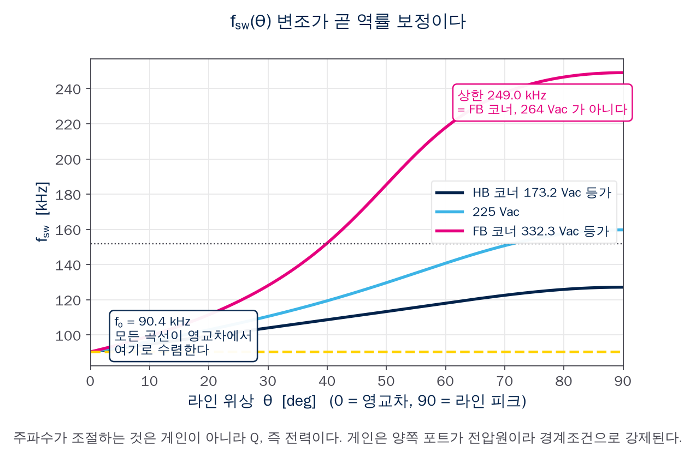

*본 설계의 탱크로 실제로 푼 $f_{sw}(\theta)$. 모든 곡선이 영교차에서 $f_o=90.4$ kHz로 수렴하며, 상한 249.0 kHz는 **FB 쪽 morphing 경계(332.3 Vac 등가)**에서 나온다.*

> **▷** **근이 두 개다.** $M(f_n,Q)$는 $f_{n0}$과 $\infty$ 사이에서 하나의 피크를 가지므로 $M_{req}$와 두 번 만난다. 반드시 *큰 쪽(유도성 영역)*의 근을 취해야 한다. 작은 쪽 근은 용량성 영역이며 하드 스위칭 상태이다. 수치로 풀 때는 $f_n$ 을 위에서부터 내려가며 첫 교차점을 취하고(부록 B), 닫힌형으로 풀면 근 선택 자체가 필요 없다(부록 C.20).

**예제:** $Q_{pk}=10.49/13.70=0.766$. 계산 결과는 다음 표와 같다.

**표 — 라인 반주기에 걸친 스위칭 주파수 (전부하, 등가 입력 기준)**

| $\theta$   | 173.2 Vac (HB 경계) | 180 Vac (90 Vac·FB) |     225 Vac     |     264 Vac     | 332.3 Vac (FB 경계) |
| :----------- | :-----------------: | :------------------: | :-------------: | :-------------: | :-----------------: |
| $15^\circ$ |        97.0        |         97.4         |      99.5      |     101.4      |       105.0        |
| $30^\circ$ |       104.0        |        104.8         |     110.5      |     116.1      |       128.0        |
| $45^\circ$ |       110.9        |        112.6         |     124.4      |     136.8      |       167.9        |
| $60^\circ$ |       118.1        |        120.8         |     140.8      |     162.5      |       217.8        |
| $90^\circ$ |   **127.1**   |   **131.3**   | **159.7** | **188.5** | **249.0** kHz |

$\theta\to0$에서 모든 조건이 $f_o=90.39$ kHz로 수렴한다. 운전 주파수 상한은 **가장 높은 등가 입력**, 즉 FB 쪽 morphing 경계에서 나온다.

> **▷ 공진 위에서 도는가 아래에서 도는가는 권선비가 정한다 — 따로 고르는 것이 아니다.**
> $f_{sw}<f_r$ 에서는 2차 전류가 잘린 사인파에 무전류 구간이 붙고 도통율 $d=f_{sw}/f_r<1$ 이다.
> $f_{sw}>f_r$ 에서는 전류가 연속이고 $d$ 는 1 로 클램프된다. 정격과 손실의 근거인 실효값이
> $d$ 위에 세워지므로 이것은 표기 차이가 아니다. 그런데 $M_{req}=2nV_{o,eff}/(\sqrt2V_{eq})$
> 이라 **$n$ 이 크면 요구 게인이 커지고, 게인을 더 얻으려면 공진에서 더 아래로 내려가야 한다.**
> $C_r$·$L_r$ 이 같고 권선비만 다른 두 트랜스포머가 같은 상용전압에서 공진의 반대편에 앉을 수 있다.
>
> | 라인 조건 | 피크 $f_{sw}$ (본 설계 7.5:1) | $f_r$ 대비 | 피크 $f_{sw}$ (9:1) | $f_r$ 대비 |
> | :--- | ---: | :--- | ---: | :--- |
> | 최저 AC 180 V | 131.3 kHz | 아래 | 111.3 kHz | 아래 |
> | 탱크 최저 173.2 V | 127.1 | 아래 | 108.5 | 아래 |
> | 110 Vac (220 V 등가) | 156.4 | **위** (16 %) | 128.4 | 아래 |
> | 공칭 225 V | 159.7 | **위** (21 %) | 130.7 | 아래 |
> | 230 Vac | 163.2 | **위** (25 %) | 133.1 | 아래 |
> | 최고 AC 264 V | 188.5 | **위** (40 %) | 152.1 | **위** (4 %) |
> | FB 문턱 332.3 V | 249.0 | **위** (56 %) | 209.5 | **위** (42 %) |
>
> (괄호는 반주기 중 공진 위에 있는 비율.) **본 설계(7.5:1)는 110 Vac 부터 반주기의 일부를 공진 위에서
> 보내고, 9:1 은 실사용 라인(110·230 V)에서 반주기 내내 공진 아래에 머문다.** 라인 5 V(225 → 230)가
> 주파수를 3 kHz 움직이는 동안 권선비 한 단(7.5 → 9)이 30 kHz 를 움직인다. 두 쪽은 2차를 다르게 괴롭힌다 —
> 공진 아래에서는 정류기가 영전류에서 꺼지고(ZCS), 위에서는 그렇지 않다. **권선비 후보를 게인
> 여유만으로 비교하면 이것이 보이지 않는다.** 트랜스포머 발주 전에 정해 둘 것.

$$
f_{sw,max,op}=f_{sw}\bigl(\theta=\pi/2,\;V_{in,FBmax}\bigr)\tag{[61]}
$$

소자·오실레이터 설계용 주파수는 이보다 낮으면 안 된다.

$$
f_{sw,max,design}=\max\Bigl(f_{sw,max,op},\ \min\bigl(f_{sw,max,spec},\;1.5\,f_{sw,max,op}\bigr)\Bigr)\tag{[62]}
$$

**예제:** $f_{sw,max,op}=\mathbf{249.0}$ kHz (332.3 Vac 등가, $\theta=\pi/2$). 사양 $f_{sw,max,spec}=225$ kHz 는 $1.5\,f_{sw,max,op}=373.5$ kHz 보다 낮아 안쪽 $\min$ 은 225 kHz 인데, **실제 최대 운전 주파수가 그것을 넘으므로 바깥쪽 $\max$ 가 든다** — $f_{sw,max,design}=\mathbf{249.0}$ kHz. 오실레이터와 소자는 이 값으로 설계한다. ST 툴은 이 바깥쪽 $\max$ 가 없어 225 kHz 로 설계한다(부록 C.10).

> **▷ 최대 주파수는 최대 상용전압에서 나오지 않는다.** $f_{sw}$ 가 실제로 최대가 되는 곳은
> **FB morphing 경계(등가 332.3 Vac)** 이지 264 Vac 가 아니다. ST 설계 툴은 이 코너를
> 아예 평가하지 않아 264 Vac 의 값인 152 kHz 를 보고한다 (부록 C.8).

> **▷** **ST 원본 툴이 말하는 264 Vac 의 값은 최대 운전 주파수가 아니다.** 원본 툴은 $\theta$ 스윕을 180 / 225 / 264 Vac 등가에서만 수행하고 FB 쪽 경계(332.3 Vac 등가)를 평가하지 않는다. 무부하 교차 $f_{n,max}=\sqrt{\lambda/(1+\lambda-1/M_{V\!max,pk})}=1.002$ (=152 kHz)로 그 축을 끝내므로 FB 코너의 동작점($f_n=1.381$)은 구조적으로 표현조차 되지 않는다 (부록 C.8). 수정본 스프레드시트는 FB 코너를 등가 입력 상한으로 잡고 격자 축도 그 $1.5$ 배까지 뻗어 있다.

### 전류 계산

임의의 $(\theta,V_{ac})$에서 해당 $f_{sw}$를 이용하여 계산한다. 아래에서 $I_{o,inst}=i_{out}(\theta)$, $f_{sw}^{*}=\max(f_{sw},f_r)$이다.

$$
I_{sec,pk} =\pi\frac{f_r}{f_{sw}}\,I_{o,inst} \left[1-\cos\!\left(\pi\frac{f_r}{f_{sw}^{*}}\right)\right]^{-1}\tag{[63]}
$$

$$
d=\frac{\min(f_{sw},f_r)}{f_r},\qquad I_{sec,rms} =\begin{cases} I_{sec,pk}\sqrt{d\,k_{tr}/4} & N_{rect}=1\ (\text{CT})\\[2pt] I_{sec,pk}\sqrt{d\,k_{tr}/2} & N_{rect}=2\ (\text{FB})\end{cases}\tag{[64]}
$$

$$
\varphi_{seg}=\pi\frac{f_r}{f_{sw}^{*}},\qquad k_{tr}=1-\frac{\sin 2\varphi_{seg}}{2\varphi_{seg}}\tag{[64a]}
$$

$$
I_{diode,rms} =\begin{cases} I_{sec,rms} & N_{rect}=1\\[2pt] I_{sec,rms}/\sqrt{2} & N_{rect}=2\end{cases}\tag{[65]}
$$

> **▷** $d$는 **도통율**이다. $f_{sw}<f_r$에서 2차 전류는 매 반주기 $1/(2f_r)$ 동안만 흐르는 반정현파이므로 실효값에 $\sqrt d$가 붙는다. ST 툴은 $d=1$ 로 두어($I_{sec,pk}/\sqrt2$, $/2$) $\sqrt{1/d}$ 만큼(예제 최악점에서 $d=0.838$, 9 %) 과대평가한다. 같은 시트의 식 \[70\]은 정작 $d$를 반영하고 있어 툴 내부에서 $i_{sec}$의 정의가 두 개였다 (부록 C.8).

> **▷** **\[63\]–\[70\]의 유효 범위.** 이 식들은 "2차 전류가 매 반주기 $1/(2f_r)$ 동안 흐르는 반정현파이고 나머지 구간은 프리휠"이라는 파형 모델에서 나온다. 이 모델은 $f_{sw}\le f_r$에서 성립하며, 본 설계의 지배 코너(173.2 / 180 Vac)가 모두 여기에 속한다. 파형을 직접 수치 적분하여 검증한 결과는 다음과 같다.
>
> - \[63\]: 평균이 정확히 $I_{o,inst}$가 되도록 유도된 식이며, 두 영역 모두에서 **엄밀**하다.
> - \[64\]: $f_{sw}\le f_r$에서 **엄밀**. $f_{sw}>f_r$에서는 도통이 잘린 정현파가 되어 8–9 % **낮게** 나온다. 이 영역까지 엄밀히 쓰려면 $\tfrac12 d$ 자리에 $\tfrac12\bigl[1-\sin 2x/(2x)\bigr]$, $x=\pi f_r/f_{sw}$를 넣는다.
> - 합성 탱크 전류 피크($\max_x[I_{Lm,pk}(2x-1)+I_{trafo,pk}\sin\pi x]$, \[79\]): $f_{sw}\le f_r$에서 파형 최대값과 **완전히 일치**.
> - \[68\]: $f_{sw}\le f_r$에서 파형 모델보다 0.7–4.8 % **크다**(보수적). 같은 모델의 닫힌형 엄밀해는 $I_{pri,rms}^2=\tfrac{d}{2}I_{trafo,pk}^2+I_{Lm,pk}^2\bigl(1-\tfrac{2d}{3}\bigr)$이며, 지배 코너에서 13.42 A(\[68\]은 13.76 A)이다. $f_{sw}\ge f_r$에서는 $d=1$이 되어 세 번째 항이 사라진다.
> - $f_{sw}>f_r$에서는 공진 전류가 0에서 시작하지 않으므로 파형 가정 자체가 느슨해진다. 아래 표의 264 / 332 Vac 행은 **참고값**으로 볼 것 — 다행히 정격을 결정하는 코너가 아니다.

$$
I_{trafo,pk} =\frac{I_{sec,pk}}{n}\tag{[66]}
$$

$$
I_{Lm,pk} =\frac{0.25\,n\,V_{o,eff}}{L_m\,f_{sw}^{*}}\tag{[67]}
$$

$$
I_{pri,rms} =\sqrt{\frac{I_{trafo,pk}^{2}}{2}+\frac{I_{Lm,pk}^{2}}{3} +\left[I_{Lm,pk}f_{sw}\!\left(\frac{1}{f_{sw}}-\frac{1}{f_r}\right)\right]^{2}}\tag{[68]}
$$

$$
I_{mos,rms} =\frac{I_{pri,rms}}{\sqrt{2}}\tag{[69]}
$$

$$
I_{Cout,rms}^{HF}(\theta) =\sqrt{\tfrac{1}{2}\,d\;I_{sec,pk}^{2}-I_{o,inst}^{2}}\tag{[70]}
$$

식 \[70\]은 **한 스위칭 주기 안의 고주파 성분**일 뿐이다. 출력 커패시터는 여기에 더해 $2f_l$ 버퍼 전류 전체를 감당하므로, 리플 전류 정격 판정에는 라인 반주기 전체의 실효값을 써야 한다.

$$
I_{Cout,rms}=\sqrt{\bigl\langle I_{sec,rms}^{2}\bigr\rangle_\theta-I_{out}^{2}} =\sqrt{\bigl\langle (I_{Cout,rms}^{HF})^{2}\bigr\rangle_\theta+\tfrac{1}{2}I_{out}^{2}}\tag{[70a]}
$$

여기서 $\langle\cdot\rangle_\theta$는 $\theta=0\ldots\pi/2$ 평균이고, $\sqrt{I_{out}^2/2}=I_{out}/\sqrt2$가 바로 $2f_l$ 성분이다.

> **▷ 센터탭의 함정 — \[70a\]에 \[64\]의 값을 그대로 넣지 말 것.**
>
> \[70a\]의 첫 형태에 들어가는 $I_{sec,rms}$는 **출력 노드로 들어가는 전류의 실효값**이어야
> 한다. 그런데 \[64\]는 $N_{rect}=1$(CT)에서 $I_{sec,pk}\sqrt{d/4}$, 즉 **권선 하나**의 실효값을
> 준다. 센터탭에서는 두 권선이 번갈아 도통하므로 노드가 보는 실효값은 그 $\sqrt2$배다:
>
> $$
> I_{node,rms} = I_{sec,pk}\sqrt{d/2}\qquad(N_{rect}=1)
> $$
>
> $N_{rect}=2$(풀브리지)에서는 \[64\]가 이미 노드 실효값이므로 이 구분이 필요 없다 — 풀브리지
> 정류 설계에서는 이 결함이 드러나지 않는다.
>
> | \[70a\]에 무엇을 넣는가 | 25 V/26.3 A 설계의 $I_{Cout,rms}$ |
> | :--- | ---: |
> | \[64\]의 CT 값 28.3 A (권선당) | 10.8 A &nbsp; **← 틀림** |
> | 노드 실효값 40.2 A | **30.2 A** |
> | \[70\]+$2f_l$ 교차 검증 | 30.2 A ✓ |
>
> **2.8배**다. 커패시터 뱅크 리플 전류 정격이 그만큼 부족해진다.
> **정류 소자**의 정격에는 \[64\]·\[65\]의 권선당·소자당 값을 그대로 쓴다 — 헷갈리지 말 것.

$I_{Lm,pk}$는 전력 전달 구간 동안 $L_m$ 양단에 반사 전압 $n\,V_{o,eff}$가 걸린다는 사실에서 나온다 ($\Delta I_{pp}=n V_{o,eff}/(2L_m f_{sw}^{*})$).

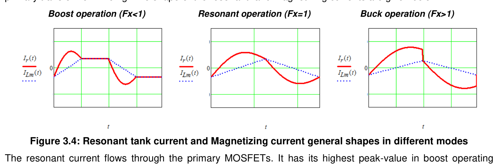

*부스트·공진·벅 각 모드에서 공진 전류(실선)와 자화 전류(점선)의 형태.*
*figure: Infineon AN 2013-03, Fig. 3.4*

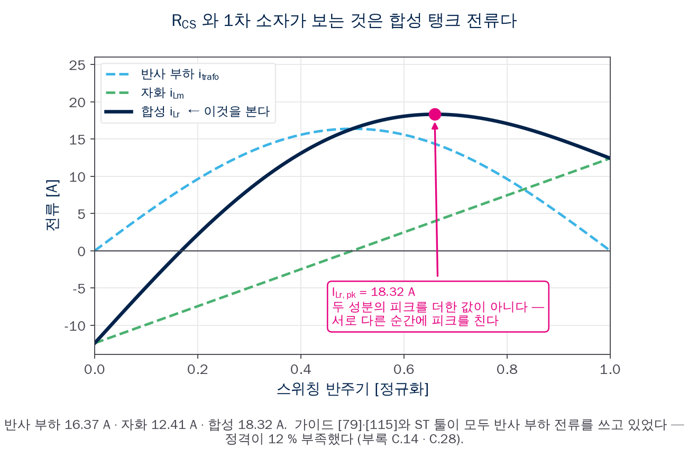

*최악 코너의 합성 탱크 전류. $R_{CS}$가 보는 것은 반사 부하 전류(16.37 A)도 자화 전류(12.41 A)도 아닌 **둘의 합(18.32 A)**이다. OCP1 22.92 A 대비 여유 25 %.*

> **▷** $I_{pri,rms}$는 *스위칭 주기* 기준 실효값이다. 소자 **정격**(피크·순시 응력)은 아래 표의 최악 코너로, 도통 **손실**은 라인 반주기 실효값으로 판정한다. 최악 코너는 $\theta=\pi/2$·**최소 등가 입력(173.2 Vac)**이다 — 90 Vac 라인 자체(등가 180 Vac)가 아니라 HB 쪽 morphing 경계다.

| 코너 (전부하)                         | $f_{sw}$ |    $I_{sec,pk}$ |  $I_{trafo,pk}$ | $I_{Lm,pk}$ |   $I_{pri,rms}$ |   $I_{mos,rms}$ | 합성$i_{Lr}$ 피크 |
| :------------------------------------ | ---------: | ----------------: | ----------------: | ------------: | ----------------: | ----------------: | ------------------: |
| **173.2 Vac, $\theta=\pi/2$** |    127.1 k | **98.6 A** | **16.37 A** |      12.41 A | **13.76 A** | **9.73 A** |   **18.32 A** |
| 180 Vac,$\theta=\pi/2$              |    131.3 k |            95.5 A |           15.85 A |      12.41 A |           13.41 A |            9.48 A |             17.86 A |
| 173.2 Vac,$\theta=\pi/4$            |    110.9 k |            56.5 A |            9.38 A |      12.41 A |           10.32 A |            7.29 A |             12.97 A |
| 264 Vac,$\theta=\pi/2$              |    188.5 k |            73.2 A |           12.15 A |       9.99 A |           10.62 A |            7.51 A |             13.85 A |
| 332.3 Vac,$\theta=\pi/2$            |    249.0 k |            75.3 A |           12.50 A |       7.56 A |           10.99 A |            7.77 A |             13.44 A |

**예제(최악 코너 = 173.2 Vac 등가, $\theta=\pi/2$):** $I_{sec,pk}=\mathbf{98.6}$ A, $I_{trafo,pk}=\mathbf{16.37}$ A, $I_{Lm,pk}=\mathbf{12.41}$ A, $I_{pri,rms}=\mathbf{13.76}$ A, 합성 탱크 전류 피크 $I_{Lr,pk}=\mathbf{18.32}$ A. 라인사이클 실효값은 $I_{pri}=10.92$ A, 스위치 자리당 $I_{mos}=7.72$ A, 정류 레그당 $I_{diode}=28.34$ A, 출력 뱅크 $I_{Cout}=30.24$ A.
라인사이클 실효값(도통 손실 산정용): 센터탭이므로 권선 = 소자, $I_{sec,rms}=I_{diode,rms}=28.34$ A, $I_{pri,rms}=10.92$ A.
출력 커패시터: 고주파 성분 23.85 A, $2f_l$ 성분 $I_{out}/\sqrt2=18.60$ A $\Rightarrow I_{Cout,rms}=\mathbf{30.24}$ A (식 \[70a\]).

> **▷** $\theta=\pi/4$ **한 점의 고주파 성분만** 취하면 21.8 A 가 나온다 — $2f_l$ 성분(18.6 A)이 통째로 빠져 실제보다 **28 % 낮다**. ST 툴의 원판이 그렇게 했다(부록 C.18). 커패시터 병렬 개수와 리플 전류 정격이 여기서 결정되므로 반드시 \[70a\]로 판정할 것.

> **▷** $I_{sec,pk}$, $I_{sec,rms}$, $I_{diode,rms}$, $I_{Cout,rms}$는 $n$을 쓰지 않으므로 부록 C.5의 수정과 무관하다. 즉 **2차측 소자 선정은 그대로**이고 1차측만 바뀐다.

## IC 주변 정수 설계

### 오실레이터 — $R_T$, $C_T$

L6790A의 VCO는 $C_T$를 $I_{RT}=V_{ref}/R_T$와 오차증폭기 전류 $I_{EA}$의 합으로 충전하여 $V_{ref}=1.5$ V까지 램프시킨 후 고정 유휴 시간 $T_{idle}$을 더한다.

$$
\frac{T_{sw}}{2}=\frac{C_T\,V_{ref}}{\dfrac{V_{ref}}{R_T}+I_{EA}}+T_{idle}, \qquad I_{EA}=0\ldots I_{EA,max}\tag{[71]}
$$

$I_{EA}$가 유일한 액추에이터이다. $I_{EA}\uparrow\Rightarrow f_{sw}\uparrow\Rightarrow P\downarrow$.

| **IC 상수** | **기호**                   | **값**                                            | **출처**        |
| :---------------- | :------------------------------- | :------------------------------------------------------ | :-------------------- |
| CT 기준 전압      | $V_{ref}$                      | 1.5 V                                                  | DS Table 5            |
| E/A 최대 전류     | $I_{EA,max}$ | 400 $\mu$A   | DS Table 5                                              |                       |
| 기동 추가 전류    | $I_{OSC,SU}$ | 412.5 $\mu$A | DS Table 5                                              |                       |
| 유휴 시간         | $T_{idle}$                     | <span style="color: warncol">250 / 350 / 700 ns</span> | **부록 C 참조** |

**설계 순서** — 먼저 $C_T$ 범위를 구하고, 선정 후 $R_T$를 구한다.

$$
C_{T,max} =\frac{I_{EA,max}}{2V_{ref}}\cdot \frac{\bigl(1-2T_{idle}f_{sw,max,design}\bigr)\bigl(1-2T_{idle}f_{sw,min}\bigr)} {f_{sw,max,design}-f_{sw,min}}\tag{[72]}
$$

$$
C_{T,min} =\frac{1}{R_{T,max}}\left(\frac{1}{2f_{sw,min}}-T_{idle}\right)\tag{[73]}
$$

$$
R_{T,min} =\frac{1}{C_T}\left(\frac{1}{2f_{sw,min}}-T_{idle}\right)\tag{[74]}
$$

여기서 $f_{sw,min}=f_o$(하측 공진)로 두는 것이 원칙이다. $R_{T,max}=30$ k$\Omega$.

선정된 $R_T$, $C_T$에 대한 실제 주파수:

$$
f_{Min} =\frac{1}{2\,(C_T R_T+T_{idle})}\tag{[75]}
$$

$$
f_{Max} =\frac{1}{2\left(\dfrac{C_T}{\dfrac{I_{EA,max}}{V_{ref}}+\dfrac{1}{R_T}}+T_{idle}\right)}\tag{[76]}
$$

$$
f_{SU} =\frac{1}{2\left(\dfrac{C_T}{\dfrac{I_{EA,max}+I_{OSC,SU}}{V_{ref}}+\dfrac{1}{R_T}}+T_{idle}\right)}\tag{[77]}
$$

**제약 조건 확인**: $R_T\in[5,\,30]$ k$\Omega$, $C_T\in[270,\,1000]$ pF, $R_T C_T\in[2.5,\,12]\,\mu$s, $f_{Max}\lesssim675$ kHz.

**예제:** $T_{idle}=250$ ns, $f_{sw,min}=f_o=90.39$ kHz, $f_{sw,max,design}=249.0$ kHz. $C_{T,max}=702.6$ pF, $C_{T,min}=176.0$ pF $\Rightarrow \mathbf{C_T=470\,pF}$ (1 %). $R_{T,ceil}=11.24$ k$\Omega \Rightarrow \boldsymbol{R_T=11\,\mathrm{k}\Omega}$. 결과: $f_{Min}=92.25$ kHz, $f_{Max}=319.6$ kHz, $f_{SU}=503.5$ kHz. $R_TC_T=5.17\,\mu$s (범위 내).

> **▷ $C_T$ 는 두 창의 교집합에서 고른다.** 설계 창 176–703 pF 와 데이터시트 창
> 270–1000 pF 가 겹치는 **270–703 pF** 의 기하 중간 $\sqrt{270\times703}=436$ pF 에
> 가장 가까운 표준값이 470 pF 다. 어느 한쪽 끝에 붙이지 않는다 — $R_T$ 와 $C_T$ 는 서로
> 맞바꿔지므로 끝에 서면 상대쪽 여유가 사라진다.

> **▷ $R_{T,ceil}$ 은 최소값이 아니라 최대값이다.** $f_{Min}=1/[2(C_TR_T+T_{idle})]$ 은
> $R_T$ 가 커질수록 **내려간다.** 라벨대로 읽고 올림하면 VCO 하한이 $f_o$ 아래로 내려가
> 용량성 영역 진입을 ACP 보호에만 의존하게 된다 (부록 C.22).

> **▷ $f_{Min}$ 이 $f_o$ 위에 있는지 확인한다.** 본 예제는 $f_{Min}=92.25$ kHz $>$ $f_o=90.39$ kHz 로 VCO 클램프가 하측 공진 위에 놓이지만 **여유가 1.02배뿐이다 — 이 설계에서 가장 얇은 여유**다. $R_T$ 를 11.24 k$\Omega$ 위로 올리면 클램프가 $f_o$ 아래로 내려가 용량성 영역 진입을 ACP 보호에만 의존하게 된다. 트랜스포머 개방 인덕턴스의 공차도 이 여유 안에 들어와야 한다(§6.6). 영교차 근방의 거동은 반드시 실측할 것.

> **▷ $f_{Max}$ 는 전부하에서만 검사하면 안 된다.** 공진 아래에서는 $f_{sw}$ 가 부하에 거의 무관하지만(225 Vac 등가에서 전 부하 160 kHz), 공진 위로 올라간 FB 코너에서는 부하를 덜수록 요구 주파수가 치솟는다 — 100 % 249 · 75 % 275 · **50 % 322 · 25 % 436 kHz**. 즉 FB 코너에서는 **약 50 % 부하 아래에서 오실레이터가 $f_{Max}=319.6$ kHz 에 걸린다.** 걸리면 주파수로는 전력을 더 줄이지 못해 출력이 오르고 FB 가 내려가 버스트로 넘어간다 — 버스트 진입점(11 %)보다 훨씬 위에서 버스트가 강제되는 것이므로 그 구간의 출력 과도와 리플을 실측할 것(부록 D.3). 실사용 라인(110·230 V)에서는 어느 부하에서도 201 kHz 아래라 이 일이 없다.

> **▷ $f_{Min}$·$f_{Max}$ 를 $T_{idle}$ 세 후보 전부로 확인할 것.** 같은 $R_T$·$C_T$ 에서 $T_{idle}=250/350/700$ ns 이면 $f_{Max}=319.6/300.4/248.2$ kHz 이고 $f_{Min}=92.3/90.6/85.2$ kHz 다. 최대 운전 주파수 249.0 kHz 에 대한 여유는 1.28 → 1.21 → **0.997배**, $f_o=90.39$ kHz 에 대한 하한 여유는 1.02 → **1.00 → 0.94배**다. 즉 **350 ns 이면 하한이 $f_o$ 에 닿고, 700 ns 이면 하한은 $f_o$ 아래로, 상한은 최대 운전 주파수 아래로 내려가 두 클램프가 다 무너진다.** 부록 C.1 의 $T_{idle}$ 불확실성은 정밀도 문제가 아니라 이 설계가 성립하는가의 문제다 — 초도 보드에서 $f_{sw}$ 를 실측해 확정하고, 700 ns 로 확인되면 $R_T$ 를 10 k$\Omega$ 으로 내린다(§6.6 의 공차 논의와 같은 처방).

### 전류 감지 저항 $R_{CS}$

$R_{CS}$는 최대전력 제한과 OCP 설정점을 *동시에* 결정한다. 두 조건 중 작은 값을 취한다.

$$
R_{CS,max1} =\frac{16.8\ \Omega\!\cdot\!\mathrm{W}}{P_{in}} \qquad\text{(최대전력 제한)}\tag{[78]}
$$

> **▷** \[78\]은 $P_{in}$(=684.8 W, 브리지·EMI 손실 포함)을, \[122\]는 $P_o/\eta_{HB}=P_{in,LLC}$(=670.9 W)를 쓴다. ISEN이 실제로 감지하는 것은 탱크 입력 전력이므로 물리적으로 맞는 것은 \[122\]이며, \[78\]이 2.1 % 큰 값을 쓰는 것은 $R_{CS}$를 그만큼 작게 잡는 **보수적** 선택이다. 둘을 통일하고 싶으면 \[78\]에도 $P_{in,LLC}$를 넣되, 최대전력 제한이 라인 손실만큼 낮아진다는 점을 감안할 것.

$$
R_{CS,max2} =\frac{|V_{OCP1}|}{I_{Lr,pk,max}}=\frac{0.55\ \mathrm{V}}{I_{Lr,pk,max}}\tag{[79]}
$$

> **▷** 분모는 $I_{trafo,pk}$가 아니라 **합성 탱크 전류 피크** $I_{Lr,pk}=\max_x\bigl[I_{Lm,pk}(2x-1)+I_{trafo,pk}\sin\pi x\bigr]$이다. $R_{CS}$는 브리지 리턴에 있으므로 자화 성분을 포함한 전체 탱크 전류를 본다.

$$
R_{CS} \le\min\bigl(R_{CS,max1},\,R_{CS,max2}\bigr)\tag{[80]}
$$

손실과 병렬 개수:

$$
P_{Rcs} =R_{CS}\,I_{Rcs,rms}^{2},\qquad I_{Rcs,rms}=\max\bigl(I_{pri,rms},\,I_{in,max}\bigr)\tag{[81]}
$$

$$
N_{par} \ge\left\lceil\frac{P_{Rcs}}{P_{single}}\right\rceil\tag{[82]}
$$

선정 후 실제값:

$$
P_{in,max,act} =\frac{16.8\ \Omega\!\cdot\!\mathrm{W}}{R_{CS}}\tag{[83]}
$$

$$
I_{OCP1} =\frac{0.55\ \mathrm{V}}{R_{CS}},\qquad I_{OCP2}=\frac{0.75\ \mathrm{V}}{R_{CS}}\tag{[84]}
$$

**예제:** $R_{CS,max1}=24.53$ m$\Omega$, $R_{CS,max2}=0.55/18.32=30.03$ m$\Omega \Rightarrow$ 24.53 m$\Omega$ 이하 (최대전력 조건이 지배). $I_{Rcs,rms}=13.76$ A(최악 스위칭 주기) $\Rightarrow P_{Rcs}=4.54$ W $\Rightarrow N_{par}=\mathbf{5}$. 실장: $120\,\mathrm{m}\Omega$ 5 병렬 $=\boldsymbol{24\,\mathrm{m}\Omega}$. $P_{in,max,act}=700$ W, $I_{OCP1}=\mathbf{22.92}$ A, $I_{OCP2}=31.25$ A.

> **▷ \[79\]의 분모는 합성 탱크 피크다.** $R_{CS}$ 는 하프브리지 리턴에 있으므로 자화
> 성분을 포함한 $I_{Lr,pk}=18.32$ A 를 본다. 반사 부하 전류 16.37 A 를 넣으면 상한이
> 12 % 헐거워진다 (부록 C.14). OCP1 여유는 $22.92/18.32=1.25$ 배.

> **▷** **OCP1 마진 확인.** $R_{CS}$가 최대전력 조건으로 결정되면 OCP1 트립점도 함께 내려온다. 실제 공진 전류 피크는 부하 성분(반사 정현파, 피크 $I_{trafo,pk}$)과 자화 성분(삼각파, 피크 $I_{Lm,pk}$)의 합성이므로 단순히 둘 중 큰 값이 아니다. $i_{Lr}(x)=I_{Lm,pk}(2x-1)+I_{trafo,pk}\sin\pi x$의 최대값을 구하면 최악 코너(173.2 Vac 등가, $\theta=\pi/2$)에서 18.32 A로, $I_{OCP1}=22.92$ A 대비 **25 %** 여유이다. EVL6790_670W 보드는 19.2 A 대 23.5 A로 약 23 % 여유이다. 설계 시 이 합성 피크를 반드시 확인할 것 — $I_{trafo,pk}$만으로 판단하면 위험하다.

> **▷** **DS §5.3.3:** $R_{CS}$와 ISEN 핀 사이에 어떠한 필터나 직렬 저항도 넣지 말 것. 최대전력 제어와 과전류 보호가 이 핀 하나를 공유하므로 설정점이 함께 어긋난다. ISEN의 절대최대정격은 $\pm3$ V뿐이므로 서지 보호용 클램프를 쓸 경우 합계 $V_f$가 OCP2 최대치 0.78 V보다 커야 한다 (다이오드 2개 직렬).

### 버스트 모드 — BM 핀

$$
R_{BM} =16.7\ \frac{\mathrm{k\Omega}}{\mathrm{V^{2}}}\,\bigl(R_{CS}\,P_{in,BM}\bigr)\tag{[85]}
$$

$$
V_{BM,eq} =\frac{R_{BM}}{100\ \mathrm{k\Omega}}+0.5\ \mathrm{V}\tag{[86]}
$$

$$
P_{in,BM,act} =\frac{R_{BM}}{16.7\,R_{CS}}\tag{[87]}
$$

$$
P_{out,BM} =P_{in,BM,act}\;\eta_{BM}\tag{[88]}
$$

$R_{BM}$ 유효 범위는 15–140 k$\Omega$이다. BM 핀을 GND에 연결하면 버스트 모드가 비활성화된다 (딥 버스트는 항상 동작).

**예제:** 진입점을 $P_{in}$ 의 11 % 로 잡아 $\boldsymbol{R_{BM}=30\,\mathrm{k}\Omega}$ 선정, $V_{BM,eq}=0.801$ V

<a id="cfg-pin"></a>

### 브라운아웃 및 토폴로지 — CFG 핀

$$
R_{CFG} =\frac{\sqrt{2}\,V_{ac,BO}}{K_{CFG}},\qquad K_{CFG}=4\ \mathrm{V/k\Omega}\tag{[89]}
$$

$$
V_{BO,pk} =R_{CFG}\,K_{CFG},\qquad V_{BO,rms}=\frac{V_{BO,pk}}{\sqrt{2}}\tag{[90]}
$$

$R_{CFG}$와 LOUT2 상태의 조합이 동작 구성을 결정한다. **DS Table 6 전 5행이다** —
LOUT2를 GND로 묶는 고정 하프브리지에도 *고정* 임계와 *조정* 임계 두 가지가 있다.

| **구성** | **$R_{CFG}$** | **LOUT2** | **입력 피크 전압** | **동작** |
| :--- | :--- | :--- | :--- | :--- |
| Morphing<br>**고정** BIBO | 15 k$\Omega$ | OPEN | $V_{in}<60$ V<br>$70<V_{in}<235$ V<br>$V_{in}>245$ V | 정지<br>**Full Bridge**<br>**Half Bridge** |
| Morphing<br>**조정** BIBO | 15–47 k$\Omega$ | OPEN | $V_{in}<V_{BO}$<br>$V_{BO}+10<V_{in}<235$ V<br>$V_{in}>245$ V | 정지<br>**Full Bridge**<br>**Half Bridge** |
| 고정 Full Bridge<br>**조정** BIBO | 47–100 k$\Omega$ | OPEN | $V_{in}<V_{BO}$<br>$V_{in}>V_{BO}+10$ | 정지<br>**Full Bridge** |
| 고정 Half Bridge (분할 $C_r$)<br>**고정** BIBO | 15 k$\Omega$ | GND | $V_{in}<60$ V<br>$V_{in}>70$ V | 정지<br>**Half Bridge** |
| 고정 Half Bridge (분할 $C_r$)<br>**조정** BIBO | 15–100 k$\Omega$ | GND | $V_{in}<V_{BO}$<br>$V_{in}>V_{BO}+10$ | 정지<br>**Half Bridge** |

**한 줄 요약 — morphing 은 언제 켜지나.**

$$
\text{morphing} \iff \text{LOUT2 = OPEN} \ \wedge\ 15\,\mathrm{k}\Omega \le R_{CFG} \le 47\,\mathrm{k}\Omega
$$

LOUT2를 GND로 묶으면 무조건 고정 HB, $R_{CFG}>47$ k$\Omega$이면 무조건 고정 FB다.
**경계 235 / 245 V$_{pk}$ 자체는 IC 고정 상수이며 $R_{CFG}$로 움직이지 않는다** —
$R_{CFG}$가 바꾸는 것은 구성과 $V_{BO}$ 둘뿐이다.

#### $R_{CFG}$가 만드는 브라운아웃 레벨

\[89\]·\[90\]을 표로 펴면 다음과 같다. **$V_{BO}$는 상용전원의 *피크*와 비교되므로
rms 환산이 필요하다.**

| $R_{CFG}$ | $V_{BO,pk}$ | $V_{BO,rms}$ | |
| ---: | ---: | ---: | :--- |
| 15 k$\Omega$ | 60 V | 42.4 V | 조정 임계가 고정 임계와 일치하는 점 |
| 20 k$\Omega$ | 80 V | 56.6 V | |
| 25 k$\Omega$ | 100 V | 70.7 V | |
| **30 k$\Omega$** | **120 V** | **84.9 V** | **← 본 설계** (90 Vac 대비 여유 1.06배) |
| 31.8 k$\Omega$ | 127 V | 90.0 V | **90 Vac 동작의 절대 상한** |
| 33 k$\Omega$ | 132 V | 93.3 V | 90 Vac에서 브라운아웃 — 사용 불가 |
| 47 k$\Omega$ | 188 V | 132.9 V | morphing 가능 범위의 끝 |
| $>$ 47 k$\Omega$ | — | — | 고정 FB로 전환됨 |

> **▷ 90–264 Vac 유니버설이면 $R_{CFG}$의 창은 15–31.8 k$\Omega$ 하나뿐이다.**
> 아래로는 DS의 15 k$\Omega$ 하한, 위로는 최저 입력에서 브라운아웃이 걸리는 한계다.
> morphing 상한 47 k$\Omega$는 이 창 밖이므로 실질적으로 구속하지 않는다.

> **▷ $V_{BO}$는 상한이므로 내림한다.** 올림하면 최저 입력에서 IC가 기동하지 않는다.
> 본 설계는 31.82 → **30 k$\Omega$**.

**예제:** $R_{CFG,max}=31.82$ k$\Omega \Rightarrow \boldsymbol{30\,\mathrm{k}\Omega}$ 선정 (**상한이므로 내림**). $V_{BO}=\mathbf{84.85}$ Vrms $<$ 90 Vac 이므로 최저 입력에서 브라운아웃이 걸리지 않는다 (여유 1.06배). 15–47 k$\Omega$ 범위이고 LOUT2가 드라이버 입력에 연결(OPEN)되므로 **Morphing 활성**

> **▷** DS의 $V_{BO}=\min(60\,\mathrm{V},\,R_{CFG}\cdot 4\,\mathrm{V/k\Omega})$ 표기는 문자 그대로 읽으면 어떤 $R_{CFG}$에서도 60 V가 되어 Table 6과 모순된다. 실제로는 $R_{CFG}\cdot4$이며 15 k$\Omega$가 하한(=60 V)이라는 의미로 읽어야 한다. 또한 **DS는 peak, Tool과 보드 주석은 rms로 표기**하므로 $\sqrt2$ 실수에 주의.

> **▷** LOUT2에 풀다운을 달면 안 된다. 핀스트랩 시 300 $\mu$A가 2.5 V를 만들어야 하므로 약 8 k$\Omega$ 이하의 풀다운은 *고정 하프브리지*로 읽힌다.

### 출력 전압 감지 및 OVP — ZCD 핀

$$
V_{OVP1,out} =V_{out}\,(1+\Delta_{OVP1})\tag{[91]}
$$

$$
V_{OVP2,out} =V_{OVP1,out}\,\frac{V_{OVP2,th}}{V_{OVP1,th}} =V_{OVP1,out}\frac{2.5}{2.3}\tag{[92]}
$$

$$
\left(\frac{n_{aux}}{n_{sec}}\right)_{\!max} = \frac{V_{AUX,max}}{V_{OVP2,out}}\tag{[93]}
$$

$$
V_{aux,OVP1} =\frac{n_{aux}}{n_{sec}}\,V_{OVP1,out}\tag{[94]}
$$

분압 저항:

$$
R_{ZCD,L} =\frac{V_{OVP1,th}}{I_{bias}}\tag{[95]}
$$

$$
R_{ZCD,H} =R_{ZCD,L}\left(\frac{V_{aux,OVP1}}{V_{OVP1,th}}-1\right)\tag{[96]}
$$

> **▷** \[96\]과 \[97\]\[98\]의 $R_{ZCD,L}$은 **반올림 후 선정값**이다. 계산값 19.17 k$\Omega$을 그대로 쓰면 $R_{ZCD,H}$ 가 달라져 선정값 19 k$\Omega$ 기준의 321.8 k$\Omega$ 과 맞지 않는다. 비($R_H/R_L$)만이 임계를 정하므로 두 저항을 같은 기준(선정값)으로 맞추어야 한다.

$I_{bias}$는 OVP1 임계에서의 분압기 전류 (DS 권장 100 $\mu$A, 본 설계 120 $\mu$A).

> **▷ \[93\] 은 보조 권선이 $V_{CC}$ 를 대는 구성에서만 뜻이 있다.** 그 식은 "OVP2 에서 보조 권선 전압이 $V_{CC}$ 정격 $V_{AUX,max}=25$ V 를 넘지 마라"는 뜻이다. **본 설계는 $V_{CC}$ 를 출력측 12 V 하우스키핑 레일에서 받고 보조 권선은 ZCD 감지 전용**이므로 이 상한이 적용되지 않는다 — 권선 전압은 분압기가 나눠 ZCD 핀으로 보낼 뿐이라 얼마여도 된다. 남는 제약은 **턴수가 정수**여야 한다는 것뿐이고, 코어당 1턴 × 3 직렬이 감을 수 있는 최소이므로 2차 2턴에 대해 $n_{aux}/n_{sec}=3/2=1.5$ 다. \[93\] 은 참고로 계산해 두되 판정에 쓰지 않는다.

선정 후 실제 임계:

$$
V_{OVP1} =\frac{V_{OVP1,th}}{n_{aux}/n_{sec}}\left(\frac{R_{ZCD,H}}{R_{ZCD,L}}+1\right)\tag{[97]}
$$

$$
V_{OVP2} =\frac{V_{OVP2,th}}{n_{aux}/n_{sec}}\left(\frac{R_{ZCD,H}}{R_{ZCD,L}}+1\right)\tag{[98]}
$$

$$
V_{out,SUend} =\frac{V_{ZCD,SUend}}{V_{OVP1,th}}\;V_{OVP1}\tag{[99]}
$$

$V_{ZCD,SUend}=1.35$ V(ST 툴 값, DS 는 1.36 V)는 기동 단계 종료 판정 임계이다. $V_{out,SUend}$는 기동 종료 시점의 출력 전압이며, HVSU 120 ms 창 안에 이 값에 도달해야 한다.

**예제:** $\Delta_{OVP1}=10\,\%\Rightarrow V_{OVP1,out}=27.5$ V, $V_{OVP2,out}=29.89$ V. \[93\] 은 0.8364 를 주지만 적용되지 않고(위 주석), 권선 구조가 $n_{aux}/n_{sec}=\mathbf{1.5}$ 를 준다 — 보조 권선 전압은 정격 37.5 V, OVP2 에서 44.8 V 이며 **감지 전압일 뿐**이다. $R_{ZCD,L}=19.17\to\boldsymbol{19\,\mathrm{k}\Omega}$, $R_{ZCD,H}=19\times(1.5\times27.5/2.3-1)=321.8\to\boldsymbol{330\,\mathrm{k}\Omega}$ — **계산값보다 큰 E24** 를 골라 OVP1 이 리플 꼭대기에서 떨어지게 한다. 실제: $V_{OVP1}=\mathbf{28.16}$ V (목표 27.5 대비 1.024 배), $V_{OVP2}=30.61$ V, $V_{out,SUend}=16.53$ V.

> **⚠ 두 저항의 위·아래를 바꿔 달면 안 된다.** $R_{ZCD,L}$ 이 작은 쪽(19 k)이고
> $R_{ZCD,H}$ 가 큰 쪽(330 k)이다. 뒤집으면 분압비가 반전되어 OVP1 임계가 28.2 V 가
> 아니라 1.6 V 가 되고 **기동 즉시 OVP 로 걸린다** (부록 C.26).

> **▷** ST 툴은 \[93\]의 분모를 $V_{OVP2,out}/N_{rect}$로 두어 $N_{rect}=2$에서 상한을 **2배 관대하게** 내놓는다. 정작 같은 시트의 $V_{aux,OVP2}$ 계산은 $N_{rect}$로 나누지 않으므로 자기모순이며, 보조 권선으로 $V_{CC}$ 를 대는 구성이라면 그 값을 고른 순간 $V_{CC}$ 정격을 넘긴다 (부록 C.8). 본 설계는 $N_{rect}=1$ 이고 $V_{CC}$ 가 외부라 둘 다 걸리지 않는다.

> **▷** 보조 권선 극성: LOUT1(및 HOUT2)이 ON일 때 ZCD 핀 전압이 **양(+)**이 되도록 연결해야 한다 (DS §5.3.4). 반대로 연결하면 소자 파괴에 이르는 하드 스위칭이 발생한다.

### HVSU 및 VCC

HVSU 핀은 입력 브리지 **앞단(AC 측)**에 고압 정류 다이오드 2개(각 상)를 통해 연결한다. 브리지 뒤에 연결하면 X-cap 방전과 브라운아웃 감지가 모두 동작하지 않는다.

- 다이오드: $V_{RRM}\ge$ 1000 V 급 (예: S1M), HVSU 핀 내압 800 V
- $V_{CC}$ 커패시터: $V_{CCon}=17$ V $\to V_{CCoff}=8$ V 구간에서 기동 후 **출력측 12 V 하우스키핑 레일**이 인계받을 때까지 IC를 유지해야 한다. HVSU는 $V_{CCon}$ 도달 후 120 ms 뒤 정지한다. **본 설계는 보조 권선으로 $V_{CC}$ 를 대지 않는다** — 그 권선은 ZCD 감지 전용이다(§5.5).
- $V_{CC}$에 선형 레귤레이터를 쓰는 경우, HVSU 충전 전류가 역주입되지 않도록 레귤레이터 출력과 $V_{CC}$ 핀 사이에 바이패스 다이오드를 넣는다 (DS §5.1.8).
- VCC 핀 바로 옆에 100 nF 바이패스 커패시터를 배치한다.

## 수동 소자 및 반도체 선정

### 입력 커패시터

벌크 커패시터가 없으므로 $C_{in}$은 스위칭 리플만 흡수하는 필름 커패시터이다. 너무 크면 라인 전류 파형이 왜곡되어 THD가 나빠진다.

$$
C_{in}=3\ \frac{\mathrm{nF}}{\mathrm{W}}\times P_{in}\tag{[100]}
$$

**예제:** $C_{in}=3\times684.77=2054$ nF $\Rightarrow \mathbf{2200\,nF}$ (필름, 450 V 이상). **3 nF/W 는 하한이므로 올림한다.**

### 출력 커패시터

2$f_l$ 에너지 버퍼링, 홀드업, 고주파 리플을 모두 출력단이 감당한다. 두 조건을 따로 계산하여 *큰 쪽*을 취한다.

$$
C_{out,ripple} =\frac{I_{out}}{2\pi f_{l,min}V_{out}\,\Delta v_{out}}\tag{[101]}
$$

$$
C_{out,hold} =\frac{2P_{out}T_{hold}}{V_{out}^{2}-V_{o,min}^{2}}\tag{[102]}
$$

$$
C_{out} =\max\bigl(C_{out,ripple},\,C_{out,hold}\bigr)=n_{C}\,C_{single}\tag{[103]}
$$

$$
ESR=\frac{ESR_{single}}{n_C}\tag{[104]}
$$

선정 후 실제 성능:

$$
\Delta V_{o,pk\text{-}pk} =\frac{I_{out}}{2\pi f_{l,min}\,C_{out}}\tag{[105]}
$$

$$
T_{hold,act} =\frac{C_{out}\bigl(V_{out}^{2}-V_{o,min}^{2}\bigr)}{2P_{out}}\tag{[106]}
$$

고주파 리플 및 노이즈(R&N)와 세라믹 커패시터:

$$
R\&N_{0} =ESR\cdot I_{sec,pk}\tag{[107]}
$$

$$
C_{cer,min} =\frac{DF\left(\dfrac{R\&N_{0}}{R\&N_{max}}-1\right)}{2\pi f_{sw}\,ESR}\tag{[108]}
$$

$$
R\&N_{act} =\frac{R\&N_{0}}{1+\dfrac{2\pi f_{sw}\,ESR\,C_{cer}}{DF}}\tag{[109]}
$$

$$
P_{Cout} =I_{Cout,rms}^{2}\left(\frac{2\pi f_{sw}C_{cer}}{DF}+\frac{1}{ESR}\right)^{-1}\tag{[110]}
$$

$DF$는 세라믹 커패시터의 변위 계수(2.5 % 권장). $f_{sw}$는 최악점의 스위칭 주파수.

**예제:** $C_{out,ripple}=\mathbf{71.25}$ mF (지배 조건), $C_{out,hold}=59.77$ mF $\Rightarrow \mathbf{470\,\mu F\times160=75.2\,mF}$, 뱅크 $ESR=30\,\mathrm{m}\Omega/160=\mathbf{0.1875}$ m$\Omega$. 실제 $\Delta V_o=1.184$ V (**4.74 %**, 목표 5 % 이내), $T_{hold}=\mathbf{13.42}$ ms (목표 12 ms, 여유 1.12배). $I_{Cout,rms}=\mathbf{30.24}$ A (식 \[70a\], 개당 0.19 A). $R\&N_0=0.1875\,\mathrm{m}\Omega\times98.6=\mathbf{18.49}$ mV 로 **$R\&N_{max}=30$ mV 를 ESR 만으로 이미 만족**하므로 $C_{cer,min}=\mathbf{0}$ — 예산을 맞추기 위한 세라믹은 필요 없다. 참고로 10 µF 를 넣으면 18.49 → 17.45 mV 로 5.6 % 개선될 뿐이다.

> **▷ 세라믹의 진짜 용도는 이 식이 다루는 대역이 아니다.** $f_{sw}$ 에서 10 µF 의
> 리액턴스는 0.125 $\Omega$ 로 뱅크 ESR 0.1875 m$\Omega$ 보다 **666배 크다** — 전류는
> 전부 전해로 흐른다. 세라믹이 필요한 곳은 SR 커뮤테이션이 만드는 **MHz 대역 링잉**이며,
> 그것은 용량값이 아니라 **배치**(SR 드레인·CT 중간탭 바로 옆)로 정해지고 이 식에 없다.

> **▷ 홀드업은 리플 골에서 시작한다.** 출력은 $2f_l$ 리플로 24.41–25.59 V 를 오가고
> AC 는 아무 위상에서나 끊기므로 최악은 $\theta=45^\circ$ 의 골이다. 에너지가 $V^2$ 이라
> 공칭 25 V 에서 시작한다고 보면 12.5 % 낙관적이 된다.

> **▷** **$ESR$은 스위칭 주파수에서의 값이다.** 전해 커패시터의 데이터시트 $\tan\delta$는 120 Hz 기준이며, 여기서 환산한 $ESR_{120}$은 100 kHz 값의 5–10배다. ST 툴은 커패시터 데이터베이스 시트에서 $\tan\delta$ 로부터 120 Hz ESR 을 계산해 표시하면서, 설계 입력으로는 고주파 ESR 을 따로 받는다. 둘을 혼동해 120 Hz 값을 넣으면 $R\&N_0$ 이 약 8배 튄다. 반드시 품번의 **100 kHz ESR** 을 쓸 것.

> **▷** 출력 커패시터의 **정격 전압**은 $\ge1.2\,V_{out}$(본 예제 25 V $\Rightarrow$ 35 V급)이고, **리플 전류 정격**은 105 °C·120 Hz 기준값에 고주파 보정계수를 곱해 판정한다. 본 예제는 개당 0.19 A이므로 통상 2 A급 이상이면 충분하다.

> **▷** **벌크 커패시터는 사라진 것이 아니라 출력으로 옮겨간 것이다.** 400 V에서 저전압으로 재배치되어 대개 유리하지만, 2$f_l$ 리플 전류 전체를 감당해야 하므로 리플 전류 정격과 병렬 개수를 반드시 확인해야 한다. 또한 출력에는 설계상 수 %의 100/120 Hz 리플이 남으므로, 이를 허용할 수 없는 시스템은 후단 레귤레이터가 필요하다.

### 입력 브리지 정류기

$$
I_{BR,rms} =\frac{I_{in,max}}{\sqrt{2}}\tag{[111]}
$$

$$
I_{BR,avg} =\frac{\sqrt{2}}{\pi}I_{in,max}\tag{[112]}
$$

$$
P_{BR} =2\left(2\,I_{BR,avg}V_{f,BR}\right)+4R_d I_{BR,rms}^{2}\tag{[113]}
$$

> **▷** 도통 경로에는 항상 다이오드 2개가 직렬이고 4개 각각이 $I_{BR,rms}$로 도통하므로 저항 항의 계수는 **4**이다 ($4R_dI_{BR,rms}^2=2R_dI_{in,max}^2$, 식 \[13\]과 동일).

**예제:** $I_{BR,rms}=5.271$ A, $I_{BR,avg}=3.356$ A, $P_{BR}=\mathbf{5.52}$ W

> **▷** 단일단에서는 저입력 시 입력 전류가 크고 첨두성이 강하므로, 고효율이 필요하면 동기 정류 브리지(예: TEA2209T + 저 $R_{DS(on)}$ MOSFET)를 권장한다. EVL6790_670W가 이 방식을 사용한다.

### 1차측 스위치

$$
V_{DS,pri} \ge1.3\sqrt{2}\,V_{ac,max}\tag{[114]}
$$

$$
I_{pri,rating} \ge1.3\,I_{Lr,pk,max}\tag{[115]}
$$

> **▷ 반사 부하 전류가 아니라 합성 탱크 전류다.** 브리지 스위치가 흘리는 것은
> $i_{Lr}=i_{trafo}+i_{Lm}$이고, 두 성분은 **서로 다른 순간에 피크**를 친다.
> \[79\]의 $R_{CS}$가 보는 것과 같은 양이므로 **보호 임계값과 소자 정격이 같은 수에서
> 나온다.** ST 툴은 여기에 $I_{trafo,pk}$ 를 쓴다 — 본 예제에서는 정격이 12 % 부족해진다
> (부록 C.28).

**소자 1개가 실제로 흘리는 전류.** 한 스위치 자리를 $n_{par}$개 병렬로 만들면 위의 정격은
**자리당** 값이고 소자 하나는 그 $1/n_{par}$을 흘린다. 병렬 개수가 없으면 $R_{DS(on)}$이
자리당인지 소자당인지도 정해지지 않는다.

$$
I_{pk,dev}=\frac{I_{Lr,pk,max}}{n_{par}},\qquad
I_{rms,dev}=\frac{I_{mos,rms}}{n_{par}}\tag{[115a]}
$$

$$
C_{tot} =2\,C_{oss}+C_{par}\tag{[116]}
$$

$$
P_{diss,sw} =k_T\,R_{DS(on),25}\,I_{rms,dev}^{2}\tag{[117]}
$$

$$
P_{diss,dc} =k_T\,R_{DS(on),25}\left(\frac{I_{pri,rms}}{n_{par}}\right)^{2}
=2\,P_{diss,sw}\tag{[117d]}
$$

$$
R_{th(j\text{-}a),max}=\frac{T_{j,max}-T_a}{\max\!\left(P_{diss,sw},\,P_{diss,dc}\right)}
\tag{[117e]}
$$

> **▷ $k_T$ 를 빼면 안 된다.** 데이터시트의 $R_{DS(on)}$ **max 는 25 °C 에서의 공정
> 산포**이지 온도가 아니다. 같은 개체가 $T_j=125$ °C 에서는 600 V 슈퍼정션이 약 2배,
> 저전압 트렌치 SR 이 약 1.5–1.9배가 된다. 25 °C 값으로 손실을 내고 \[117e\]로
> "$T_j$ 125 °C 용 $R_{th}$"를 구하면 **같은 식의 분자와 분모가 다른 온도**가 되어
> 요구 $R_{th}$가 약 2배 후하게 나온다 (부록 C.29). $k_T$ 는 부품 데이터시트의
> *normalized $R_{DS(on)}$ vs $T_j$* 곡선에서 **$R_{DS(on)}$ 을 규정한 것과 같은
> $V_{GS}$** 로 읽는다.

> **▷ \[117d\]가 열 설계를 지배한다.** morphing 이 하프브리지로 넘어가면 L6790A 가
> LOUT2 를 정적 High 로 두므로 **레그 2 로우사이드가 탱크 전류 전체를 연속으로 흘린다.**
> $I_{pri,rms}=\sqrt2\,I_{mos,rms}$ 이므로 손실은 정확히 **2배**다. 220 V 계통에서는
> 하프브리지가 상시 동작 모드이므로 이것은 예외 상황이 아니다.

$C_{tot}$은 앞서 사용한 $c_{HB}$와 일치해야 한다. 불일치하면 §3.7–3.8을 재계산한다.

**예제:** $V_{DS}\ge\mathbf{485.4}$ V $\Rightarrow$ 600 V급, $I\ge1.3\times18.32=\mathbf{23.81}$ A (합성 탱크 피크 기준). $n_{par}=1$ 이므로 소자 하나가 그것을 다 흘린다. 45 m$\Omega$(max, $V_{GS}=10$ V, $T_C=25$ °C) 급 슈퍼정션에 $k_T=1.8$ 을 적용하면 열간 81 m$\Omega$ $\Rightarrow$ 스위칭 소자 $P_{diss,sw}=\mathbf{4.83}$ W, 정적 도통 소자 $P_{diss,dc}=\mathbf{9.65}$ W, 요구 $R_{th(j\text{-}a)}=\mathbf{10.4}$ °C/W. 정적 소자 하나로 3 W 예산을 지키려면 열간 25.2 m$\Omega$(25 °C 기준 약 14 m$\Omega$)이 필요한데 600 V 급의 최선이 17 m$\Omega$ 이므로 **어느 소자로도 예산 안에 들지 않는다** — 방열 설계로 받는다.

> **▷ 어떤 $C_{oss}$ 인지 반드시 적는다.** 데이터시트는 같은 이름으로 셋을 준다 — 표제
> $C_{oss}$, 에너지 등가 $C_{o(er)}$, 시간 등가 $C_{o(tr)}$(= $Q_{oss}$) — 그리고 **3–5배
> 차이가 난다.** ZVS 는 데드타임에 **전하**를 옮기는 문제이므로 써야 할 것은 $C_{o(tr)}$ 다.

> **▷ 게이트 구동 전압은 $R_{DS(on)}$ 값의 일부다.** 45 m$\Omega$ 은 $V_{GS}=10$ V 에서
> 잰 값이고, L6790A 의 HOUTx·LOUTx 는 **$V_{OH}=4$ V 로직 출력**이라 이 소자의 문턱전압
> 최대치(4.5 V)보다도 낮다. 외부 하프브리지 드라이버가 **필수이며 10 V 이상을 줘야 한다.**

> **▷** 본 설계는 $N_{rect}=1$(센터탭)이므로 부록 C.5의 권선비 2배 문제 자체가 발생하지 않는다.

#### 바디 다이오드 역회복 — 소자를 죽이는 파라미터

$V_{DS}$·$I$·$R_{DS(on)}$·$C_{oss}$만으로는 1차 스위치를 고를 수 없다. **바디 다이오드의
역회복 특성이 이 토폴로지에서는 그 넷과 같은 급의 선정 조건이다.**

**정상 ZVS 동작에서는 문제가 없다.** 바디 다이오드는 데드타임에만 도통하고, 채널이 거의
0 V에서 전류를 넘겨받으므로 역회복이 일어나지 않는다.

**위험한 것은 용량성 영역이다.** 거기서는 전류가 전압을 앞서므로, 반대편 소자가 켜질 때
이쪽 바디 다이오드가 **아직 도통 중**이다. 다이오드가 강제로 역회복되는 동안 두 소자가
동시에 도통해 **버스를 가로지르는 관통 전류**가 흐른다. LLC에서 1차 MOSFET이 파괴되는
전형적인 경로가 이것이다.

**설계 오류일 때만 들어가는 영역이 아니다.** 과부하, 부하 스텝, 저입력, 그리고 **기동**이
모두 몇 사이클씩 공진을 벗어나게 만든다. 따라서 "안 들어가게 한다"가 아니라 **"들어가도
살아남는다"**로 설계해야 한다.

역회복이 일어나는 동작점:

$$
V_{bd,rr} = \sqrt{2}\,V_{ac,max}\tag{[117a]}
$$

$$
I_{bd,rr} = I_{Lm,pk}\tag{[117b]}
$$

$$
E_{rr} = Q_{rr}\,V_{bd,rr}\tag{[117c]}
$$

용량성 영역에는 소프트 전이가 없으므로 다이오드가 보는 전압은 **정류된 라인 피크 그대로**이고,
회복시켜야 할 전류는 그때까지 흐르던 **자화 전류**다.

> **▷ 요구조건:** $t_{rr}$과 $Q_{rr}$을 **이 조건에서** 규정할 것 — 데이터시트 기본값
> (보통 25 °C, 낮은 $dI/dt$)이 아니라. $Q_{rr}$은 25 °C에서 125 °C로 가면 대략 두 배가 된다.
> 고속 바디 다이오드를 갖는 슈퍼정션 MOSFET이 통상적인 답이다.
>
> $Q_{rr}$ 값은 **여기서 가정하지 않는다.** 소자 파라미터이고, 후보 소자가 정해지면
> \[117c\]에 넣어 스위칭 손실 예산과 대조한다.

**예제 (본 설계):** $V_{bd,rr}=373.4$ V, $I_{bd,rr}=12.41$ A. 즉 **373 V에서 12.4 A를
강제 회복**시키는 조건으로 다이오드를 규정해야 한다.

### 2차측 정류 소자

$$
V_{DS,sec} \ge1.2\cdot\frac{2\,V_{out}}{N_{rect}}\tag{[118]}
$$

$$
I_{sec,rating} \ge1.2\,I_{sec,pk}\tag{[119]}
$$

$$
P_{diss,d} =0.5\,V_{f}\,I_{out}+R_{D}\,I_{diode,rms}^{2}\tag{[120]}
$$

$$
P_{diss,sec,tot} =2\,N_{rect}\,P_{diss,d}\tag{[121]}
$$

**예제:** $V_{DS}\ge\mathbf{60}$ V(=$1.2\times2V_o/N_{rect}$) 이나 누설 링잉을 감안해 **80 V 급 이상**을 권장한다 — 양산 보드들은 25 V CT 출력에 100 V, ST EVB 는 48 V 에 150 V 로 모두 반사 전압의 약 1.6배를 쓴다. 레그당 $I\ge1.2\times98.6=\mathbf{118.3}$ A. 레그당 $n_{SR}=2$ 병렬이므로 소자 하나는 **14.17 A rms · 49.3 A peak**. 3.7 m$\Omega$(max, $V_{GS}=10$ V) 에 $k_T=1.9$ 를 적용해 열간 7.03 m$\Omega$ $\Rightarrow$ 소자당 $P_{diss}=\mathbf{1.411}$ W, 총 **5.65 W** — 레그당 2.82 W 로 3 W 예산 안에 들지만 여유가 6 % 뿐이다. 권선비를 올려 2차 실효가 커지면(9:1 에서 15.16 A) 예산을 넘고, 그때는 레그당 $n_{SR}=3$ 병렬 말고는 방법이 없다.

> **▷ 센터탭 레그는 2차 전류 전체를 흘린다 — 절반이 아니다.** 두 레그가 동시에 도통하지
> 않으므로 순시값은 나뉘지 않는다. 실효값이 노드값보다 낮은 것은 레그가 반주기 쉬기
> 때문($1/\sqrt2$)이고, 공진 아래에서 반사인파가 반주기보다 먼저 끝나기 때문($\sqrt d$)이다.
> 둘 다 \[64\]에 이미 들어 있다. **나눌 것이 남아 있다면 그것은 병렬 소자 수뿐이다.**

> **▷ 다이 정격보다 패키지 정격을 먼저 본다.** 소자당 49.3 A 피크는 리드·클립 전류 정격에 먼저 걸린다.

### 트랜스포머 — 자속과 벤더 사양

권선비가 둘이라는 것은 §3.10 에서 이미 다뤘다. 여기서는 **그 둘 중 어느 것이 자속을
정하는가** 를 확정한다. 이 구분을 놓치면 코어가 1.2배 작게 나온다.

#### 자속은 2차가 정한다

공진 아래에서 2차는 공진 반주기 $1/(2f_r)$ 동안 도통하고, 그 구간에서 2차 권선에는
출력 전압이 그대로 걸린다. 나머지 구간은 2차가 열려 자속이 멈춘다. 따라서

$$
B_{pk} =\frac{V_{out,eff}}{4\,f_{r}\,N_{s}\,A_{e}}\tag{[149]}
$$

**$N_{p}$ 가 들어 있지 않다.** 1차 턴수를 늘려도 자속은 내려가지 않는다 — 내려가는 것은
$N_s$ 를 늘릴 때뿐이다. 그리고 분모는 $f_{sw}$ 가 아니라 $f_r$ 이다. 공진 위에서는
2차가 스위칭 반주기 내내 도통하므로 $1/(2f_{sw}) < 1/(2f_r)$ 이 되어 자속이 오히려
작아진다. **$f_r$ 이 최악의 경우이고, 라인 사이클 어디에서 동작하든 이 값이 상한이다.**

#### 자화 인덕턴스로 계산해도 되지만, **어느 $L$ 인지가 전부다**

같은 자속을 인덕턴스에서 구할 수 있다. 단, 쓸 것은 **물리 1차 인덕턴스** $L_\mu$ 이지
탱크 모델의 $L_m$ 이 아니다. 둘은 다른 양이다:

$$
L_{\mu} =\sqrt{L_{m}\,(L_{m}+L_{r})} =L_{m}\sqrt{1+\lambda},
\qquad L_{L1} =L_{m}+L_{r}-L_{\mu},
\qquad L_{L2} =\frac{L_{L1}}{n_{T}^{2}}\tag{[150]}
$$

$L_\mu$ 로 하면 \[149\]와 **정확히 같은 값**이 나온다:

$$
B_{pk} =\frac{L_{\mu}}{N_{x}}\cdot\frac{i_{\mu,pk}}{N_{p}\,A_{e}},
\qquad i_{\mu,pk} =\frac{n_{T}\,V_{out,eff}}{4\,f_{r}\,L_{\mu}}
\;\;\Longrightarrow\;\;
B_{pk} =\frac{V_{out,eff}}{4\,f_{r}\,N_{s}\,A_{e}}\tag{[150a]}
$$

$L_\mu$ 가 약분되어 \[149\]가 그대로 남는다. **두 경로는 근사가 아니라 항등식이다.**

| 본 설계 (7.5:1, $N_s=2$, $\lambda_{act}=0.55$) | $B_{pk}$ |
| :--- | ---: |
| \[149\] 2차 볼트-초 | **182.1 mT** |
| \[150a\] 물리 $L_\mu=24.90$ µH · $i_{\mu,pk}=12.41$ A | **182.1 mT** |
| $L_m=20$ µH (탱크 모델) 를 $N_p$ 와 섞은 값 | 146.3 mT — **틀렸다** |

> **▷ 흔한 실수는 $L_m$ 과 $N_p$ 를 섞는 것이다.** $L_m$ 은 누설을 전부 1차로 몰아 놓은
> **등가회로**의 값이라 그 가지 전압이 $n\,V_{out}$ 이고, 실제 권선에 반사되는 전압은
> $n_T\,V_{out}$ 이다. $n = n_T/\sqrt{1+\lambda}$ 이므로 자속이 정확히
> $\sqrt{1+\lambda}$ 배, 여기서는 **19.7 % 작게** 나온다. 필요 $A_e$ 를 103 이 아니라
> 83 mm² 로 보고하는 셈이다.
>
> **▷ $L_\mu$ · $L_{L1}$ · $L_{L2}$ 는 ST 툴의 `Final Design Check` 블록과 SMath 시트 §3.10 에
> 같은 이름으로 있다.** 자속·포화를 인덕턴스로 따질 때는 **이 값을 쓴다.**

#### 그래서 사양서에는 무엇을 적는가 — 개방·단락이지 $L_\mu$ 가 아니다

$L_\mu$ 는 **어느 단자쌍에서도 측정되지 않는 모델 내부 값**이다. LCR 미터를 댈 곳이 없다.
측정되는 것은 둘뿐이다:

$$
L_{open} =L_{\mu}+L_{L1} =L_{m}+L_{r},
\qquad
L_{short} =L_{L1}+\bigl(L_{\mu}\,\|\,n_{T}^{2}L_{L2}\bigr) =L_{r}\tag{[150b]}
$$

**두 표현은 같은 트랜스포머다.** 본 설계(세트)로 확인하면

| | 물리 인덕턴스에서 | 탱크 모델에서 |
| :--- | ---: | ---: |
| 개방 $L_{open}$ | $24.90+6.10=\mathbf{31.00}$ µH | $L_m+L_r=\mathbf{31.00}$ µH |
| 단락 $L_{short}$ | $6.10+24.90\,\|\,6.10=\mathbf{11.00}$ µH | $L_r=\mathbf{11.00}$ µH |

1차가 3직렬이므로 사양서에는 $\div3$ 한 **10.33 µH / 3.67 µH** 를 적는다.

> **▷ 개방·단락·권선비 셋을 주면 $L_\mu$·$L_{L1}$·$L_{L2}$ 가 전부 따라 나온다.**
> 반대는 성립하지 않는다 — $L_\mu$ 만 주면 벤더가 검사할 방법이 없다. **측정 가능한
> 양으로만 사양을 쓴다**는 것이 규칙이다.
>
> **▷ 다만 셋을 주어도 누설의 1차/2차 배분까지 정해지지는 않는다.** 위 분해는
> $L_{L1}=n_T^2 L_{L2}$ 라는 **대칭 가정**을 쓴 것이고, 실제 배분은 권선 배치가 정한다.
> **탱크 동작에는 영향이 없다** — 탱크가 보는 것은 $L_{open}$ 과 $L_{short}$ 뿐이다.

#### 코어 유효 단면적

$$
A_{e} \ge\frac{V_{out,eff}}{4\,f_{r}\,N_{s}\,B_{max}}\tag{[151]}
$$

$B_{max}=0.20$ T (페라이트, $T_c$ 100 °C 에서 포화의 약 절반) 를 쓰면 본 설계는

| 2차 턴수 | 세트 권선비 | 유닛 권선 | 필요 $A_e$ | EE6405 (113 mm²) |
| ---: | :--- | :--- | ---: | :--- |
| **2 T (본 설계)** | 7.5 : 1 | 5 : 2 | **103 mm²** | 들어간다 (여유 1.10배) |
| 1 T | 9 : 1 | 3 : 1 | **206 mm²** | 1.8배 부족 |

> **▷ 코어를 키우는 문제가 아니라 2차 턴수 문제다.** 2차가 1턴이면 \[149\]의 $N_s$ 가
> 절반이 되어 자속이 두 배가 되고, 같은 코어로는 감당하지 못한다(9:1 은 2차 1턴이므로
> 그 자리에 있다). 2차 2턴은 코어를 살리는 대신 유닛당 권선을 4 → 7턴으로 늘리므로
> **창 면적이 새로운 관건**이 된다.

#### 개방 시험 전류는 동작 피크 전류가 아니다

벤더의 DC 중첩(포화) 시험은 **다른 권선을 전부 개방한 채** 1차에 DC 를 흘린다.
동작 중에는 2차 기자력이 1차 기자력의 대부분을 상쇄하지만 **개방 시험에서는 상쇄가
전혀 없다.** 그래서 같은 전류가 훨씬 큰 자속을 만든다. 시험 전류의 기준은

$$
I_{eq} =\frac{B_{pk}\,N_{p}\,A_{e}}{L_{open,unit}}\tag{[152]}
$$

— **동작 자속과 같은 자속을 개방 시험에서 만드는 DC 전류**다.

| 본 설계 (7.5:1) | |
| :--- | ---: |
| $I_{eq}$ \[152\] | 9.96 A |
| 사양서 시험 전류 (=$1.5\,I_{eq}$, 올림) | 15 A |
| 여유 | 50 % |
| (참고) 1차 피크 $I_{Lr,pk}$ | 18.3 A |

> **▷ 1차 피크 전류를 그대로 시험 전류로 적으면 안 된다.** 18.3 A 를 개방 시험에 걸면
> 0.33 T 를 요구하는 셈이고, **100 °C 포화(약 0.4 T)에 육박해 어떤 페라이트도 편하게 통과하지 못한다.** 벤더는
> 그 사양을 못 맞추거나, 맞추려고 불필요하게 큰 코어를 제안한다. 둘 다 손해다.

#### 사양서에 무엇을 적는가

**개방 인덕턴스 + 단락 인덕턴스 + 권선비 셋이면 T-모델이 완전히 결정된다.** 2차 누설을
따로 지정하지 않는다 — 지그 부유 인덕턴스 수준이라 측정이 재현되지 않는다.

> **▷ 권선비는 반드시 글로 적는다.** 저턴수 2차의 자기 인덕턴스에는 전선 고리 성분이
> 섞여 있어 $\sqrt{L_1/L_2}$ 가 권선비를 담지 못하고(기존 양산품의 예: 계산 2.12 µH 대
> 사양 2.80 µH, 벤더가 ±50 % 를 걸어 놓았다), 벤더의 표준 측정 항목 어디에도 권선비
> 정보가 없다.

## 제어 루프 및 보상망 설계

### 플랜트 — 순수 적분기

단일단 PF LLC의 출력은 정전력 부하가 걸린 커패시터이므로, 제어-출력 전달함수는 모든 주파수에서 위상 $-90^\circ$인 순수 적분기가 된다.

$$
V_{FB}(P_o) =\frac{2K_{HV}}{K_M K_{FF}}\cdot\frac{P_o}{\eta_{HB}}\cdot R_{CS}\tag{[122]}
$$

$$
V_{FB,set} =V_{FB}(P_o)+V_{os}\tag{[123]}
$$

$$
\Delta V_o(P_o,f_l) =\frac{P_o}{V_{out}}\cdot\frac{1}{2\pi f_l}\cdot\frac{1}{C_{out}}\tag{[124]}
$$

$$
G_{cto}(s) =\frac{G_o}{s},\qquad G_o=\frac{P_o}{V_{out}}\cdot\frac{1}{V_{FB}(P_o)}\cdot\frac{1}{C_{out}}\tag{[125]}
$$

$$
f_{cto,cross} =\frac{G_o}{2\pi}\tag{[126]}
$$

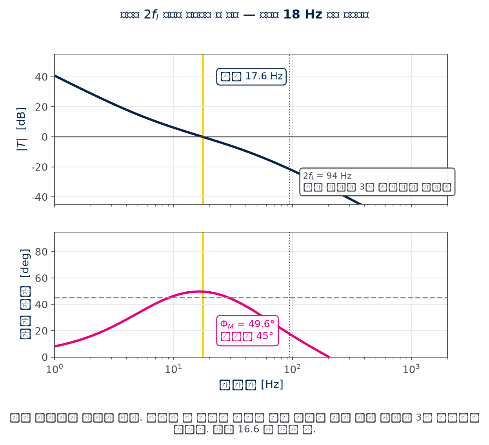

*선정 보상망의 개루프 이득. 교차 17.6 Hz, 위상 여유 49.6°. $2f_l$ 에서의 루프 이득이 3차 고조파를 4.23 % 로 예산(5 %) 안에 묶는다.*

> **▷** $G_o$·$EA_o$의 단위는 **rad/s**이지 Hz가 아니다. \[126\]의 $f_{cto,cross}=G_o/2\pi$가 성립하려면 rad/s여야 한다. \[141\]에 대입할 때 $EA(s)=EA_o/s$ ($s=j\omega$)로 쓰고 $2\pi$를 다시 곱하지 말 것.

**예제:** $V_{FB,set}=3.189$ V, $\boxed{G_o=130.1\ \mathrm{rad/s}}$

### 루프 요구조건

교차 주파수는 3차 고조파 왜율 예산이 결정한다. 2$f_l$ 리플이 FB로 되돌아오면 그대로 입력 전류 왜곡이 되기 때문이다.

$$
G_{EA}(2f_l) =\frac{4\bigl(V_{FB,set}-V_{os}\bigr)\dfrac{D_{3rd}}{100}}{\Delta V_o(P_o,f_l)}\tag{[127]}
$$

$$
\Gamma_v =0.744\,\frac{V_{in,max}}{V_{in,min}}\tag{[128]}
$$

$D_{3rd}$는 허용 3차 고조파 \[%\], $\Gamma_v$는 입력 전압 변동에 대한 여유 계수이다.

**예제:** $D_{3rd}=5\,\%$, $\Phi_M=50^\circ$ 목표, $\Gamma_v=0.744\times264/173.24=\mathbf{1.1338}$

### Venable K-factor 기반 Type II 보상

$$
K_v =\frac{1}{2\alpha_v}\left[(1+\alpha_v^{2})\tan\Phi_M +\sqrt{\bigl(1+\alpha_v^{2}\tan\Phi_M\bigr)^{2}+4\alpha_v^{2}}\right]\tag{[129]}
$$

$$
EA_{o,goal} =\frac{2\pi\,(2f_{l,min})\,G_{EA}(2f_l)}{K_v^{2}}\tag{[130]}
$$

$$
f_{MB} =\frac{1}{2\pi}\sqrt{\frac{G_o\,K_v\,EA_{o,goal}}{\Gamma_v}}\tag{[131]}
$$

$$
f_{p,goal} =K_v\,f_{MB},\qquad f_{z,goal}=\frac{f_{MB}}{K_v}\tag{[132]}
$$

$\alpha_v=1.2$ 고정 권장. 여기에 고주파 극점 $f_{p,HF}$(1 kHz 권장)를 하나 더 둔다.

**예제:** $K_v=2.722$, $EA_{o,goal}=\mathbf{36.20}$ **rad/s**, $f_{MB}=16.92$ Hz, $f_{p,HF}=1000$ Hz

### 보상망 소자값 (FB 핀 주변)

FB 핀은 옵토커플러 컬렉터가 직결되는 *전류 입력*이며, 내부 등가 저항 $R_{FB}=35$ k$\Omega$, 정상상태 전류 $I_{FB,steady}=150\,\mu$A이다.

$$
C_{Fo} =\frac{f_{z,goal}}{f_{p,goal}}\cdot \frac{CTR_{steady}\,R_{FB}}{R_{I}\,R_{B}\,EA_{o,goal}}\tag{[133]}
$$

$$
C_{F} =C_{Fo}\left(\frac{f_{p,goal}}{f_{z,goal}}-1\right)\tag{[134]}
$$

$$
R_{F} =\frac{1}{2\pi f_{z,goal}\,C_{F}}\tag{[135]}
$$

$$
C_{fx} =\frac{1}{2\pi f_{p,HF}\,R_{FB}}-C_{opto}\tag{[136]}
$$

$R_I$는 출력 분압기의 상단 저항, $R_B$는 옵토 바이어스 저항(§7.5), $C_{opto}$는 옵토커플러 출력 커패시턴스이다.

> **▷ \[134\]\[135\]는 선정값 기준이다.** \[133\]의 계산값은 $C_{Fo}=77.88$ nF 이지만 예제의 $C_F=525.5$ nF 는 **선정된** $C_{Fo}=82$ nF 기준이다(계산값을 쓰면 499.1 nF). $R_F=45.72$ k$\Omega$ 도 선정된 $C_F=560$ nF 기준이다. \[96\]과 같은 규약이다.

실제 구현된 전달함수:

$$
EA_{o} =\frac{CTR_{steady}\,R_{FB}}{(C_F+C_{Fo})\,R_I\,R_B}\tag{[137]}
$$

$$
f_{z} =\frac{1}{2\pi R_F C_F}\tag{[138]}
$$

$$
f_{p} =\frac{1}{2\pi R_F\dfrac{C_F C_{Fo}}{C_F+C_{Fo}}}\tag{[139]}
$$

$$
f_{px} =\frac{1}{2\pi R_{FB}\bigl(C_{opto}+C_{fx}\bigr)}\tag{[140]}
$$

$$
EA(s)=\frac{EA_o}{s}\cdot\frac{1+s/(2\pi f_z)} {\bigl(1+s/(2\pi f_p)\bigr)\bigl(1+s/(2\pi f_{px})\bigr)}\tag{[141]}
$$

**예제:** $R_B=6.2$ k$\Omega$ 에서 $C_{Fo}=77.88\to\mathbf{82\,nF}$, $C_F=525.5\to\mathbf{560\,nF}$, $R_F=45.72\to\boldsymbol{47\,\mathrm{k}\Omega}$, $C_{fx}=\mathbf{1.55\,nF}$. 구현값: $EA_{o,i}=32.53$ rad/s, $f_z=6.05$ Hz, $f_p=47.3$ Hz, $f_{px}=999$ Hz. $T(s)=G_{cto}(s)EA(s)$를 \[141\] 그대로(고주파 극점 포함) 수치 계산하면 $\boxed{f_{cross}=17.57\ \mathrm{Hz},\ \Phi_M=49.64^\circ}$, 3차 고조파 $=4.23\,\%$ ($<$ 5 % 만족), 이득 여유 $=34.2$ dB

### 이득 여유 \[141b\]

위상 여유만으로는 안정성 논증이 닫히지 않는다. 이 보상망은 고주파에서 **영점 1개 대 극점
2개**이므로 위상이 $-270^\circ$로 향하고, 따라서 $\arg T$는 **유한 주파수에서 $-180^\circ$를
지난다.** 그 지점의 이득이 이득 여유다.

근 탐색이 필요 없다. $\arg T=-180^\circ$는

$$
\arctan\frac{f}{f_z}=\arctan\frac{f}{f_p}+\arctan\frac{f}{f_{px}}
$$

를 뜻하므로, 양변에 탄젠트를 취해 $f/f_z=(f/f_p+f/f_{px})/(1-f^2/(f_pf_{px}))$로 쓰고
$f$로 나누면 제곱근 하나가 남는다:

$$
f_{180}=\sqrt{\,f_p f_{px}-f_z\bigl(f_p+f_{px}\bigr)\,}\tag{[141b]}
$$

$$
GM\;[\mathrm{dB}]=-20\log_{10}\bigl|T(f_{180})\bigr|\tag{[141c]}
$$

**근호 안이 음수이면 위상이 $-180^\circ$에 닿지 않고 이득 여유는 무한대다** — 식 자체가 그
경우를 알려 준다. 본 예제는 $f_p=47.34$, $f_{px}=999.4$, $f_z=6.047$ Hz 이므로
$f_{180}=\sqrt{47314.6-6329.7}=\boldsymbol{202.4\ \mathrm{Hz}}$, $|T|=0.01955$,
$GM=\boldsymbol{34.2\ \mathrm{dB}}$. 통상 6 dB가 하한, 10 dB가 편안한 목표다.

> **▷** 교차 주파수가 20 Hz 수준인데 $f_{180}$이 200 Hz 부근이므로 이 토폴로지에서 이득
> 여유는 보통 매우 크다. 그래도 **값을 봐야 한다** — 크다고 가정하는 것과 확인하는 것은
> 다르다. ST 설계 툴에는 이 항목이 없다.

### 출력 분압기와 옵토 바이어싱

$$
R_o =\frac{V_{R}}{V_{out}-V_{R}}\,R_I\tag{[142]}
$$

$$
V_{out,act} =V_R\,\frac{R_I+R_o}{R_o}\tag{[143]}
$$

$V_R$은 션트 레귤레이터 기준 전압(TL431: 2.495 V).

DS §5.2.12의 FB 안티새추레이션 회로가 선형 범위를 유지하려면 바이어스 저항이 아래 범위 안에 있어야 한다.

$$
R_{P,max} =\frac{V_{F}}{I_{min}}\tag{[144]}
$$

$$
R_{B,max} =\frac{V_{supply}-\bigl(V_{R}+V_{F}\bigr)} {\dfrac{V_F}{R_P}+\dfrac{I_{FB,steady}}{CTR@I_{FB,steady}}}\tag{[145]}
$$

$$
R_{B,min} =\frac{V_{supply}-\bigl(V_{R}+V_{F}\bigr)} {\dfrac{V_F}{R_P}+\dfrac{I_{FB,max}}{CTR@I_{FB,max}}}\tag{[146]}
$$

$V_F$는 포토다이오드 순방향 전압, $I_{min}$은 션트 레귤레이터 최소 동작 전류, $I_{FB,max}=300\,\mu$A(DS 최소 규격)이다.

**예제:** $V_{supply}=12$ V(2차 하우스키핑 레일), TL431 ($V_R=2.495$ V, $I_{min}=0.8$ mA), SFH617A ($V_F=1.15$ V, $CTR=0.37@150\,\mu$A, $0.53@300\,\mu$A). $R_I=100$ k$\Omega\Rightarrow R_o=\boldsymbol{11\,\mathrm{k}\Omega}$ ($V_{out,act}=25.18$ V). $R_{P,max}=1.437\to\boldsymbol{1.3\,\mathrm{k}\Omega}$ (**상한이므로 내림**). $R_{B}$ 창 $5.759\sim6.477$ k$\Omega \Rightarrow \boldsymbol{6.2\,\mathrm{k}\Omega}$ (기하 중간).

> **▷ $R_B$ 의 창은 $R_P$ 에 딸려 움직인다.** $V_{Fo}/R_P$ 가 창의 분모에 있으므로
> $R_P$ 를 내리면 창도 같이 내려온다. 두 값을 동시에 바꾸면 **한 번 더 반복해서
> 수렴시켜야 한다.**

> **▷ $V_{Fo}$ 를 어느 전류에서 읽었는지 확인한다.** 이 루프는 LED 를
> $I_{FB}/CTR\approx0.55$ mA 로 굽고, SFH617A 는 그 부근에서 약 1.1 V 다. 데이터시트
> 표제값 1.45 V(수십 mA 조건)를 넣으면 $R_{P,max}$ 와 $R_B$ 창이 20 % 헐거워진다.

> **▷ 상한은 내림한다.** $R_{P,max}=1.437$ k$\Omega$ 을 **1.5 k$\Omega$ 으로 올림**하면
> 션트 레귤레이터 캐소드 전류가 $1.15/1.5=0.767$ mA 로 최소 0.8 mA 아래로 떨어져 FB 범위
> 하단에서 조정 능력을 잃는다. ST 툴의 예제가 그렇게 되어 있다 (부록 C.23).

> **▷** $R_B$가 이 범위를 벗어나면 안티새추레이션 회로의 선형 영역이 좁아져 대신호 과도 응답이 크게 느려진다. 교차 주파수가 20 Hz 수준이므로 이 회로가 유일한 고속 복구 수단이다.

### FB 리플과 버스트 임계의 간섭 검증

교차 주파수가 낮으므로 2$f_l$ 리플이 FB 핀에 남는다. 이 리플이 버스트 임계를 넘나들면 버스트 채터링이 발생한다.

$$
\Delta V_{FB@BM} =\frac{P_{in,BM}}{V_{out}}\cdot\frac{1}{2\pi f_l}\cdot\frac{1}{C_{out}} \cdot G_{EA}(2f_l)\tag{[147]}
$$

$$
\Delta R_{BM} =\frac{\Delta V_{FB@BM}}{2\times0.01\ \mathrm{V/k\Omega}}\tag{[148]}
$$

$\Delta R_{BM}$만큼 $R_{BM}$을 *낮추어* 버스트 진입점을 리플 아래로 내린다.

**예제:** $\Delta V_{FB@BM}=52.9$ mV $\Rightarrow \Delta R_{BM}=2.65$ k$\Omega$. 즉 경부하에서 $R_{BM}$ 을 30 k$\Omega$ 에서 27 k$\Omega$ 부근으로 낮출 여지가 있다

> **▷** 교차 주파수를 올리면 리플은 줄지만 3차 고조파(THD)가 나빠진다. 두 제약이 서로 반대 방향으로 당기므로, 20 Hz 근방에서 타협하고 $R_{BM}$으로 조정하는 것이 현실적인 해법이다.

## 설계 요약 — 25 V / 26.3 A

| 항목 | 값 |
| :--- | :--- |
| 입력 | 90–264 Vac · 47–63 Hz · morphing 등가 **173.2–332.3 Vac** |
| 출력 | **25 V / 26.3 A = 657.5 W** · 리플 $\le$ 5 % pk-pk · 홀드업 12 ms @100 Vac |
| 입력 전력 | $P_{in}=684.8$ W · $\eta_{tot}=96.0\,\%$ |
| 2차 정류 | 센터탭 + SR ($N_{rect}=1$) · 레그당 2 병렬 |
| 권선비 | 세트 **7.5 : 1**(코어당 1차 5턴 : 2차 2턴, 3코어 직병렬) · $n_T=7.5$ · $n=6.024$ · 반사 전압 150.6 V |
| 탱크 | $C_r=100$ nF · $L_r=11\,\mu$H · $L_m=20\,\mu$H · $\lambda_{act}=0.55$ · $m=2.82$ |
| 공진 | $f_r=151.7$ kHz · $f_o=90.4$ kHz · $Q_{pk}=0.766$ · $R_{ac}=13.70\,\Omega$ |
| 주파수 범위 | HB 코너 127.1 kHz · **FB 코너 249.0 kHz** = 설계 상한 |
| ZVS | 설계 코너 $T_{ZC}=460$ ns 대 $t_D=220$ ns — **여유 2.09배** (FB 코너 50 % 부하 501 ns; 그 아래는 VCO 상한 밖) |
| 전류(최악 코너) | $I_{sec,pk}=98.6$ A · $I_{Lr,pk}=18.32$ A · $I_{Lm,pk}=12.41$ A |
| 전류(라인사이클) | $I_{pri}=10.92$ A · $I_{mos}=7.72$ A · $I_{diode}=28.34$ A · $I_{Cout}=30.24$ A |
| 출력 뱅크 | $470\,\mu$F $\times$ **160** $=75.2$ mF · ESR 0.1875 m$\Omega$ · $\Delta V_o=1.184$ V (4.74 %) · $T_{hold}=13.42$ ms |
| 1차 스위치 | 600 V · $\ge23.8$ A · 45 m$\Omega$(max) · 스위칭 4.83 W · **정적 도통 9.65 W** · $R_{th}\le10.4$ °C/W |
| 2차 SR | 80 V 이상 · 레그당 118 A · 3.7 m$\Omega$(max) · 소자당 1.41 W · 총 5.65 W (레그당 2.82 W, 예산 3 W 안) |
| $R_{CS}$ | 120 m$\Omega$ 5 병렬 $=24$ m$\Omega$ · $I_{OCP1}=22.9$ A |
| 오실레이터 | $R_T=11$ k$\Omega$ · $C_T=470$ pF · $f_{Min}=92.3$ kHz (대 $f_o$ 90.4 — **여유 1.02배**) · $f_{Max}=319.6$ kHz |
| 보호 | $R_{CFG}=30$ k$\Omega$ · $V_{BO}=84.9$ V · $R_{BM}=30$ k$\Omega$ · ZCD 19 k / 330 k → $V_{OVP1}=28.2$ V · $V_{CC}$ 외부 12 V |
| 제어 루프 | $f_{cross}=17.6$ Hz · $\Phi_M=49.6^\circ$ · GM 34.2 dB · 3차 고조파 4.23 % |
| 보상망 | $R_I=100$ k · $R_o=11$ k · $R_P=1.3$ k · $R_B=6.2$ k · $C_{Fo}=82$ n · $C_F=560$ n · $R_F=47$ k |

> **▷ 이 설계가 일반 LLC 와 다른 곳 셋.**
> ① **$\lambda_{act}=0.55$($m=2.82$)** — 일반 LLC 의 $m=5\sim10$ 을 쓰면 저입력에서 기동조차
> 못 한다. 순환 전류가 큰 것이 승압단을 없앤 대가다.
> ② **출력 커패시터 75.2 mF** — 400 V 벌크 커패시터를 없앤 에너지가 여기로 왔다.
> 라인 반주기의 에너지 $P/\omega=2.23$ J 을 25 V 에서 저장해야 하기 때문이다.
> ③ **탱크 설계의 양 끝이 90/264 Vac 가 아니다** — morphing 때문에 173.2/332.3 Vac 이며,
> 이 둘을 놓치면 설계가 성립하지 않는다.

## EVL6790_670W 평가보드 대조

본 절차를 EVL6790_670W 평가보드에 역으로 적용한 결과이다. 모든 값이 회로도 실장 부품값과 정합한다.

**표 — EVL6790_670W 실장값 대조**

| **항목**                                                                                                 | **실장값**                                                                                    | **본 문서 식으로 재계산**                    | **보드 주석**    |
| :------------------------------------------------------------------------------------------------------------- | :-------------------------------------------------------------------------------------------------- | :------------------------------------------------- | :--------------------- |
| $C_r$ (C9/C12/C13)                                                                                           | 33 nF$\times$ 3 = 99 nF                                                                         | $f_r=152.5$ kHz                                 | —                     |
| $L_r$ / $L_m$      | 11 / 22 $\mu$H                                                                     | $\lambda=0.500$, $f_o=88.1$ kHz                                                                | 일치                                               |                        |
| $n$ / $n_{aux}$                                                                                            | 3.2 / 0.33                                                                                          | CT 정류 기준 등가 217 Vac 설계                    | 일치                   |
| $R_{CS}$                                                                                                     | $68\|68\|75$ m$\Omega$ (2512, 3 W)           | 23.4 m$\Omega\Rightarrow P_{in,max}=718$ W | 670 W 출력                                        |                        |
| OCP1 / OCP2                                                                                                    | —                                                                                                  | 23.5 / 32.1 A                                     | $I_{pri,pk}=17.6$ A |
| $R_{CFG}$          | 31 k$\Omega$                                 | 124 V$_{pk}$ = 87.7 Vrms          | VBO = 85 V                                                                                         |                                                    |                        |
| $R_{BM}$           | 24 k$\Omega$                                                                         | $V_{BM,eq}=0.74$ V, $P_{in,BM}=61.4$ W                                                        | BMi = 55 W (출력)                                 |                        |
| ZCD 분압                                                                                                       | 150 k / 23 k$\Omega$                                                                            | $I_{bias}=100\,\mu$A, OVP1 52.4 V, OVP2 57.0 V | 52 V / 57 V          |
| $R_T$ / $C_T$      | 13 k$\Omega$ / 470 pF                                                             | $R_TC_T=6.11\,\mu$s (범위 내)                                                                     | —                                                 |                        |
| $C_{in}$                                                                                                     | 680 nF$\times$ 3 = 2.04 $\mu$F                                                                | 3 nF/W$\times$ 670 W = 2.01 $\mu$F          | —                     |
| $C_{out}$          | 4700 $\mu$F/63 V $\times$ 4 = 18.8 mF | 홀드업 10 ms, 48$\to$ 40 V: 19.0 mF | —                                                                                                  |                                                    |                        |
| LOUT2                                                                                                          | HB2 드라이버 입력, 풀다운 미실장                                                                    | OPEN$\Rightarrow$ morphing                       | 의도대로               |
| HVSU                                                                                                           | S1M$\times$ 2, AC 라인(브리지 앞)                                                                 | 800 V 핀 요구 충족                                | —                     |

### 보드 구성

| 단         | 구성                                                                   |
| :--------- | :--------------------------------------------------------------------- |
| EMI        | CM 초크 1.8 mH$\times$ 2, X-cap 0.68 $\mu$F, MOV, 퓨즈 10 A     |
| 입력 정류  | 동기 브리지: TEA2209T + ST8L65N044M9$\times$ 4 (44 m$\Omega$)     |
| $C_{in}$ | 680 nF$\times$ 3 필름 (**벌크 커패시터 없음**)                |
| 풀브리지   | HBGANPWR 도터보드$\times$ 2: STDRIVEG600 + ISG6123TA (GaN, TOLL)     |
| 탱크       | T1 = TL301698A-003,$C_r$ = 99 nF                                    |
| 2차 정류   | 센터탭 SR: TEA2096 + ISC079N15NM6$\times$ 4 (2채널 $\times$ 2병렬) |
| 출력       | 48 V / 14 A,$C_{out}$ = 18.8 mF                                   |
| 후단       | 외부 벅 3개: 24 V/21 A, 20 V/3 A, 12 V/8 A                       |

> **▷** 보드 주석 “BMi = 55 W”는 *출력* 기준이다. $R_{BM}=24$ k$\Omega$에서 $P_{in,BM}=R_{BM}\cdot0.01/(0.167\,R_{CS})=61.4$ W이고, $\eta_{BM}=90\,\%$를 곱하면 55.3 W가 되어 주석과 일치한다 (식 \[88\]).

> **▷** $P_{in,max}=718$ W는 670 W 출력에 대해 여유가 크지 않다. 종합 효율 95 %로 보면 입력 705 W이므로 전부하에서 FB 전압이 상단 레일 근처에 놓인다. 실측으로 확인이 필요한 항목이다.

> **▷** **2차 정류가 센터탭임을 두 가지로 확인하였다.** (i) 트랜스포머 권선 라벨 `W-DR1 / W-CT / W-DR2`와 SR 보드의 게이트 구동 채널 수(2채널에 MOSFET 2개씩 병렬). (ii) 보드 주석의 $I_{sec,pk}=56.41$ A와 $I_{sec,rms}=16.30$ A의 비 **3.46**은 듀티 보정판 \[64\]로만 설명된다. 보드 탱크로 라인사이클 적분을 하면 CT에서 $I_{sec,pk}/I_{sec,rms}=3.48$, FB이면 2.46이 나온다.

> **▷** 보드 주석의 $I_{pri,rms}=9.67$ A는 설계 등가 입력(217 Vac)에서의 **라인사이클 실효값** 9.70 A와 일치한다. 즉 ST 보드 주석은 라인사이클 기준이며, 툴의 $\theta=\pi/4$ 단일점 값과는 다른 기준이다.

## SMath 구현 노트

동봉한 SMath 시트는 사양·목표·회로 상수·IC 상수·선정값을 **노란 입력 셀**로 분리해 두었고, 나머지는 전부 살아 있는 수식이다. 시트를 새로 만들거나 다른 도구로 옮길 때 지켜야 할 것은 다음과 같다.

### 구현 시 주의점

1. **선정값 처리.** Tool은 모든 단계에서 `if(selected, selected, calculated)` 패턴을 쓴다. SMath에서도 `Cr := if(Cr_sel > 0, Cr_sel, Cr_calc)` 형태로 구현해야 이후 식이 표준값 기준으로 재계산된다. 이것을 빠뜨리면 최종 확인값(§3.10)이 전부 틀어진다.
2. **식 \[59\]의 근 선택.** $M(f_n,Q)=M_{req}$는 근이 두 개다. SMath의 `roots()` / `FindRoot()`는 초기값에 따라 용량성 근을 반환할 수 있다. 안전한 방법은 $f_n$을 $3.0$에서 $f_{n0}$까지 감소시키며 스캔해 $M(f_n,Q)\ge M_{req}$가 되는 *첫* 지점을 취하는 것이다. 또는 $M$의 피크 위치를 먼저 구해 그 오른쪽에서만 이분법을 적용한다.
3. **$M_{req}<1/(1+\lambda)$인 경우.** 고입력 쪽 morphing 경계 직전(풀브리지, 235 V$_{pk}$)에서 경부하일 때 요구 게인이 무부하 점근값 $1/(1+\lambda)$ 아래로 내려간다. 이때 해는 매우 높은 주파수로 발산하며 물리적으로는 *버스트 모드*로 처리되는 영역이다. 스캔 상한($f_n=3$ 정도)에서 해를 못 찾으면 “burst region”으로 표시하고 넘어가도록 예외 처리할 것.
4. **$T_{idle}$을 반드시 입력 변수로.** 부록 C.1의 세 후보값 중 어느 것이 맞는지 확정되지 않았다. 상수로 하드코딩하지 말고 셀로 빼서 세 값을 모두 비교할 수 있게 한다. $f_{Max}$ 가 $\pm25\,\%$ 흔들리고 $f_{Min}$ 도 움직인다 (§5.1).
5. **루프 계산.** $f_{cross}$와 $\Phi_M$은 해석해가 없다. $|T(j2\pi f)|=1$을 이분법으로 풀고, 그 주파수에서 위상을 평가하여 $\Phi_M=180^\circ+\angle T$를 계산한다. Tool은 27회 이분법을 수동 전개해 두었는데, SMath에서는 `FindRoot()` 한 줄로 대체 가능하다.
6. **단위계.** Tool은 셀마다 kHz, nF, $\mu$H, m$\Omega$가 섞여 있어 상수에 $10^{\pm n}$이 산재한다. 본 문서의 식은 모두 SI로 정리했으므로, SMath의 단위 기능을 사용하면 그대로 옮길 수 있고 Tool보다 오류 가능성이 낮다.
7. **라인 위상 스윕.** $\theta$를 $\pi/12$ 간격 정도로 벡터화하여 $f_{sw}(\theta)$, $I_{sec,pk}(\theta)$ 등을 한 번에 계산하고 그래프로 확인하면 설계 검증이 쉬워진다. 최악값은 $\max()$로 뽑는다.

## 데이터시트 불일치 및 미확정 항목

### C.1 오실레이터 유휴 시간 $T_{idle}$

DS 내부에서 상호 모순된다. 모델 자체는 검증되었으나 상수가 세 가지이다.

| **출처** | **$T_{idle}$** | **$f_{Min}$** | **$f_{Max}$** |
| :--- | :--- | ---: | ---: |
| DS §5.3.2 $f_{sw}$ 설계식                     | 700 ns | 85.2 kHz | 248.2 kHz |
| DS §5.3.2 $C_{T,max}$ 식                      | 350 ns | 90.6 kHz | 300.4 kHz |
| DS Table 5 $f_{osc}$ 실측표 (역산, **8/8칸 일치**) | 250 ns | 92.3 kHz | 319.6 kHz |
| ST 설계 툴 r1.0                                 | 350 ns | 90.6 kHz | 300.4 kHz |

($C_T=470$ pF, $R_T=11$ k$\Omega$ 기준 — 본 예제)

DS의 $C_{T,max}$ 식에 등장하는 상수 133.34 $\mu$A/V는 $I_{EA,max}/(2V_{ref})=400\,\mu\mathrm{A}/3\,\mathrm{V}$와 정확히 일치하고, 그 식 안의 “700 ns”는 $2T_{idle}$에 해당하므로 $T_{idle}=350$ ns를 의미한다. 반면 $f_{sw,min}=1/\bigl(2(C_TR_T+700\,\mathrm{ns})\bigr)$에서의 700 ns는 $T_{idle}$ 그 자체이다. DS Table 5의 4개 데이터 행을 역산하면 241–251 ns가 나온다.

**보강된 증거.** Table 5의 $f_{osc}$ 행 **8칸 전부**($R_T$/$C_T$ 4조합 × min/max 2열)를 역산했다.

| $R_T$ / $C_T$ | min 열에서 역산 | **max 열에서 역산** |
| :--- | ---: | ---: |
| 10 k / 330 p | 251.1 ns | **250.0 ns** |
| 20 k / 330 p | 249.3 ns | **249.9 ns** |
| 10 k / 560 p | 248.0 ns | **250.2 ns** |
| 20 k / 560 p | 241.6 ns | **250.1 ns** |

max 열은 $I_{EA,max}$ 경로가 추가로 들어가는 **다른 식**인데도 4개가 250.0 ns에 **0.2 ns 이내**로
모인다. 우연으로 보기 어렵다. 실리콘 값은 250 ns일 가능성이 높고, DS §5.3.2의 700 ns는 한 상수를
두 자리에 잘못 쓴 것으로 보인다.

**부수 확인:** DS §5.3.2의 상수 **541.34 $\mu$A/V** $=(400+412.0)/1.5$ 는 Table 5의
$I_{OSC,SU}=412.5\ \mu$A와 어긋난다(541.67이어야 함). ST 툴 전용 오차로 알려졌던 412 $\mu$A가
**DS 자신의 식에도 있다.**

**조치:** 마진 확인은 700 ns(가장 보수적), 성능 예측은 250 ns로 **병기**한다.
**조치:** 초도 보드에서 $f_{sw}$를 실측하여 확정할 것. 그 전까지는 가장 보수적인 값(주파수 상한이 낮은 700 ns)으로 마진을 확인하는 것이 안전하다.

### C.2 브라운아웃 식의 min/max

DS: $V_{BO}=\min\bigl(60\,\mathrm{V},\;R_{CFG}\cdot4\,\mathrm{V/k\Omega}\bigr)$. 문자 그대로 읽으면 $R_{CFG}\ge15$ k$\Omega$인 모든 경우에 60 V가 되어 Table 6의 “조정 BIBO” 행과 모순된다. $\max$이거나, 15 k$\Omega$가 하한이라는 의미의 표기 오류로 보인다.

### C.3 CFG 스케일의 peak / rms 혼용

DS는 $V_{BO}$를 **peak**로 정의하지만, ST 설계 툴과 EVL6790 보드 주석은 **rms**로 표기한다 ($R_{CFG}=32$ k$\Omega$ $\to$ DS 기준 128 V peak, 툴 표기 90.5 V). $\sqrt2$ 배 오설정하기 쉬운 지점이다.

### C.4 DRAFT 상태로 미확정

- $R_{th(j\text{-}a)}$ TBD, ZCD 절대최대정격 하한 TBD, 주문 정보 TBD
- THD optimizer 내부 알고리즘, 영교차 성형 전략 — 명칭만 있고 규격 없음
- HVSU가 전류원으로 동작하면서 동시에 $V_M(\theta)$를 취득하는 방식 (“sensor-less”)
- $f_{sw}$가 $f_o$ 아래 하한에 도달했을 때의 실제 거동
- 영교차 근방 극경부하에서의 적응 데드타임(ADT) 거동

### C.5 ST 설계 툴 — $N_{rect}=2$에서의 권선비 2배 불일치

**이 항목은 데이터시트가 아니라 ST 설계 툴 r1.0 의 문제다.** 수치는 툴의 기본 예제(240 W / 60 V, $N_{rect}=2$)로 보인 것이다.

#### 증상

Tool은 $V_{o,eff}=(V_{out}+N_{rect}V_{rect})/N_{rect}$로 정의하고 $n=\sqrt2 V_{in,res}/(2V_{o,eff})$를 “Physical Turn Ratio (npri/nsec)”로 출력한다. $N_{rect}=2$인 240 W 예제에서는 $V_{o,eff}=30$ V, $n=5$가 나온다.

그러나 게인식 $M=2nV_{o,eff}/(\sqrt2 V_{in})$에서 실제로 의미를 갖는 양은 *반사 전압* $n\,V_{o,eff}=150$ V뿐이다. 물리적으로 반사 전압은 $N_p/N_s\cdot(V_{out}+N_{rect}V_{rect})$이므로

$$
\frac{N_p}{N_s}=\frac{n\,V_{o,eff}}{V_{out}+N_{rect}V_{rect}}=\frac{150}{60}=2.5 =\frac{n}{N_{rect}}
$$

즉 **Tool의 $n$은 물리 권선비의 $N_{rect}$배**이다. 분자의 $N_{rect}V_{rect}$가 이미 직렬 정류 소자 개수를 반영하고 있는데 분모에서 한 번 더 나누어 생긴 이중 계산으로 보인다. $N_{rect}=1$(센터탭)에서는 두 정의가 일치하므로 문제가 드러나지 않는다 — EVL6790_670W가 센터탭이라 이 경로가 검증되지 않은 것으로 추정된다.

#### 영향

$n\,V_{o,eff}$와 $n^2V_{o,eff}^2$만 쓰는 항목은 불변이다.

| 항목                                                                 | 영향                   | 비고                                                                                                       |
| :------------------------------------------------------------------- | :--------------------- | :--------------------------------------------------------------------------------------------------------- |
| $M_{V\!min,pk}$, $M_{V\!max,pk}$, $M_{req}(\theta)$            | 없음                   | $n V_{o,eff}$ 불변                                                                                       |
| $R_{ac}$, $Q_{ZVS}$, $Z_0$, $\lambda$                        | 없음                   | $n^2V_{o,eff}^2$ 불변                                                                                    |
| $C_r$, $L_r$, $L_m$, $f_r$, $f_o$                          | **없음**         | **탱크 설계는 그대로**                                                                               |
| $f_{sw}(\theta)$, $Q_{ZVS,3}$                                    | 없음                   |                                                                                                            |
| $I_{sec,pk}$, $I_{sec,rms}$, $I_{diode,rms}$, $I_{Cout,rms}$ | 없음                   | $n$ 미사용, 2차측 선정 그대로                                                                            |
| $n$ (권선 사양)                                                    | $\div2$              | 5$\to$ **2.5**. 이대로 감으면 게인 2배                                                             |
| $n_T$, $L_{L2}$                                                  | $\div2$, $\times4$ | 6.171$\to$ 3.085 / 0.493 $\to$ 1.973 $\mu$H                                                         |
| $I_{trafo,pk}$                                                     | $\times2$            | 2.952$\to$ **5.904** A                                                                            |
| $I_{Lm,pk}$                                                        | $\div2$              | 7.679$\to$ **3.840** A                                                                            |
| $I_{pri,rms}$ / $I_{mos,rms}$                                    | 최악점 이동            | $\pi/4$ 5.06 A $\to$ $\pi/2$ 4.76 A                                                                |
| 1차 스위치 전류 정격                                                 | $\times2$            | 3.84$\to$ 7.68 A                                                                                        |
| $R_{CS,max2}$                                                      | $\div2$              | 186.3$\to$ 93.2 m$\Omega$ (합성 탱크 전류 기준으로는 82.6 m$\Omega$, 여전히 비지배) |

**실무적으로 가장 위험한 것은 권선비다.** $N_{rect}=2$ 설계에서 Tool의 $n=5$를 그대로 감으면 반사 전압이 300 V가 되어 요구 게인이 2배가 되고, 저입력에서 기동하지 않는다. $R_{CS}$ 선정 결과는 최대전력 조건이 지배하므로 바뀌지 않는다.

#### 검증

라인 피크($\theta=\pi/2$, $V_{in,min}=180$ Vac 등가)에서 전력 수지로 확인하였다. 구동 기본파 진폭 $V_1=(4/\pi)(\sqrt2\cdot180/2)=162.06$ V, 탱크 입력 순시 전력 $2P_{in,LLC}=489.8$ W이므로 필요한 1차 동상 전류 기본파는 $2P/V_1=6.045$ A이다. $I_{sec,pk}=14.759$ A인 반사 전류 파형(도통율 $f_{sw}/f_r=0.851$)의 기본파를 수치 적분하면:

| 가정                                         | 기본파 진폭 |     요구값 대비 |
| :------------------------------------------- | ----------: | --------------: |
| $n=5$ (Tool)                               |    2.690 A |           0.445 |
| $n=2.5$ (본 문서)                          |    5.381 A | **0.890** |
| 대조군: EVL 보드 ($N_{rect}=1$, $n=3.2$) |    15.14 A | **1.078** |

$N_{rect}=1$인 보드가 1.08(FHA 오차 범위)로 맞는 것을 기준으로 보면, $n=2.5$의 0.89는 같은 오차 범위이고 $n=5$의 0.445는 명백히 절반이다.

자화 전류는 독립적으로 확인된다. 전력 전달 구간 동안 $L_m$ 양단 전압은 반사 전압 $n V_{o,eff}=150$ V이므로 $\Delta I_{pp}=150\times(1/2f_r)/L_m=7.68$ A, 즉 $I_{Lm,pk}=3.84$ A이다. Tool의 7.68 A는 이 값을 $\Delta I_{pp}$가 아니라 피크로 잘못 대응시킨 것과 수치가 같아진다.

> **▷ 이 결함은 `RTC` 시트에도 복제되어 있다.** `RTC`는 반사 출력 전압을 `((C$5+C$11*C$6)/C$11)` 형태로 자체 계산하며(행 16–18, 41–46, 53–58, 67–72, 81–86, 95–107, 합계 **2,803셀**) 여기서도 $N_{rect}$로 한 번 더 나눈다. `Res. Tank Design!D9`만 고치고 $n$을 2.5로 내리면 격자 전체 게인이 절반이 되어 $1/M>1+\lambda$가 되고 시트가 `#NUM!`으로 붕괴한다. **두 곳을 반드시 함께 고쳐야 한다.**

> **▷** 본 절은 제공된 자료로부터의 *역추론*이며 ST 문서에 명시된 바가 아니다. $N_{rect}=2$로 설계한다면 반사 전압 $nV_{o,eff}$를 기준으로 직접 검산할 것을 권한다. $N_{rect}=1$(센터탭)로 설계하면 이 문제 자체가 발생하지 않는다.

### C.6 ST 설계 툴 — 기타 경미한 사항

- `CC!D26`, `CC!E26`(=$I_{diode,rms}$ @ $\theta=\pi/3,\pi/2$)이 정류 구성 셀 대신 $V_{f,BR}$ 셀을 참조한다. 현재 $N_{rect}=2$에서는 우연히 결과가 맞지만, 센터탭으로 바꾸면 두 값이 $\sqrt2$배 작게 나온다.
- $I_{R1,pk}$ 식이 평균 전력을 쓴다 (§3.8 참조). 결과적으로 $I_{R0}$과 $T_T$가 절반이 된다.
- $I_{R0,crit}=\sqrt{2c_{HB}/(L_r+L_m)}\cdot V_{in}$에서 $V_{in}$에 rms를 넣는다. 피크여야 하므로 $\sqrt2$배 작게 나온다 (0.572 대 0.809 A). 이 값은 다른 곳에 쓰이지 않는다.
- $V_{ZCD,SUend}$를 1.35 V로 둔다 (DS는 1.36 V). $I_{OSC,SU}$는 412 $\mu$A (DS는 412.5 $\mu$A). 영향 무시 가능.

### C.7 DS §5.3.4의 $R_{ZCD,L}$ 식

DS는 $R_{ZCD\_L}=\dfrac{V_{out\_OVP1}}{V_{OVP1}}\cdot\dfrac{n_{aux\_pri}}{n_{sec}}\cdot\dfrac{1}{I_{bias}}$로 쓴다. 앞 두 항이 모두 무차원이므로 **단위가 $\Omega$가 아니라 $\mathrm{A^{-1}}$**이다. 예제 값을 넣으면 95.7 k$\Omega$이 나오고, 그때 분압기 전류는 24 µA로 DS 자신이 정의한 "OVP1에서의 분압기 전류 $I_{bias}=100\,\mu$A"와 모순된다.

ST 툴과 본 문서 \[95\]는 $R_{ZCD,L}=V_{OVP1,th}/I_{bias}$를 쓰며, EVL6790_670W의 실장값(23 k$\Omega$ / 150 k$\Omega$, $2.3\,\mathrm{V}/23\,\mathrm{k}\Omega=100\,\mu$A)이 정확히 이쪽이다. 즉 **DS 쪽이 오타**로 판단된다. 비($R_H/R_L$)를 주는 두 번째 식은 양쪽이 같다.

### C.8 ST 설계 툴 — 추가로 확인된 결함

부록 C.5·C.6 에 이어 확인한 항목이다. 수치는 툴의 기본 예제 기준이다.

| 위치                              | 내용                                                                                                                                                                                                                 | 영향                                                                  |
| :-------------------------------- | :------------------------------------------------------------------------------------------------------------------------------------------------------------------------------------------------------------------- | :-------------------------------------------------------------------- |
| `Design Spec!D79`               | morphing인데 등가 입력 상한을$V_{ac,max}$로 둠. 실제 상한은 $2V_{HVPK\_BOH}/\sqrt2=332.3$ Vac                                                                                                                    | 최대 운전 주파수 187 →**241 kHz**                              |
| `Design Spec!D20/F20`           | 등가 입력 하한을 "165–180" 범위로 표시하고 사용자가 고르게 함. 실제 하한은$V_{HVPK\_BIH}/\sqrt2=173.2$ Vac                                                                                                        | 요구 게인 1.179 →**1.225**, ZVS 여유 축소                      |
| `RTC!25/26`                     | $f_n$ 탐색 격자 상한 $f_{n,max}=1.3703$ (205.9 kHz). 그 위의 동작점은 해를 낼 수 없음                                                                                                                            | 위 항목이 드러나지 않는 구조적 원인                                   |
| `Device Setting!D83`            | $(n_{aux}/n_{sec})_{max}$를 $V_{OVP2,out}/N_{rect}$로 나눔. 같은 시트의 $V_{aux,OVP2}$는 나누지 않음                                                                                                           | $N_{rect}=2$에서 **2배 관대**                                 |
| `CC!C25`, `CC!C26`            | $I_{sec,rms}$에 도통율 $d$ 보정이 없음($I_{pk}/\sqrt2$). 같은 시트 `C31`(식 \[70\])은 $d$를 반영                                                                                                           | 2차 실효값$\sqrt{1/d}$ 과대(보수적)                                 |
| `CC!C31`                        | $I_{Cout,rms}$가 $\theta=\pi/4$ 한 점의 고주파 성분만. $2f_l$ 성분 누락                                                                                                                                        | 3.35 →**4.72 A**                                               |
| `Comp!D15`, `D43`             | $I_{FB,max}$에 $CTR$를 두 번 적용(300 → 566 → 1068 µA)                                                                                                                                                        | $R_{B,min}$ 4.47 vs DS식 6.27 k$\Omega$                           |
| `Power Components!D40`          | $P_{Cout}$만 $f_{sw}@\pi/4$를 쓰고 D37·D39는 $f_{sw}@\pi/2$ 사용                                                                                                                                              | 경미                                                                  |
| `Comp!D73` vs `D83`           | $G_{EA}(2f_l)$은 $f_l$, $EA_{o,goal}$은 $2f_{l,min}$ — 혼용                                                                                                                                                 | 경미                                                                  |
| `Comp!132/134`                  | 루프 검증에서$f_{px}$ 극점 누락                                                                                                                                                                                    | $\Phi_M$ 50.3° vs 49.2°                                           |
| `Prelim!D11`                    | $I_{in,max}=P_{in,LLC}/V_{ac,min}$ (브리지·EMI 손실 전)                                                                                                                                                           | 0.85 % 과소                                                           |
| `Design Spec!D33/34/37`         | `OutCap_Sel_DB`의 자동 커패시터 선정 결과를 **아무 셀도 참조하지 않는다**. 실제 계산은 `Power Components`의 수동 입력만 사용                                                                               | 추천값과 계산값이 달라도 경고 없음                                    |
| `Design Spec!D48` (`Cp` 2 nF) | 어디에서도 참조되지 않는**죽은 입력 셀**                                                                                                                                                                       | 없음                                                                  |
| `Power Components!D37`          | 권장 세라믹 최소값이 하류에서 미사용(D38 수동 입력)                                                                                                                                                                  | 없음                                                                  |
| `Power Components!D77`          | $C_{tot}=2C_{oss}+C_{par}=548$ pF가 `Design Spec!D46` $c_{HB}=500$ pF로 **되먹임되지 않는다**. 식 \[116\]이 요구하는 반복이 실행되지 않음 | 본 예제는 영향 없음($Q_{ZVS,2}$ 5.00→4.56, 여전히 비지배) |                                                                       |
| `Device Setting!B113`           | "Split resonant capacitors for forced HB configuration" 절이**제목만 있고 내용이 없다**                                                                                                                        | 고정 HB 설계 시$C_r/2$ 두 개 배치를 툴이 안내하지 않음 (DS §5.3.1) |
| `Res. Tank Design!D9` / `D51` | $n$을 "Physical Turn Ratio", $n_T$를 "Real Turn Ratio"로 **동시에 라벨**                                                                                                                                   | 권선비 오해 (§3.10)                                                  |

> **▷** 부록 C 의 툴 결함은 동봉한 **수정본 스프레드시트**에 셀 단위로 반영되어 있고, 변경 내역은 그 안의 CHANGELOG 시트에 있다. 파일을 열면 전체 재계산(Ctrl+Alt+F9)할 것.

### C.9 근거를 확인할 수 없는 상수

아래 값들은 ST 툴에만 존재하고 DS에도, 본 문서의 유도 과정에도 근거가 없다. **오류라는 뜻이 아니라, 검증하지 못했다는 뜻이다.** 설계 여유를 잡을 때 이 항목들이 불확실성의 원천임을 기억할 것.

| 상수                             | 위치                                       | 성격                                                                                                                 |
| :------------------------------- | :----------------------------------------- | :------------------------------------------------------------------------------------------------------------------- |
| $\pi^2/8$                      | \[28\] $\lambda_{min,TD}$                | 데드타임 보정 계수. 유도 불명                                                                                        |
| 지수 5                           | \[36\] $f_{n,min}$의 $(Q/Q_{ZVS,1})^5$ | 경험적 피팅으로 보임                                                                                                 |
| 0.744                            | \[128\] $\Gamma_v$                       | 유래 불명                                                                                                            |
| 3 nF/W                           | \[100\] $C_{in}$                         | ST 경험칙. EVL 보드와는 일치(2.01 vs 2.04 µF)                                                                       |
| 계수 4                           | \[127\] 3차 고조파                         | pk-pk→진폭 및 고조파 성분비의 곱으로 추정                                                                           |
| $K_v$ 식의 비대칭              | \[129\]                                    | 앞항$(1+\alpha_v^2)\tan\Phi_M$, 뒷항 $(1+\alpha_v^2\tan\Phi_M)^2$. 오타 의심이나 결과 $\Phi_M$은 목표에 맞는다 |
| $K_{HV}=3.34\times10^{-3}$     | §2.4                                      | 곱$2K_{HV}/(K_MK_{FF})=0.167$만 DS §5.3.3으로 검증됨. 개별 값은 툴 전용                                           |
| $DF=2.5\,\%$, $\alpha_v=1.2$ | §6.2, §7.3                               | 권장값                                                                                                               |

### C.10 ST 설계 툴 — 설계 절차 셀의 결함 3건

| 위치 | 내용 | 영향 |
| :--- | :--- | :--- |
| `Device Setting!D3` | $f_{sw,max,design}=\min(f_{sw,max,spec},1.5f_{sw,max,op})$ — 식 \[62\]의 **바깥쪽 $\max$가 누락** | 실제 최대 운전 주파수가 spec을 넘으면 오실레이터가 그보다 낮은 상한으로 설계된다. 실제 최대 운전 주파수가 spec 을 넘는 설계(예: 240.9 kHz 대 225 kHz)에서 $C_{T,max}$ 가 770 pF 이어야 할 자리에 637 pF 이 나온다 |
| `Preliminary Calculation!D17` | $\eta_{HB}$로 라벨되었으나 실제로는 $\eta_{rect}\eta_{HB}$. 이 셀이 `Res. Tank Design!D35`에서 $\eta_{HB}$로 사용된다 | $V_{rect}=0$일 때만 우연히 일치 |
| `Comp!D42` | $R_{B,max}$ 분모에 DS §5.2.12의 $V_F/R_P$ 대신 $I_{min}$ | $R_P=R_{P,max}$일 때만 일치. 6.93 vs 7.13 k$\Omega$ |

### C.11 SMath 구현에서 걸리는 함정 6종

SMath 에서 실제로 돌려 확인한 것들이다. **모두 값이 정상으로 보이거나 아예 침묵하다가 나중에 터지는 유형**이라 문서로 남긴다.

| # | 증상 | 원인 | 회피법 |
| :-- | :--- | :--- | :--- |
| 1 | 인쇄물의 수식이 실제 계산과 다르게 보임 | **표시 괄호 요소가 없다.** SMath는 괄호를 자동 삽입하지 않는다 | 부분식의 RPN 바로 뒤에 `<e type="bracket">(</e>`. 예: \[36\]이 $1+\tfrac1\lambda\cdot1-M^{-1+k}$로 렌더링되어 **0.7172**로 읽히지만 실제 계산은 **0.8211** |
| 2 | $P_{d,BR}$·$\eta_{tot}$·$P_{in}$ 이하 전부 `error 74` | 저항 단위를 **`Ohm`(대문자)**로 씀 — 인식되지 않아 독립 차원으로 취급된다. $W+\mathrm{Ohm}\cdot A^2$가 차원 불일치 | **`ohm`(소문자)** 를 쓸 것 |
| 3 | $\ln$·비정수 거듭제곱이 "Operation cannot be performed with units" | $V_{in,min}$에서 **`abs()`를 볼트 단위 값에 적용**해 단위 태그가 남고, $M_{V,min}$까지 전파된다. 값은 정상으로 표시되므로 증상이 없다 | `abs()`는 **순수 숫자에만** 적용하고 단위는 마지막에 다시 붙인다 |
| 4 | 무단위여야 할 비가 태그를 달고 있음 | 위와 같은 경로 | $\ln$·$\exp$·$\arctan$·변수 지수에 들어가는 비는 **각 변을 단위로 나누어** 명시적으로 무단위화: `(Vo.eff/'V)/(Vin.min/'V)` |
| 5 | \[37\]에서 `error 25` | **`arctan`은 정의되어 있지 않다** | 역탄젠트는 **`atan`** |
| 6 | 값이 안 보이고 우측 메모만 보임 | 표시 리전에 `<result>` 요소가 없음 | `<result action="numeric">` 를 넣어야 SMath가 평가·출력한다 |

### C.12 ST 설계 툴 — 보상망 검증부에 고주파 극점 $f_{px}$가 빠져 있다

`CompensationNet&Check` 시트의 **설계식 26개는 본 문서와 전부 일치**한다
(`D37 D38 D41 D42 D43 D64 D65 D66 D67 D72 D73 D74 D78 D83 D84 D85 D86 D93 D94 D95 D96
D101 D102 D103 D104 D128 D129`). 회로 토폴로지도 동일하다.

**그러나 루프를 되짚어 확인하는 부분이 다르다.** 이득·위상·교차주파수를 계산하는
`H132`/`H134`/`H139`와 이분법 블록 `H141:N167`, 그리고 `D124`가 **$f_{px}$ 극점을 포함하지
않는다.** $f_z$와 $f_p$만으로 위상을 만든다.

**영향:** 교차주파수 근방에서 위상이 **약 1° 낙관적**으로 나온다(예: 툴 50.3° 대 실제 49.3°). 판정을 뒤집을 크기는 아니지만, 여유가 45°에 가까운 설계에서는
확인해야 한다.

### C.13 ST 설계 툴 — 요구 E/A 이득이 $f_{l,min}$을 쓰지 않는다

`CN!D73`의 라벨은 *"Required E/A Gain @ 2fL**min**"* 인데, 분모가 **`D65`(공칭 $f_l$의 리플)**
이다. 바로 아래 `D68`이 $f_{l,min}$ 리플을 계산해 놓고도 **어디에서도 참조되지 않는다.**
`D125`도 `AV122 = 2·D110`(공칭 $f_l$)에서 읽는다.

**영향:** 50/47 = **1.064배 낙관.** 3차 고조파 예산이 그만큼 헐거워지고, 그 오차가
$EA_o$ → $f_{MB}$ → $f_z$ → $C_{Fo}$ → $R_F$ 로 전파되어 보상 소자값이 3–6 % 어긋난다.

**조치:** 라인 주파수 범위가 있는 설계에서는 **최소값이 최악**이다. 분모를 `D68`로,
`AV122`를 `2*D7`로 바꾼다.

### C.14 ST 설계 툴 — $R_{CS,max2}$의 분모가 $I_{trafo,pk}$다

`Device Setting!D39`가 반사 부하 전류 피크만 본다. $R_{CS}$는 하프브리지 리턴에 있으므로
**자화 성분을 포함한 합성 탱크 전류 피크**를 본다 (본문 \[79\]).

670 W 예제에서 16.90 A 대신 **18.62 A** → 32.54가 아니라 **29.54 m$\Omega$**. **1.10배 낙관.**
최대전력 조건이 지배하는 설계에서는 결과가 바뀌지 않지만, $\lambda$가 크거나 반사 전압이 높아
D39가 지배하면 그대로 위험하다.

### C.15 ST 설계 툴 — $R_{CS}$ 선정 셀이 계산이 아니라 상수 왕복이다

`Device Setting!D45`는 라벨이 *"Select…"* 인데 수식 셀이고, 그 수식이
$(3/220+1/440)^{-1}=62.857$ m$\Omega$ — **EVL 보드의 220‖220‖220‖440 실장망을 박아 넣은
상수**다. 거기에 `D43`을 곱해 두어 뒤의 `D46 = D45/D43`이 같은 값을 다시 뱉는다.

**즉 사양을 무엇으로 바꿔도 $R_{CS}$는 영원히 62.857 m$\Omega$다.** 게다가
`D46 = D45/D43`은 "동일 저항 D43개 병렬"을 전제하는데 실제 망은 220 3개 + 440 1개다.
결정적으로 **D45가 바로 위 D44(상한)를 2.6배 위반해도 경고가 없다** — 240 W 원본에서는
D44 = 204.05 > 188.57이라 우연히 통과했을 뿐이다.

### C.16 ST 설계 툴 — $R_{CS}$ 손실의 전류 기준이 어느 것도 아니다

`Device Setting!D33`이 `MAX(CC!C29, Prelim!D11)`인데 `CC!C29`는 **$\theta=\pi/4$ 한 점**의
스위칭주기 실효값이다. 670 W 예제에서 10.24 A. 라인사이클 실효는 10.88 A(손실의 물리적 정답),
본 문서가 쓰는 최악 스위칭주기($\theta=\pi/2$)는 13.93 A. **툴 값은 둘 중 어느 것도 아니다.**
$R_{CS}=24$ m$\Omega$에서 2.52 / 2.84 / 4.66 W → 1 W 부품 **3개가 아니라 5개**가 맞다.

### C.17 ST 설계 툴 — OCP 트립점이 시트 어디에도 없다

시트 전체에 $V_{OCP2}=0.75$ V 도, "OCP"라는 문자열도, 어떤 수식·라벨에도 없다.
**$R_{CS}$를 고른 뒤 OCP가 몇 A에서 트립하는지 시트가 알려주지 않는다.**

670 W 예제에서 62.86 m$\Omega$ 가 조용히 살아남은 이유가 이것이다 — $I_{OCP1}=8.75$ A인데
실제 합성 피크는 18.62 A로 상시 트립인데도 시트 어디에도 그 사실이 나오지 않는다.

**조치:** $I_{OCP1}=0.55/R_{CS}$, $I_{OCP2}=0.75/R_{CS}$ 와 합성 피크 대비 여유를
반드시 별도 행으로 둘 것.

### C.18 ST 설계 툴 — $\theta=\pi/4$ 한 점을 "라인사이클 실효값"이라 부른다

`CC` 시트는 $\theta$를 **세 점($\pi/4$, $\pi/3$, $\pi/2$)** 에서만 평가한다. 그 중
**$\theta=\pi/4$ 열**이 여러 곳에서 *"(mains cycle)"* 라벨을 달고 있다 —
`Res. Tank Design` D65·D67, `Power Components` D60·D61·D84·D85.

**왜 $\pi/4$ 인가.** 포락선이 정확히 $\sin\theta$ 라면 그 점의 값이 라인사이클 실효값과
같아진다($\sin(\pi/4)=1/\sqrt2$). 근거 없는 선택이 아니라 **의도된 근사**다.

**그런데 실제 포락선은 $\sin^2\theta$ 다** ($I_{o,inst}=2I_{out}\sin^2\theta$, 식 \[62\]).
본 설계(7.5:1)에서 5점 Simpson 적분과 대조하면:

| | $\theta=\pi/4$ 한 점 | 라인사이클 실효 | 차이 |
| :--- | ---: | ---: | ---: |
| $I_{pri}$ | 10.32 A | 10.92 A | +5.8 % |
| $I_{diode}$ (권선당) | 24.16 A | 28.34 A | **+17.3 %** |

**손실은 전류의 제곱이므로 영향이 커진다** — 2차 정류기 손실 4.10 W → **5.65 W (1.38배)**,
100 K 상승 기준 필요 $R_{th}$ 24.4 → **17.7 °C/W**. 방열 설계가 통째로 어긋난다.

> **▷ 5점이면 충분한가 — 2000구간 격자와 대조했다.** SMath 시트는 $\theta=0,\pi/8,\pi/4,3\pi/8,\pi/2$
> 다섯 점, 수정본 스프레드시트(C.18 조치)는 일곱 점을 쓴다. 2000구간 Simpson 을 참값으로 두면 5점은
> **0.0013 % 낮고** 7점은 **0.0011 % 낮다.** 다시 말해 성긴 적분은 근사가 아니라 사실상 엄밀해다 —
> 포락선이 $\sin^2\theta$ 의 낮은 차수 다항이라 Simpson 이 거의 정확히 적분한다. 끝점을 빼먹지
> 않는 것($\theta\to0$ 에서 1차는 자화전류가 남고 2차는 0 이다)이 점 개수보다 중요하다.

**조치:** 라인사이클 실효값은 $\theta$를 3점만 잡아서는 나오지 않는다. 5점 이상의 Simpson
적분을 쓰거나, 툴의 값을 근사로 명시하고 별도로 계산한 값을 손실식에 넣을 것.

### C.19 DS §5.3.1의 LOUT1 / LOUT2 오타

본문은 *"a strong pull down on **LOUT1**"* 이라 쓰지만, Table 6의 열 제목과 실제 핀스트랩
동작은 **LOUT2**다. EVL6790_670W 보드도 LOUT2 풀다운(R7 100 k)을 **미실장**하여 morphing을
사용한다. 본문 쪽이 오타다.

**LOUT1에 풀다운을 달면 morphing이 아니라 다른 것이 망가진다** — 반드시 LOUT2로 읽을 것.

### C.20 본 문서 §4.2 — 수치 근 탐색이 필요 없다

§4.2 와 부록 B 항목 2 는 $M(f_n,Q)=M_{req}$ 를 **수치적으로** 풀되 근이 두 개(용량성/유도성)이므로
큰 쪽을 잡으라고 안내한다. **이 방정식은 애초에 수치로 풀 필요가 없다.**

$M_{req}=M_{pk}/\sin\theta$, $Q=Q_{pk}\sin^2\theta$를 \[2\]에 넣고 $x=1/f_n^2$로 정리하면
**$x$에 대한 3차식**이 된다:

$$
\lambda^2x^3+\bigl(q-2\lambda(1+\lambda)\bigr)x^2
+\Bigl((1+\lambda)^2-2q-\frac{u}{M_{pk}^2}\Bigr)x+q=0,
\qquad u=\sin^2\theta,\; q=Q_{pk}^2u^2
$$

근의 곱이 $-q/\lambda^2<0$, 근의 합이 양수이므로 **세 근은 항상 실근이고 정확히 하나만
음수**다. 따라서 물리적(유도성) 근은 **언제나 "가운데 근"** — 분기 판정 자체가 필요 없다.
Cardano 삼각함수형의 **$k=1$ 분기** $w\cos(\varphi-2\pi/3)-a_2/3$ 가 항상 그 근이다.

$\lambda\,0.35$–$0.80$ × $Q_{pk}\,0.2$–$1.4$ × 등가입력 6종 × $\theta\,2°$–$90°$,
**6,089건 전수 확인 · 예외 0 · 오차 $4.8\times10^{-14}$**. bracketed solver와 대조해도
최대 오차 $2.9\times10^{-15}$·실패 0건이다.

**의의:** 근 탐색·격자 상한·초기값 문제가 **전부 사라진다.** ST 툴 `RTC` 시트의 구조적 한계
($f_n$ 격자 상한 1.3703)도 이 형태에서는 발생하지 않는다. 역방향(주어진 $f_n$에 대한
$\sin^2\theta$)은 2차식이며 역시 기계정밀도다.

### C.21 ST 설계 툴 — $Q_{ZVS,3}$를 계산해 놓고 버린다

`Res. Tank Design` D26의 $Q_{ZVS}=\frac{1}{1+m}\min(D18\!:\!D19)$는 **식 \[34\]와 정확히
일치**한다 — \[34\]도 두 개뿐이다. 그런데 툴은 D20에 세 번째 값을 계산해 놓고 쓰지 않는다.

역산하면 $Q_{ZVS,3}=\sqrt{\lambda(1+\lambda)}\,/\,M_{V\!min,pk}$ 이다 — 설계 $\lambda$ 를 쓴다.
본 예제에서는 $\sqrt{1.2407\times2.2407}/1.2294=1.356$ 이고 $Q_{pk}=0.7655$ 는 그 44 % 아래라
걸리지 않는다. 다만 이 식은 설계 $\lambda$ 가 작을수록 내려오므로($\lambda=0.55$ 라면 0.751)
$\lambda$ 후보를 낮게 잡은 설계에서는 선정 $Q$ 를 물 수 있다.

**한계가 아니다 — 두 가지로 직접 확인하였다.**

| 확인 | 결과 |
| :--- | :--- |
| FHA 게인 천장 @ $Q_{pk}=0.7655$, $\lambda_{act}=0.55$ | $M_{peak}=1.424$ vs 요구 $M=1.229$ — **여유 15.8 %** |
| \[38a\] 전 영역 ZVS 스윕 | $T_{ZC}=460$ ns vs $t_D=220$ ns — **여유 109 %** |

즉 탱크는 요구 게인을 여유 있게 내고 ZVS도 넉넉하다. $Q_{ZVS,3}$는 근거를 확인할 수 없는
**과보수 식**이며(부록 C.9 계열), 그대로 적용하면 $Q$를 불필요하게 낮추게 된다.

### C.22 ST 설계 툴 — `Device Setting` D24 `RT.min`의 라벨이 정반대다

$f_{Min}=1/\bigl(2(C_TR_T+T_{idle})\bigr)$은 **$R_T$가 커질수록 내려간다.** D24가 계산하는
값은 $f_{Min}$이 $f_o$와 정확히 같아지는 $R_T$이므로, $R_T$는 그 **아래**에 있어야 한다.

"min"이라고 적혀 있으면 $R_T$를 올림하게 되고, 그러면 VCO 클램프가 $f_o$ 아래로 내려가
용량성 영역 진입을 ACP 보호에만 의존하게 된다 — **부록 D.2 규칙 3 이 명시적으로 금지하는
상황**이다.

**조치:** `RT.ceil`로 읽을 것. 선정값과 비교하는 셀을 반드시 둘 것.

### C.23 ST 설계 툴 — $R_{P}$ 선정값이 자기 상한을 위반한다

$R_{P,max}=V_F/I_{min}=1.15/0.8\,\mathrm{mA}=1.4375$ k$\Omega$ 인데 툴의 예제는
**1.5 k$\Omega$** 을 쓴다. 상한을 올림한 것이다.

1.5 k$\Omega$ 이면 션트 레귤레이터 캐소드 전류가 0.767 mA 로 최소 0.8 mA 아래다.
**상한은 내림한다** — 본 예제는 1.3 k$\Omega$ 이다 (§7.6).

$R_P$ 를 내리면 \[145\]\[146\] 의 분모가 커져 $R_B$ 창이 함께 내려온다. 두 값을 같이
바꾸면 한 번 더 반복해서 수렴시킨다.

### C.24 한계를 계산해 놓고 비교하지 않는 곳

C.15(선정값이 자기 상한을 2.6배 위반해도 경고가 없음)와 같은 구조가 다섯 군데 더 있었다.
**한계를 계산만 하고 비교하지 않으면 위반이 조용히 지나간다.**

| 한계 | 선정값 |
| :--- | :--- |
| $C_{T,max}$ / $C_{T,min}$ | $C_T$ |
| $R_{T,ceil}$ | $R_T$ |
| $(n_{aux}/n_{sec})_{max}$ | $n_{aux}/n_{sec}$ |
| $R_{P,max}$ | $R_P$ |
| $C_{in,min}$ | $C_{in}$ |

**조치:** 한계를 계산하는 모든 자리에 선정값과의 비(> 1)를 인쇄하는 행을 둔다. 수정본
스프레드시트와 SMath 시트는 그렇게 되어 있다.

### C.25 ST 설계 툴 — C.6의 오류가 75 % / 50 % 부하 블록에 남아 있었다

C.6 의 오류는 100 % 부하 블록(`CC` 행 26)만이 아니라 75 % / 50 % 블록(행 34–54)에도
복제되어 있다. `IF('Design Spec'!$D$108=1,…)` 은 $V_{f,BR}$(0.08 V)을 정류 구성($D107$) 대신 본다.
0.08은 결코 1이 아니므로 **조건이 항상 거짓**이고, CT 설계에서도 FB 분기($/\sqrt2$)가 돈다.

현재 행 34–54를 읽는 셀이 하나도 없어 수치 영향은 0이다 — **그래서 살아남았다.**
그 블록을 쓰는 순간 권선당 실효값이 **29 % 낮게** 나온다. 네 셀 모두 $D107$ 을 봐야 한다.

> **▷ 부분 수정은 수정이 아니다.** 같은 오류가 여러 블록에 복제되어 있으면 전 블록을 훑어야
> 한다.

### C.26 ST 설계 툴 — BOM의 ZCD 분압 저항 설명이 서로 바뀌어 있다

`BOM&Schematics`가 $R_{ZCD,L}$(19 k)을 "Upper ZCD resistor", $R_{ZCD,H}$(162 k)를
"Lower ZCD resistor"로 설명하고 있었다. **값과 링크는 맞고 설명만 뒤바뀐 것**이다.

이 BOM대로 실장하면 분압비가 뒤집힌다. OVP1 임계가 27.4 V가 아니라
$\frac{2.3}{0.8}\times(19/162+1)=3.2$ V가 되어 **기동 즉시 OVP로 걸린다.**

> **▷ BOM은 계산과 함께 검증되지 않는 유일한 곳이다.** 값은 살아 있는 참조라 자동으로 맞지만,
> 그 옆의 *설명*은 사람이 적은 텍스트다. 실장하는 사람은 설명을 읽는다.

### C.27 ST 설계 툴 — BOM이 선정값을 무시하고 계산값을 읽는다

`BOM&Schematics`의 $R_{CS,single}$ 행이 `='Device Setting'!D$45`를 읽는다. $D45$는
**계산값**이고 선정값은 $F45$다. 툴 자신의 관용구는 `IF(ISNUMBER(F..),F..,D..)`이며
다른 BOM 행은 전부 그것을 쓴다.

현재 $D45$와 $F45$가 우연히 둘 다 120 m$\Omega$이라 **보이지 않는다.** $F45$를 바꾸면
BOM이 따라오지 않는다.

### C.28 \[115\] 및 ST 설계 툴 — 1차 스위치 전류 정격이 반사 부하 전류만 본다

C.14와 **정확히 같은 오류가 소자 정격 쪽에도** 있다.

| | 쓰고 있던 값 | 써야 할 값 |
| :--- | :--- | :--- |
| \[79\] $R_{CS}$ (C.14) | $I_{trafo,pk}$ | $I_{Lr,pk}$ |
| **\[115\] $I_{pri,rating}$** | $I_{trafo,pk}$ | $I_{Lr,pk}$ |

`Power Components!D65 = 1.3\times`​`CC!E27`이고 `CC!E27`은 $I_{sec,pk}/n$ —
반사 부하 전류다. 브리지 스위치는 **자화 전류를 포함한 합성 탱크 전류**를 흘린다.

본 예제에서 16.37 A 대신 **18.32 A** — 정격이 **12 % 부족**해진다.
그 합성 피크는 **툴이 이미 갖고 있다** — OCP1 설정점을 잡으려고 `Device Setting!D32`
에 계산해 둔 값이다. 소자 정격 셀이 그것을 읽지 않을 뿐이다.

> **▷ 보호 임계값과 소자 정격은 같은 수에서 나와야 한다.** 둘이 다른 양을 보고 있으면,
> OCP가 걸리기 전에 소자가 먼저 정격을 넘는 구간이 생긴다.

### C.29 ST 설계 툴 — 손실은 25 °C, 열저항은 125 °C

```
D78   손실     = R_DS(on) @ 25 °C × I²
D79   요구 Rth = (125 − T_a) / D78          ← T_j = 125 °C 를 가정
```

**같은 계산의 분자와 분모가 다른 온도다.** 2차(D100·D101)도 같다.

600 V 슈퍼정션은 25 → 125 °C에서 $R_{DS(on)}$이 대략 **2배**, 저전압 SR FET은 **1.5배**가
된다. 그만큼 손실이 과소평가되고 **요구 $R_{th}$가 약 2배 후하게** 나온다.

**조치:** $k_{T}$ 입력을 두어 손실식이 열간값을 쓰게 한다 (\[117\]). 요구 $R_{DS(on)}$ 도 **동작 온도 기준**과
**25 °C 데이터시트 기준**을 나란히 인쇄한다 — 사람은 데이터시트 표제값으로 소싱하기 때문이다.

> **▷ 이 부류의 오류는 "보수적"이 아니다.** 틀린 방향이 정확히 위험한 쪽이다.
> 같은 감사에서 함께 나온 것들: 병렬 소자 수가 없어 **소자 1개당 전류가 어디에도 없었고**
> (그래서 두 문서의 $R_{DS(on)}$이 서로 다른 것을 뜻했다), 2차 손실이 **다이오드 모델**인데
> 본 설계는 SR이며, 예산은 정해 놓고 **비교하는 검사가 없었다**(C.24와 같은 구조).

### C.30 \[64\]가 \[63\]과 다른 파형을 제곱하고 있었다

바로 위 \[63\]의 분모 $1-\cos(\pi f_r/f_{sw}^{*})$는 **공진 위에서 사인이 잘린다**는 뜻이다.
스위칭 반주기가 공진 반주기보다 짧아 **전류가 0으로 돌아오지 못한 채 끊긴다.**

그런데 \[64\]는 $d=\min(f_{sw},f_r)/f_r$로 공진 위에서 $d=1$로 고정되므로
$I_{sec,rms}=I_{sec,pk}/2$ — **온전한 반사인파의 실효값**이다. 두 식이 서로 다른 파형을
말한다.

\[63\]이 가정하는 그 파형(위상 폭 $\varphi_{seg}=\pi f_r/f_{sw}$의 사인 조각)의
평균제곱은

$$\overline{i^2}=\frac{I_{sec,pk}^2}{4}\,d\left[1-\frac{\sin 2\varphi_{seg}}{2\varphi_{seg}}\right]$$

이고, 이것이 \[64a\]다. **공진 아래에서는 $\varphi_{seg}=\pi$, $\sin2\pi=0$ 이므로
인수가 정확히 1** — 기존 식과 같아진다.

| | 공진 위 비율 | 레그 실효 (기존 → 보정) | |
| :--- | ---: | ---: | ---: |
| 본 예제, 저입력 코너 | 0 % | 28.34 → 28.34 A | — |
| 본 예제, FB 코너 | 56.1 % | 23.10 → 24.96 A | **+8.0 %** |

> **▷ 2차 실효의 최악은 저입력이므로 소자 선정과 커패시터 개수는 하나도 바뀌지 않는다.** 저입력에서는 $f_{sw}$가 $f_r$에 도달하지 않아 인수가 1이기 때문이다.
> 재사양으로 **고입력이 최악이 되는 순간** 이 8 %가 그대로 드러난다.
>
> **▷ 여기까지가 모델의 한계다.** 공진 위에서는 두 레그가 쉬는 구간 없이 **직접 넘겨받고,
> 그 과도 구간에서는 누설 인덕턴스 때문에 잠깐 둘이 동시에 도통한다.** 그 겹침은 어느
> 식에도 없다 — 겹침 시간은 SR 컨트롤러의 데드타임과 2차 누설로 정해지고, 그것이 바로
> SR 바디 다이오드가 강제 역회복되는 지점이다. **실측 대상이다.**

### C.31 \[26\] 무부하 최소 게인 조건은 해가 없을 수 있다

\[26\]의 $\lambda \le 1/M_{min} - 1$ 은 **무부하에서** 가장 낮은 요구 게인
$M_{FBmax}$ 에 도달할 수 있는가를 묻는다. 그런데 LLC 의 무부하 게인은 주파수를
아무리 올려도 점근선

$$M_{\infty} =\frac{1}{1+\lambda_{act}}\tag{[153]}$$

아래로 내려가지 않는다. **$M_{FBmax} < M_{\infty}$ 이면 어떤 주파수에도 해가 없다.**
ST 툴에서 등가 입력 상한을 FB 코너(332.34 Vac)로 고치면 요구 게인이 내려가 `RTC`
시트의 $f_{n,max}$ 행이 `#NUM!` 이 되는데, 계산이 깨진 것이 아니라 **묻는 질문에 답이
없는 것**이다.

권선비 후보 셋($C_r$·$L_r$ 은 같고 $L_m$ 이 권선비를 따라간다)을 비교하면:

| | $\lambda_{act}$ | $M_{\infty}$ \[153\] | $M_{FBmax}$ | 무부하 FB 코너 |
| :--- | ---: | ---: | ---: | :--- |
| **7.5 : 1 (본 설계)** | 0.5500 | 0.6452 | 0.6409 | **해 없음 (0.7 % 차이)** |
| 9 : 1 | 0.4583 | 0.6859 | 0.7928 | 231 kHz — 해가 있다 |
| 6 : 1 | 0.4507 | 0.6893 | 0.5299 | 해 없음 |

> **▷ 이것은 불합격이 아니다.** 무부하·고입력은 **버스트 모드**가 담당하는 영역이고,
> 주파수로 조절하는 영역이 아니다. 부하가 걸리면 게인 곡선이 더 내려가 코너가 더 일찍
> 오므로 전부하 판정($f_{Min}$·$f_{Max}$ 여유)은 영향을 받지 않는다.
>
> **▷ 다만 권선비 후보를 비교할 때 이 항목도 함께 볼 것.** 본 설계는 점근선을 0.7 % 밑돌아
> 무부하·고입력을 버스트 모드에 맡기고, 9:1 만 주파수로 끝낸다. 게인 여유만 비교해서는 이 차이가
> 보이지 않는다.

## 핀 및 레이아웃 규칙

### D.1 핀 규칙 (DS 명시)

| **핀**  | **규칙**                                                                                                                                    |
| :------------ | :------------------------------------------------------------------------------------------------------------------------------------------------ |
| ISEN (6)      | 필터·직렬저항 금지. 최대전력 법칙과 OCP 설정점이 이 핀을 공유한다. AMR$\pm3$ V이므로 클램프 사용 시 합계 $V_f>0.78$ V (다이오드 2개 직렬). |
| CFG (11)      | 커패시터 금지 (파워업 시 핀스트랩). 15–100 k$\Omega$ 밖이면 IC 래치.                                                                           |
| BM (10)       | 커패시터 금지 (핀스트랩). GND 연결 시 버스트 모드 비활성화.                                                                                       |
| DRV_EN (3)    | 커패시터 금지. 2 ms마다 15$\mu$s 샘플링하므로 용량이 붙으면 오검출 디스에이블이 발생한다. 출력 저항 500 $\Omega$.                           |
| RT (7)        | 커패시터 금지 (DRV_EN과 동일 이유). GND로 당기면 IC 디스에이블.                                                                                   |
| LOUT2 (13)    | 풀다운 금지 (FB/morphing 사용 시). 300$\mu$A가 2.5 V를 만들어야 하므로 약 8 k$\Omega$ 이하는 고정 HB로 읽힌다.                              |
| HVSU (1)      | 입력 브리지 **앞단(AC 측)**에 HV 다이오드 2개로 연결. 브리지 뒤에 달면 X-cap 방전과 브라운아웃 감지가 모두 동작하지 않는다.                       |
| ZCD (12)      | 보조 권선 극성은 LOUT1(및 HOUT2) ON일 때 ZCD가 양(+).                                                                                             |
| HOUTx / LOUTx | 로직 레벨 출력($V_{OH}$ 4 V)이며 드라이버가 아니다. 외부 하프브리지 드라이버가 필수.                                                           |

### D.2 시스템 설계 규칙

1. 탱크는 **등가 입력 범위의 진짜 양 끝**에서 설계한다. Morphing이면 하한은 $\min(2V_{ac,min},\,V_{HVPK\_BIH}/\sqrt2)=173.2$ Vac, 주파수 판정용 상한은 $2V_{HVPK\_BOH}/\sqrt2=332.3$ Vac이다. $2V_{ac,min}$과 $V_{ac,max}$만 보면 최악 코너를 둘 다 놓친다.
2. $\lambda\approx0.5$를 예상한다. 관습적인 $L_m/L_r=5\sim10$은 저입력에서 기동 실패.
3. $f_{Min}$을 $f_o$ 이상에 두는 것이 원칙이다. ACP 보호에만 의존하지 말 것.
4. 출력 뱅크는 리플과 홀드업을 따로 계산해 큰 쪽을 취하고, 반드시 RMS 리플 전류를 확인한다.
5. 전압 루프 교차 주파수는 20 Hz 근방. 그 결과 남는 FB 리플과 버스트 임계의 간섭을 $R_{BM}$으로 조정한다.
6. Morphing 경계(235 / 245 V$_{pk}$)의 전부하 및 경부하 동작을 반드시 실측한다. 주파수 여유의 최악 코너이다. **HB 쪽 경계가 게인·ZVS의 최악 코너, FB 쪽 경계가 주파수의 최악 코너다.**
7. 권선비는 항상 *반사 전압* $n\,V_{o,eff}$로 검산한다. 특히 2차 풀브리지 정류($N_{rect}=2$)에서는 ST 툴의 $n$을 그대로 쓰지 말 것 (부록 C.5).
8. OCP1 여유는 $I_{trafo,pk}$가 아니라 부하 성분과 자화 성분의 *합성* 공진 전류 피크로 판정한다 (§5.2).
9. 출력 커패시터 리플 전류는 반드시 $2f_l$ 성분을 포함해 판정한다 (식 \[70a\]). 스위칭 주기 성분만 보면 30 % 가까이 과소평가된다.
10. 2차 실효 전류에는 도통율 $\sqrt d$를 반영한다 (식 \[64\]). $f_{sw}<f_r$에서 무시하면 손실을 과대평가한다.
11. 권선비는 구현 방식을 먼저 정하고 기록한다. $L_r$이 별도 인덕터면 $n$, 누설 통합이면 $n_T$를 감는다 (§3.10). 도면에는 권선비뿐 아니라 **개방 인덕턴스와 단락 인덕턴스**를 함께 지정하는 것이 안전하다.
12. 커패시터 $ESR$은 반드시 사용 주파수의 값을 쓴다. 데이터시트 $\tan\delta$(120 Hz)를 고주파 계산에 넣지 말 것.
13. $L_m$은 계산값 이하로 택한다. 위로 반올림하면 $\lambda_{act}$가 줄어 ZVS 여유가 사라진다 (§3.9).
14. ZVS 최종 확인은 \[36\]–\[38\]의 닫힌형이 아니라 \[38a\](실제 동작점 전 영역 스윕)로 한다. 닫힌형의 오차는 부호가 정해져 있지 않다(본 예제 22 % 보수적, 다른 탱크에서 23 % 낙관적). 부득이 닫힌형을 쓴다면 **반드시 $\lambda_{act}$와 $Q_{act}$를 함께** 넣을 것.
15. 계산값과 선정값을 구분해 기록한다. \[96\]·\[134\]\[135\]는 **선정값** 기준이다. `if(selected, selected, calculated)` 패턴을 지키지 않으면 최종 확인값이 전부 어긋난다.

### D.3 최우선 실측 항목

1. 라인 반주기에 걸친 $f_{sw}(\theta)$ — $T_{idle}$ 확정, $f_o$ 대비 하한 마진
2. Morphing 경계 부근의 게이트/탱크 파형 (전부하 및 경부하)
3. 90 Vac 전부하에서 입력 전류와 THD — 영교차 사각지대 정량화
4. 콜드 스타트업 — mF급 출력 뱅크를 120 ms HVSU 창 안에 세울 수 있는지
5. 경부하에서 FB 리플 대 버스트 임계 마진
6. ($N_{rect}=2$ 설계인 경우) 저입력 전부하 기동 — 권선비가 2배로 잘못 감기면 여기서 먼저 드러난다
7. **morphing 경계의 ZVS** — HB 쪽 경계(245 V$_{pk}$, 전부하)는 탱크를 설계한 코너로 $T_{ZC}=460$ ns, FB 쪽 경계(235 V$_{pk}$)는 부하를 덜수록 나빠져 50 % 에서 501 ns 다 (§3.8). 두 곳 다, 전부하와 경부하에서 볼 것. 게이트·중점 파형으로 하드 스위칭 여부를 직접 확인하고, 적응 데드타임이 실제로 220 ns 이하로 수렴하는지 볼 것.
8. **FB 쪽 morphing 경계(235 V$_{pk}$)에서의 $f_{sw}$ — 전부하와 경부하 모두** — 전부하 계산상 249.0 kHz 이고, 50 % 부하 아래에서는 VCO 상한에 걸려 버스트가 강제된다(§5.1). 그때의 출력 과도·리플을 볼 것. $T_{idle}=700$ ns 이면 VCO 상한이 248 kHz 로 **그 아래**이므로 전력 제한에 걸리는지, 그리고 $f_{Min}$ 이 $f_o$ 아래로 내려가지 않는지 확인할 것.

— 문서 끝 —
본 문서는 비공식 자료이며, 양산 설계 전 정식 데이터시트로 재검증할 것.
